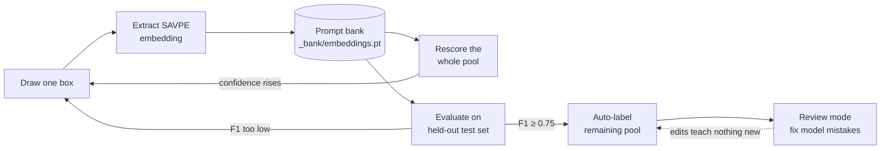

# CT-Flow


**Teach a model by drawing one box.** CT-Flow is a human-in-the-loop visual-prompt
labeling tool for [YOLOE](https://github.com/THU-MIG/yoloe): label a box, its
SAVPE embedding drops into a per-class prompt bank, the whole image pool gets
rescored instantly, and a held-out test set tells you — with an actual
precision/recall/F1 number, not a guess — when the model is ready to
auto-label the rest.

No project workspaces, no training run, no label taxonomy to pre-declare.
**One image folder is the whole config** — labels, the prompt bank, and the
test set you hold back all live in a hidden `.ctflow/` subfolder inside it.

---

## Contents

- [How it works](#how-it-works)
- [Feature status](#feature-status)
- [Repository layout](#repository-layout)
- [Quick start (Docker)](#quick-start-docker)
- [Using CT-Flow](#using-ct-flow)
- [Model selection](#model-selection)
- [Keyboard shortcuts](#keyboard-shortcuts)
- [Multi-user & security](#multi-user--security-optional)
- [Configuration reference](#configuration-reference)
- [API overview](#api-overview)
- [Local development](#local-development-without-docker)
- [Testing & CI](#testing--ci)
- [Datasets & measured accuracy](#datasets--measured-accuracy)
- [Known limitations & roadmap](#known-limitations--roadmap)
- [Documentation index](#documentation-index)
- [Troubleshooting](#troubleshooting)

---

## How it works

Every image labeled feeds an embedding back into the model, so the model gets
better *while* the pool is being labeled — not after a separate training step.



The test set never touches the prompt bank — it exists only to answer "is
this ready?" with a number, so that question isn't answered by eyeballing the
pool.

## Feature status

| Area | Status | Notes |
|---|---|---|
| Label → embed → rescore loop | Ready | the core workflow, fully wired end to end |
| Held-out evaluation (precision/recall/F1 @ IoU 0.5) | Ready | per class + overall, with a visual report |
| Per-class confidence thresholds (`conf_by_class`) | Ready | needed once one class is easy and another is hard — see [datasets](#datasets--measured-accuracy) |
| Selectable YOLOE checkpoint (`services/models.py`) | Ready | 11 checkpoints, `yoloe-v8s-seg` up to `yoloe-26x-seg` — locked per project after the first label, see [model selection](#model-selection) |
| GPU (CUDA) inference | Ready | on by default in Docker; falls back to CPU with a one-line build-arg override |
| Auto-label + review mode | Ready | predicted boxes are fully editable before they're accepted |
| Learning-curve / plateau advice | Ready | "keep labeling" vs "diminishing returns" per class |
| Session auth (`/api/auth/*`) | Backend only | off unless `LABEL_TOOL_USERS` is set; **no sign-in screen in the UI yet** |
| Image upload | Backend only | `POST /api/upload`, refuses to run without auth in `vm` mode; no dropzone in the UI yet |
| Per-label attribution (`labeled_by`) | Ready | recorded once auth is on |
| Usage metrics (`_bank/events.jsonl`) | Backend only | abandonment / correction-rate math is ready; nothing calls `POST /api/events` from the UI yet |
| Embedding-distance duplicate detection | Approximated | an 8×8 thumbnail hash stands in for true embedding distance — good enough today, see [limitations](#known-limitations--roadmap) |

## Repository layout

```
label_tool/                     repo root
├── backend/                    FastAPI service
│   ├── app.py                    mounts routers + the auth middleware, nothing else
│   ├── deps.py                   checked_path() — the path-safety gate every router uses
│   ├── config.py                 LABEL_TOOL_MODE / VM_ROOT / model path / defaults
│   ├── routers/                  HTTP layer — request in, service call, response out
│   │   ├── system.py               GET /api/config, /api/browse
│   │   ├── pool.py                 session, image, boxes, label, relabel, history, events
│   │   ├── testset.py              /api/testset/*
│   │   ├── jobs.py                 /api/jobs/{id}, score, evaluate, autolabel
│   │   ├── auth.py                 /api/auth/me|login|logout
│   │   └── uploads.py              POST /api/upload
│   ├── services/                 business logic — no FastAPI import in here
│   │   ├── bank.py                  the prompt bank (embeddings + labeled_by provenance)
│   │   ├── vpe.py                   YOLOE wrapper — arm() / predict_one() / extract_embedding()
│   │   ├── groundtruth.py           YOLO ground truth for the held-out test set
│   │   ├── yolo_labels.py           shared label-file read/write
│   │   ├── metrics.py               precision/recall/F1 against ground truth
│   │   ├── job_tracker.py           in-memory progress tracking for background jobs
│   │   ├── events.py                append-only usage-metrics log
│   │   └── auth.py                  pbkdf2 password hashing + signed session cookies
│   ├── Dockerfile
│   ├── requirements.txt
│   ├── _smoke_test.py            the one end-to-end check, see Testing below
│   └── _experiment_conf.py       T-01 conf-threshold sweep, see Datasets below
├── frontend/                   Next.js 15 App Router UI
│   ├── app/
│   │   ├── page.tsx               chrome + tab nav only, all state lives in lib/session.ts
│   │   ├── panels/                 one file per tab
│   │   │   ├── PoolPanel.tsx         Label tab
│   │   │   ├── TestsetPanel.tsx      Test set tab
│   │   │   ├── ReportPanel.tsx       Report tab — per-image eval breakdown
│   │   │   └── InsightsPanel.tsx     Progress tab — learning curves, next-action advice
│   │   ├── components/             BoxCanvas, DirPicker, EvalOverlay, LearningCurve,
│   │   │                           ProgressBar, SetupCard, ShortcutsDialog, Confirm
│   │   ├── lib/
│   │   │   ├── session.ts            all labeling state + mutations (useSession)
│   │   │   ├── api.ts                every fetch call in the app lives here
│   │   │   ├── history.ts            eval-run history → learning curve + readiness verdict
│   │   │   ├── ui.tsx                icons, formatting, shared constants (READY_F1 = 0.75)
│   │   │   └── types.ts              shapes shared across the above
│   │   └── api/[...path]/route.ts  runtime proxy to the backend (cookies + multipart safe)
│   └── Dockerfile
├── docs/                        design + requirements docs (Thai), see the index below
├── certs/                       root CAs trusted at image-build time (corporate TLS proxies)
├── .github/workflows/backend.yml
├── docker-compose.yml
└── .env.example
```

A router never touches a file directly and a service never imports FastAPI —
that split is what lets `backend/_smoke_test.py` drive the app through
`TestClient` while also calling `Bank(...)` directly to check what actually
landed on disk. The same split exists on the frontend: `session.ts` owns
every mutation, panels only render a slice of it — a panel takes one `s`
prop instead of forty.

## Quick start (Docker)

```bash
cp .env.example .env      # point DATA_DIR at the folder holding your datasets
docker compose up --build # http://localhost:3000
```

Everything under `DATA_DIR` is mounted at `/data` in the api container, and
`/data` is the only thing the folder picker can reach — paths outside it are
rejected server-side (the browser can send any string). Model weights land
in a named volume (`models`) so they persist across restarts; the default
checkpoint plus the two newest/largest ones are baked into the image so a
brand-new volume starts pre-seeded (see [Model
selection](#model-selection)), everything else in the catalog auto-downloads
into the volume the first time it's actually selected.

> **GPU by default.** The build installs a CUDA build of PyTorch and
> `docker-compose.yml` requests a GPU for the `api` service. This needs an
> NVIDIA GPU + driver + the [NVIDIA Container
> Toolkit](https://docs.nvidia.com/datacenter/cloud-native/container-toolkit/latest/install-guide.html)
> on the host (`docker info` should list an `nvidia` runtime). No GPU on this
> machine? Either delete the `deploy.reservations` block in
> `docker-compose.yml`, or build CPU-only without touching any file:
> ```bash
> docker compose build --build-arg TORCH_INDEX_URL=https://download.pytorch.org/whl/cpu api
> ```

## Using CT-Flow

The UI has four tabs. **Label** and **Test set** write to different places
and never share data — test images must stay held out, or the F1 you read
back is measuring memorization, not generalization.

1. **Label** — set the image folder (`<dataset>/pool`) once in the session
   setup card; that's the only folder there is to pick. Draw a box, name the
   class, save. That save extracts a SAVPE embedding into the prompt bank at
   `<dataset>/pool/.ctflow/_bank/`.
2. **Test set** — pull 10–20 images in with **Import from pool** ("Add
   random" or tick specific ones). This flags them in a manifest, no file
   copy — a test image *is* the pool image, so there's nothing to duplicate
   on disk. Draw ground-truth boxes the same way — Save here writes straight
   to `.ctflow/testset/labels/*.txt`, never into a prompt bank; the backend
   rejects any attempt to teach the bank from a flagged image with a `400`.
3. Hit **Evaluate on test set** (from either tab) — YOLOE runs against the
   held-out images with the current bank and reports precision / recall / F1
   at IoU 0.5, overall and per class. This is the readiness signal, not pool
   confidence, which only tells you *which* image to label next.
4. **Report** tab — every test image with ground truth and predictions drawn
   on top, color-coded by match status, so you can see *what kind* of
   mistake the model is making.
5. **Progress** tab — F1 vs. number of examples taught, one line per class,
   plus plain-language advice: keep labeling this class, or it's plateaued
   and more hand-labeling has little left to buy (bar is F1 ≥ 0.75).
6. F1 good enough? **Auto-label remaining** writes labels for the rest of the
   pool, tracked separately (`auto`) in `_bank/metadata.json` so you can tell
   them from human-drawn ones.
7. Click into any auto-labeled image ("reviewing auto-label") to enter
   **review mode** — every predicted box is editable: click to select, × to
   delete an over-prediction, drag to add a box the model missed. **Save
   review** rewrites just that image's label file with no embedding
   extraction, since fixing a prediction isn't the same as teaching the model
   a new prompt.

Evaluate, Rescore, and Auto-label all run as background jobs with a progress
bar + ETA, since each is a full inference pass over a folder. Revisiting an
already-labeled image (either tab) shows its saved boxes automatically,
dimmed.

Save defaults to replacing an image's whole label file. Tick **update (keep
existing)** to add the drawn boxes to what's already saved instead of
replacing it — for going back and adding one more instance without redrawing
everything.

Toggle **Plain language** in the header to swap technical wording ("SAVPE
embedding", "prompt bank") for descriptions anyone can follow, without
changing what the tool does underneath.

`Bank.classes` is insertion-ordered, never alphabetized — a label file's
class column is an index into that list, so it stays fixed once assigned or
older files silently decode under the wrong class.

## Model selection

The **Model** picker (`ModelPicker.tsx`, shared by the session setup card and
the "Model" card in the main labeling screen — pick or change it from
wherever you're already looking, not just before opening a session) chooses
which YOLOE checkpoint a project teaches — from `yoloe-v8s-seg` (the oldest,
smallest generation) up through `yoloe-26x-seg` (the newest generation's
largest, most accurate size). The full catalog is in
[`backend/services/models.py`](backend/services/models.py) and served at
`GET /api/config`.

**The choice is locked in the moment the first box is saved.** Embeddings
from two different checkpoints don't share a vector space — mixing them into
one prompt bank would feed `set_classes()` vectors that don't mean the same
thing, silently or with a shape error. `Bank.lock_model()` enforces this the
same way class-index order is locked: the first embedding decides, and a
`model_id` that doesn't match what's already there gets a `409`, not a
silent switch. Once a project has a model, every picker becomes a read-only
chip — but it's not a dead end: a **"Switch model…"** button next to the
chip re-extracts every already-taught example under a new checkpoint and
swaps the lock (`Bank.reembed()`, `POST /api/reembed`, a background job
like Evaluate/Auto-label). Saved label files are never touched — only the
prompt bank's vectors and everything downstream of them (predict/evaluate/
auto-label from that point on) change, so cached confidence scores and any
measured F1 need re-checking afterward. Starting a new image folder is still
the way to keep two models' work side by side instead of overwriting one
with the other.

Each option carries a 🟢/🔴 dot: whether the checkpoint's weight file is
already on the server (`GET /api/config`'s `available` field, backed by
`services/models.py::is_available()` checking `MODELS_DIR` on disk) or still
needs an auto-download from GitHub the first time it's used — which can be
slow or fail outright with no route to `github.com`. `yoloe-11s-seg` (the
default), `yoloe-26s-seg`, and `yoloe-26x-seg` are pre-cached.

Outside Docker that's just the repo-local `label_tool/models/` folder. In
Docker, `/models` inside the `api` container is the `models` *named volume*
(`docker-compose.yml`), not the repo folder of the same name on the host —
those are two different filesystems. A **named volume that has never been
mounted before seeds itself from whatever's at that path in the image**
(standard Docker behavior), so `backend/Dockerfile` bakes the same three
`.pt` files into the image at `/models/` — a fresh volume (first
`docker compose up`, or after `docker compose down -v`) comes up already
populated with no manual step. `docker cp`-ing a file into a *running*
container only patches that one volume instance and gets lost the next time
the volume is recreated — bake it into the image instead if it needs to
survive that. The rest of the catalog still downloads into the volume on
first use, same as before.

Bigger sizes are slower per image but generally more accurate; there's no
rule of thumb better than trying one on your own dataset's held-out test set
(see [Using CT-Flow](#using-ct-flow) step 3). On a 4 GB GPU the largest
checkpoints (`yoloe-26l-seg`, `yoloe-26x-seg`) may not fit — if a model fails
to load with an out-of-memory error, drop to a smaller size or run on CPU
(see [Quick start](#quick-start-docker)).

## Keyboard shortcuts

Opens with **`?`** in the app; inert while a text field or dialog has focus.

| Key | Action |
|---|---|
| `Enter` / `Ctrl`+`S` | Save (or Save review, in review mode) |
| `→` / `N` / `S` | Next image |
| `←` / `P` | Previous image |
| `Ctrl`+`Z` / `Ctrl`+`Shift`+`Z` | Undo / redo box edits |
| `1`–`9` | Set the active class |
| `Delete` / `Backspace` | Remove the selected box |
| `Esc` | Clear all drawn boxes on this image |
| `C` | Paste the clipboard's boxes (copied from another image) |
| `A` | Accept all predicted boxes in review mode |

## Multi-user & security (optional)

Off by default: with no `LABEL_TOOL_USERS` set, there is no login, and
`POST /api/upload` refuses to run in `vm` mode — a shared server that takes
files from anyone who knows the URL is worse than no upload at all. Turn
both on together:

```bash
python -m backend.services.auth alice 'their password'
# -> alice:pbkdf2$240000$...   put it in LABEL_TOOL_USERS (comma-separated)
python -c "import secrets; print(secrets.token_hex(32))"   # LABEL_TOOL_SECRET
```

Then every endpoint except `GET /api/config` and `/api/auth/*` needs a signed
session cookie, and every prompt-bank instance records the `labeled_by` who
taught it. Passwords are PBKDF2-HMAC (240k iterations) with
`hmac.compare_digest` throughout — stdlib only, no user database, no new
dependency.

**There is no sign-in screen in the UI yet** — the header shows a permanent
"Not signed in" indicator, and signing in currently means calling
`POST /api/auth/login` directly. See [Known limitations](#known-limitations--roadmap).

## Configuration reference

| env | default | meaning |
|---|---|---|
| `DATA_DIR` | `../data` | host folder mounted at `/data` — datasets and outputs must live under it (default is the sibling `data/` folder shared with the original POC) |
| `WEB_PORT` | `3000` | port the UI is served on |
| `LABEL_TOOL_MODE` | `vm` in Docker | `vm` = confined to `LABEL_TOOL_VM_ROOT`; `local` = browse every drive |
| `LABEL_TOOL_VM_ROOT` | `/data` | the confinement root in `vm` mode |
| `MODELS_DIR` | `/models` in Docker | where YOLOE checkpoints are cached after auto-download — a named volume in Docker, a plain repo-local folder otherwise |
| `LABEL_TOOL_USERS` | *(empty)* | `name:hash,name:hash` — empty means no login and no upload |
| `LABEL_TOOL_SECRET` | *(random per restart)* | signs the session cookie; unset = everyone signed out on every restart |
| `LABEL_TOOL_MAX_UPLOAD_MB` | `25` | per-file upload cap |
| `APP_UID` | `1000` | build arg — must own `DATA_DIR` on a Linux host, since the container doesn't run as root |
| `TORCH_INDEX_URL` | `.../whl/cu126` | build arg — the pip index PyTorch installs from; override to `.../whl/cpu` for a GPU-less build |

`local` mode only makes sense outside Docker, where the server runs on your
own PC and browsing the server means browsing your machine.

## API overview

Full request/response shapes: [`docs/API_REFERENCE.md`](docs/API_REFERENCE.md)
(Thai). Every endpoint is under `/api`, called only through the Next.js proxy
(`app/api/[...path]/route.ts`) — never directly from the browser.

| Router | Base path | Endpoints |
|---|---|---|
| `system` | `/api` | `GET /config`, `GET /browse` |
| `pool` | `/api` | `POST /session`, `GET /image`, `GET /boxes`, `POST /label`, `POST /predict`, `POST /relabel`, `GET`/`POST`/`DELETE /history`, `GET`/`POST /events` |
| `testset` | `/api/testset` | `POST /import`, `POST /remove`, `POST /label` |
| `jobs` | `/api` | `GET /jobs/{id}`, `POST /score`, `POST /evaluate`, `POST /autolabel`, `POST /reembed` |
| `auth` | `/api/auth` | `GET /me`, `POST /login`, `POST /logout` |
| `uploads` | `/api` | `POST /upload` |

Every one of these operates on a single `input_dir` a client sends — the
prompt bank, labels, and test-set manifest all live in a fixed `.ctflow/`
subfolder of it (see `backend/deps.py`), so there's no separate output or
test-set folder to pass. Conventions worth knowing before calling any of
these directly: errors are always `{"detail": "<message>"}`; any endpoint
taking a path from the browser (`input_dir`, an image path) is validated by
`deps.checked_path()` and returns `403` outside the allowed root; boxes are
always `{"cls": str, "box": [x1, y1, x2, y2]}` in source-image pixels, never
normalized.

## Local development (without Docker)

Run from the repo root (`label_tool/`) so `backend` resolves as a package:

```bash
.venv\Scripts\python.exe -m uvicorn backend.app:app --port 8000 --reload
cd frontend && npm run dev          # needs API_URL if not 127.0.0.1:8000
.venv\Scripts\python.exe -m backend._smoke_test               # backend end-to-end check
.venv\Scripts\python.exe -m backend._experiment_conf 20        # conf-threshold sweep, needs data/conveyor_pvc
```

Outside Docker, `pip install`s whatever torch build is already in `.venv` —
install a [CUDA build](https://pytorch.org/get-started/locally/) yourself if
your GPU and driver support it, or leave the CPU build; either works, `vpe.py`
never hardcodes a device.

## Testing & CI

There's one runnable check, not a test framework: `backend/_smoke_test.py`
drives the whole app through FastAPI's `TestClient` — session, label,
predict (including a mid-process class-count change, the regression guard
for a real bug found once), evaluate, auto-label, review, upload, auth,
history and events — while asserting on what actually landed on disk via
`Bank(...)` directly. No mocks.

```bash
.venv\Scripts\python.exe -m backend._smoke_test
.venv\Scripts\python.exe -m backend.services.auth      # pbkdf2 + cookie self-check
.venv\Scripts\python.exe -m backend.services.events     # metrics-log self-check
.venv\Scripts\python.exe -m backend.services.metrics    # precision/recall/F1 self-check
```

`.github/workflows/backend.yml` runs all of the above on every push/PR that
touches `backend/**` — a `checks` job with no model weight (seconds), and a
`smoke` job that installs CPU torch and caches the 28 MB weight between runs.

## Datasets & measured accuracy

All datasets live outside this repo (see `../data/README.md`) and mount at
`/data` in the container. `/data/conveyor_pvc` — PVC fittings from
[Roboflow's conveyor-belt v3](https://universe.roboflow.com/onkar/conveyor-belt)
(CC BY 4.0) — is the one with a documented accuracy ceiling worth knowing
before you rely on this tool for a similar dataset:

| conf threshold | `good_part` F1 | `defect` F1 | `defect` recall |
|---|---|---|---|
| 0.25 (old default) | 0.82 | 0.00 | 0.00 |
| 0.10 | 0.77 | 0.06 | 0.04 |
| 0.05 | 0.59 | 0.25 | 0.26 |
| **per-class (`conf_by_class`)** | **0.82** | **0.25** | — |

`defect` (small chips/scratches) needs a much lower threshold than
`good_part` to show up at all — median box size is 2.09% of the image for
`defect` vs. 43.45% for `good_part`, a ~20x gap. `conf_by_class` gets both
classes their own threshold in one evaluation pass instead of trading one off
against the other. Full methodology and every intermediate number:
[`docs/EXPERIMENT_T01_CONF.md`](docs/EXPERIMENT_T01_CONF.md).

`/data/iron_ore` (235 frames of rock/ore on a moving belt) is the dataset
that matches the real production use case; label ~15 images into `test/`
first to get a readiness number for it.

## Known limitations & roadmap

Full gap analysis: [`docs/NEXT_STEPS.md`](docs/NEXT_STEPS.md) and
[`docs/REQUIREMENTS_STAKEHOLDER_ANALYSIS.md`](docs/REQUIREMENTS_STAKEHOLDER_ANALYSIS.md).
The headline items:

- **No sign-in / upload UI.** Both are fully built and tested on the backend
  (`/api/auth/*`, `POST /api/upload`); nothing in the frontend calls them
  yet. Building the two screens is the next-highest-leverage frontend work.
- **`defect`-class recall is still low even with `conf_by_class`** (0.25 F1).
  The box-size gap above points at cropping around each detection before
  running SAVPE on it as the next lever — unblocked and prioritized ahead of
  further threshold tuning.
- **Duplicate/near-duplicate detection uses an 8×8 thumbnail hash**, not true
  embedding distance. Cheap and has been good enough in practice; swapping
  in real embedding distance would roughly double rescore latency, so it's
  deferred until it's a measured problem.
- **GPU/non-root Docker build succeeds; runtime is unverified.**
  `docker compose build api` completed successfully with the CUDA torch
  wheel and the non-root user setup, but Docker Desktop's daemon stopped
  responding (`500` on every API call) right after — `docker compose up` and
  an actual `torch.cuda.is_available()` check inside the running container
  are still outstanding. Restart Docker Desktop and re-run to finish
  verifying.

## Documentation index

Deeper design and requirements docs live in `docs/` (Thai, written for
whoever picks this project up next):

| Doc | What's in it |
|---|---|
| [`PRODUCT_OVERVIEW.md`](docs/PRODUCT_OVERVIEW.md) | What the tool does and doesn't do, in plain terms |
| [`ARCHITECTURE.md`](docs/ARCHITECTURE.md) | Tech stack + system design |
| [`API_REFERENCE.md`](docs/API_REFERENCE.md) | Every endpoint, request/response shapes, conventions |
| [`REQUIREMENTS_STAKEHOLDER_ANALYSIS.md`](docs/REQUIREMENTS_STAKEHOLDER_ANALYSIS.md) | Requirement-by-requirement status, the source of truth for "is X done" |
| [`PROJECT_STATUS.md`](docs/PROJECT_STATUS.md) | Test coverage + current overall status |
| [`EXPERIMENT_T01_CONF.md`](docs/EXPERIMENT_T01_CONF.md) | The conf-threshold experiment behind the accuracy table above |
| [`NEXT_STEPS.md`](docs/NEXT_STEPS.md) | Prioritized gap list for the next round of work |
| [`GLOSSARY.md`](docs/GLOSSARY.md) | Terminology (SAVPE, prompt bank, etc.) in the order you'll meet it |

## Troubleshooting

`docker compose build` failing with `CERTIFICATE_VERIFY_FAILED`? Something is
intercepting TLS during the build — a corporate proxy, or antivirus HTTPS
scanning (AVG/Avast/Kaspersky all do this). Drop the intercepting root CA
into `certs/`; see [`certs/README.md`](certs/README.md) for how to export it
from the Windows certificate store.

---

*Internal Connected Tech tool. No open-source license — do not redistribute
outside the organization.*
