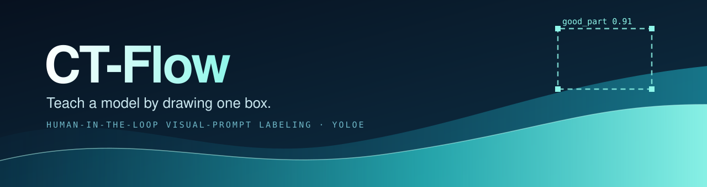
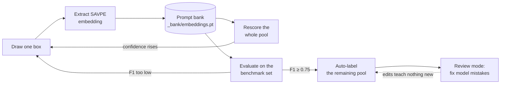
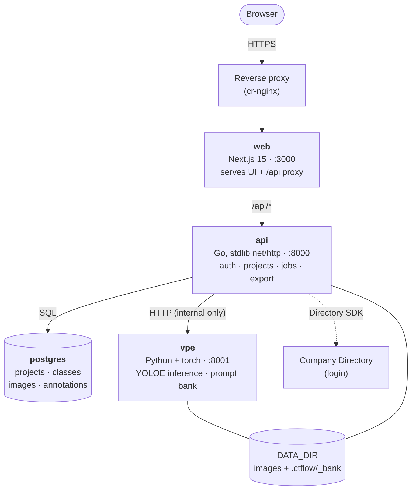
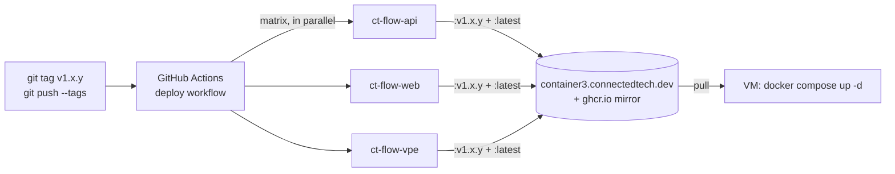

<div align="center">



<br>

[](https://github.com/P-PrPas/CT-Flow/actions/workflows/backend.yml)
[](https://github.com/P-PrPas/CT-Flow/actions/workflows/frontend.yml)
[](https://github.com/P-PrPas/CT-Flow/actions/workflows/deploy.yml)


**[How it works](#how-it-works)** ·
**[Quick start](#quick-start-docker)** ·
**[Production](#production-deployment)** ·
**[Configuration](#configuration-reference)** ·
**[API](#api-overview)** ·
**[Docs](#documentation-index)**

</div>

---

**CT-Flow** is a human-in-the-loop visual-prompt labeling tool for
[YOLOE](https://github.com/THU-MIG/yoloe). Draw a box around one example and its
SAVPE embedding drops into a per-class prompt bank; the whole image pool is
rescored instantly; and a held-out **benchmark set** tells you — with a real
precision / recall / F1 number, not a guess — when the model is ready to
auto-label the rest.

<table>
<tr>
<td width="33%" valign="top">

### 🎯 No training run
The model improves *while* you label. Every saved box is a new prompt, not a
job in a queue.

</td>
<td width="33%" valign="top">

### 📏 A number, not a hunch
Precision / recall / F1 at IoU 0.5 on images the model has never been taught
from — per class and overall.

</td>
<td width="33%" valign="top">

### 👥 Built for teams
Two people in one project are never handed the same image, and every box
records who drew it.

</td>
</tr>
</table>

No label taxonomy to pre-declare. **One image folder is one project**: the prompt
bank lives in a hidden `.ctflow/` subfolder inside it, and the labels live in
PostgreSQL keyed by that same folder.

## Contents

- [Highlights](#highlights)
- [How it works](#how-it-works)
- [Architecture](#architecture)
- [Quick start (Docker)](#quick-start-docker)
- [Production deployment](#production-deployment)
- [Using CT-Flow](#using-ct-flow)
- [Model selection](#model-selection)
- [Keyboard shortcuts](#keyboard-shortcuts)
- [Multi-user & security](#multi-user--security)
- [Configuration reference](#configuration-reference)
- [API overview](#api-overview)
- [Repository layout](#repository-layout)
- [Local development](#local-development-without-docker)
- [Testing & CI](#testing--ci)
- [Datasets & measured accuracy](#datasets--measured-accuracy)
- [Known limitations & roadmap](#known-limitations--roadmap)
- [Documentation index](#documentation-index)
- [Troubleshooting](#troubleshooting)
- [Contributing](#contributing)
- [License](#license)

## Highlights

| Area | Status | Notes |
|---|---|---|
| Label → embed → rescore loop | ✅ Ready | the core workflow, wired end to end |
| Held-out evaluation (P / R / F1 @ IoU 0.5) | ✅ Ready | per class + overall, with a visual report |
| Per-class confidence thresholds (`conf_by_class`) | ✅ Ready | needed once one class is easy and another is hard — see [datasets](#datasets--measured-accuracy) |
| Selectable YOLOE checkpoint | ✅ Ready | 11 checkpoints (`yoloe-v8s-seg` → `yoloe-26x-seg`), locked per project after the first label — see [model selection](#model-selection) |
| GPU (CUDA) inference | ✅ Ready | requested for the `vpe` service; one build-arg falls back to CPU |
| Auto-label + review mode | ✅ Ready | predicted boxes are fully editable before they are accepted |
| Learning-curve / plateau advice | ✅ Ready | "keep labeling" vs "diminishing returns", per class |
| Company Directory login | ✅ Ready | server-side code exchange, HttpOnly session, logout; local accounts as a fallback |
| Project workspaces | ✅ Ready | `/` lists every project with owner, progress and contributors; `/p/{id}` is the workspace |
| Multi-user queue | ✅ Ready | image claims (10-minute expiry), teammates' progress polled every 15 s, who-labeled-what on every image |
| Dataset export | ✅ Ready | YOLO, COCO and Pascal VOC ZIPs; pool, benchmark set or both; source images bundled by default |
| Per-label attribution | ✅ Ready | every box and every taught prompt records its author's stable id |
| Image upload | 🟡 Backend only | `POST /api/upload` is built and gated by login; no dropzone in the UI yet |
| Usage metrics (`events.jsonl`) | 🟡 Backend only | the maths is ready; nothing in the UI calls `POST /api/events` yet |
| Duplicate detection | 🟡 Approximated | an 8×8 thumbnail hash stands in for embedding distance — see [limitations](#known-limitations--roadmap) |

## How it works

Every image labeled feeds an embedding back into the model, so it gets better
*during* labeling — not after a separate training step.


```mermaid
flowchart LR
    A["Draw one box"] --> B["Extract SAVPE<br/>embedding"]
    B --> C[("Prompt bank<br/>_bank/embeddings.pt")]
    C --> D["Rescore the<br/>whole pool"]
    D -->|confidence rises| A
    C --> E["Evaluate on the<br/>benchmark set"]
    E -->|"F1 ≥ 0.75"| F["Auto-label<br/>the remaining pool"]
    E -->|"F1 too low"| A
    F --> G["Review mode:<br/>fix model mistakes"]
    G -.->|edits teach nothing new| F
```

The benchmark set never touches the prompt bank — it exists only to answer *"is
this ready?"* with a number, so that question is never answered by eyeballing
the pool.

## Architecture


```mermaid
flowchart TB
    U(["Browser"]) -->|HTTPS| N["Reverse proxy<br/>(cr-nginx)"]
    N --> W["<b>web</b><br/>Next.js 15 · :3000<br/>serves UI + /api proxy"]
    W -->|"/api/*"| A["<b>api</b><br/>Go, stdlib net/http · :8000<br/>auth · projects · jobs · export"]
    A -->|SQL| P[("<b>postgres</b><br/>projects · classes<br/>images · annotations")]
    A -->|"HTTP (internal only)"| V["<b>vpe</b><br/>Python + torch · :8001<br/>YOLOE inference · prompt bank"]
    V --- F[("DATA_DIR<br/>images + .ctflow/_bank")]
    A --- F
    A -.->|Directory SDK| D["Company Directory<br/>(login)"]
```

| Service | Image | Owns |
|---|---|---|
| `web` | `ct-flow-web` | the UI and the same-origin `/api` proxy — the browser never talks to `api` directly |
| `api` | `ct-flow-api` (~35 MB) | everything that is not torch: auth, projects, labels, jobs, export, path confinement |
| `vpe` | `ct-flow-vpe` | everything that needs torch: YOLOE inference and the prompt bank (`embeddings.pt`). **Never published to the host** — it trusts its caller |
| `postgres` | `postgres:16-alpine` | label and box storage |

**Why two backends.** YOLOE's SAVPE head has no Go equivalent, and
`embeddings.pt` is a `torch.save`, so the bank and the model cannot be split
across a language boundary (`Bank.lock_model()` and `reembed()` commit
atomically under one file lock, which only works with a single writer). In
exchange the sidecar owns nothing else: no database, no uploads, no auth. Full
reasoning: [`docs/history/REFACTOR_PLAN.md`](docs/history/REFACTOR_PLAN.md).

## Quick start (Docker)

```bash
cp .env.example .env      # set DATA_DIR to the folder holding your datasets, then fill in
                          # POSTGRES_PASSWORD and a sign-in method (see Multi-user & security)

# Model weights are gitignored and backend/inference/Dockerfile bakes three of
# them into the image, so a fresh clone fetches them once before building:
pip install ultralytics
mkdir -p models && cd models && python -c "from ultralytics import YOLOE
for m in ('yoloe-11s-seg', 'yoloe-26s-seg', 'yoloe-26x-seg'): YOLOE(m + '.pt')" && cd ..

docker compose up --build # http://localhost:3000
```

Everything under `DATA_DIR` is mounted at `/opt/mount/project`, and that is the
only tree the folder picker can reach — paths outside it are rejected
server-side. Model weights live in the `models` named volume so they survive
restarts; the default checkpoint plus the two newest/largest are baked into the
image, and the rest of the catalog downloads into the volume the first time it
is selected (see [Model selection](#model-selection)).

> [!IMPORTANT]
> **GPU by default.** The build installs a CUDA build of PyTorch and
> `docker-compose.yml` requests a GPU for the **`vpe`** service. That needs an
> NVIDIA GPU, its driver, and the [NVIDIA Container
> Toolkit](https://docs.nvidia.com/datacenter/cloud-native/container-toolkit/latest/install-guide.html)
> on the host (`docker info` should list an `nvidia` runtime).
> No GPU? Delete the `deploy.reservations` block under `vpe`, then build CPU-only:
> ```bash
> docker compose build --build-arg TORCH_INDEX_URL=https://download.pytorch.org/whl/cpu vpe
> ```

> [!NOTE]
> Building `api` locally needs the company's private Go proxy for the Directory
> SDK. Point `NETRC_PATH` in `.env` at your `~/.netrc`; without it the build
> still runs but cannot fetch that one module. Running already-built images
> needs none of this.

## Production deployment

Production runs the **pre-built images** from the company registry — nothing on
the VM builds. The ready-to-copy VM layout is [`deploy/`](deploy/README.md):

```
deploy/
├── core/                 shared edge: cr-nginx reverse proxy + cr-watchtower auto-updater
└── app/ctflow/           this app: postgres + vpe + api + web  (docker-compose.yml, .env.example)
```

**Release pipeline**


```mermaid
flowchart LR
    T["git tag v1.x.y<br/>git push --tags"] --> CI["GitHub Actions<br/>deploy workflow"]
    CI -->|matrix, in parallel| I1["ct-flow-api"]
    CI --> I2["ct-flow-web"]
    CI --> I3["ct-flow-vpe"]
    I1 & I2 & I3 -->|":v1.x.y + :latest"| R[("container3.connectedtech.dev<br/>+ ghcr.io mirror")]
    R -->|"pull"| VM["VM: docker compose up -d"]
```

Pushing a `v*` tag builds all three images in parallel and pushes each as
`:<tag>` **and** `:latest`, to the company registry (what the VM pulls from) and
to `ghcr.io` (a free public mirror). Typical timings: `web` ≈ 1.5 min, `api` ≈
2 min, **`vpe` ≈ 15 min** (it bakes in the model checkpoints). The workflow
never touches the VM.

**First time on a fresh VM**

```bash
docker network create --driver=bridge --subnet=172.20.0.0/16 bridge0
docker login container3.connectedtech.dev
scp -r deploy/* vm:~/
cd ~/core && docker compose up -d
cd ~/app/ctflow && cp .env.example .env && vim .env && docker compose up -d
```

**Shipping a new version** — pick one strategy in `app/ctflow/.env`:

| `TAG=` | How it updates | Use when |
|---|---|---|
| `latest` *(default)* | `cr-watchtower` polls the registry every minute and restarts a service whose `:latest` digest changed — no action needed | you want every release live automatically |
| `v1.x.y` *(pinned)* | `docker compose pull && docker compose up -d` by hand; a version tag's digest never changes, so watchtower leaves it alone | you want deliberate, reversible rollouts |

> [!WARNING]
> **Wait for all three images before pulling a pinned tag.** `TAG` is one value
> shared by `web`, `api` and `vpe`, and `web → api → vpe` are chained with
> `depends_on`, so `docker compose up -d web` reconciles the whole chain. If the
> slow `vpe` build is still running you get
> `ct-flow-vpe:<tag>: not found`. Check the **deploy** workflow is green first,
> then run `docker compose pull && docker compose up -d`.

**Rolling back:** set `TAG=` to the previous version and `docker compose up -d`.
Labels live in the `postgres` bind mount and each project's `.ctflow/` folder,
so swapping images never touches data.

Background and the networking conventions this follows:
[`docs/deploying-a-service.md`](docs/deploying-a-service.md).

## Using CT-Flow

A project's workspace has five tabs. **Label** and **Benchmark set** write to
different places and never share data — benchmark images must stay held out, or
the F1 you read back is measuring memorization, not generalization.

| Tab | What it is for |
|---|---|
| **Label** | draw boxes, name classes, teach the model |
| **Gallery** | browse every image in the dataset, with its status |
| **Benchmark set** | build the independent answer key |
| **Report** | every benchmark image with truth and predictions drawn on top |
| **Progress** | F1 vs. examples taught, with plain-language advice |

1. **Label** — pick or create a project (an image folder under `DATA_DIR`). Draw
   a box, name the class, save. That save extracts a SAVPE embedding into the
   prompt bank at `<dataset>/.ctflow/_bank/`.
2. **Benchmark set** — pull 10–20 images in with **Import from pool** ("Add
   random" or tick specific ones). This flags them in PostgreSQL — no file copy.
   Draw ground-truth boxes the same way; Save here writes to PostgreSQL only,
   and the backend rejects any attempt to teach the bank from a flagged image
   with a `400`.
3. **Evaluate on benchmark set** (from either tab) runs YOLOE against the
   held-out images with the current bank and reports precision / recall / F1 at
   IoU 0.5, overall and per class. This is the readiness signal; pool confidence
   only tells you *which* image to label next.
4. **Report** — see *what kind* of mistake the model makes, color-coded by match
   status.
5. **Progress** — one learning-curve line per class plus advice: keep labeling
   this class, or it has plateaued (the bar is F1 ≥ 0.75).
6. F1 good enough? **Auto-label remaining** writes labels for the rest of the
   pool, tracked separately (`auto` status) from human-drawn ones.
7. Open any auto-labeled image to enter **review mode**: click to select, × to
   delete an over-prediction, drag to add a missed box. **Save review** rewrites
   just that image's label — no embedding extraction, because fixing a
   prediction is not teaching a new prompt.

Evaluate, Rescore and Auto-label run as background jobs with a progress bar and
ETA. Revisiting a labeled image shows its saved boxes, dimmed. Save replaces an
image's whole label by default; tick **update (keep existing)** to add to it
instead. Toggle **Plain language** in the header to swap technical wording
("SAVPE embedding", "prompt bank") for descriptions anyone can follow.

> [!NOTE]
> `Bank.classes` is insertion-ordered and never alphabetized — a label's class is
> an index into that list, so it stays fixed once assigned or older labels
> silently decode under the wrong class.

### Export annotations

Choose **Export dataset** beside the project title. Pick **YOLO**, **COCO** or
**Pascal VOC**, then **Pool annotations** (default), **Benchmark set
annotations**, or **All annotations**, and click **Download annotations**.

- A training export should stay on **Pool**: anything in the benchmark set stops
  being held-out the moment it is trained on.
- Source images are bundled by default (under `images/`, or VOC's
  `JPEGImages/`) so the archive is self-contained. Toggle **Include source
  images** off for labels only.
- Pascal VOC output is spec-conformant: `Annotations/` + `JPEGImages/`,
  integer pixel coordinates, `<folder>`, `<pose>`, `<truncated>`, `<difficult>`.
- Images with no saved boxes, unreadable files, and train/validation splits are
  not included. Export is read-only and can be cancelled or retried.

## Model selection

The **Model** picker chooses which YOLOE checkpoint a project teaches — from
`yoloe-v8s-seg` (oldest, smallest) up to `yoloe-26x-seg` (newest, largest, most
accurate). The catalog is [`backend/models.json`](backend/models.json), read by
both the Go API and the Python sidecar (adding one is a single edit) and served
at `GET /api/config`.

**The choice locks when the first box is saved.** Embeddings from different
checkpoints do not share a vector space. `Bank.lock_model()` enforces it: the
first embedding decides, and a different `model_id` gets a `409`. The picker
becomes a read-only chip — not a dead end: **Switch model…** re-extracts every
taught example under the new checkpoint and swaps the lock atomically
(`POST /api/reembed`, a background job). Saved labels are never touched; cached
confidence scores and any measured F1 need re-checking afterwards.

Each option carries a 🟢/🔴 dot: whether the weight file is already on the server
or would auto-download from GitHub on first use (slow, or failing outright with
no route to `github.com`). `yoloe-11s-seg` (default), `yoloe-26s-seg` and
`yoloe-26x-seg` are pre-cached.

<details>
<summary><b>Where weights live (Docker vs. local)</b></summary>

<br>

Outside Docker it is the repo-local `models/` folder. In Docker, `/models` in
the `vpe` container is the `models` *named volume*, not the repo folder of the
same name (`api` mounts it read-only, only to report what is present). A named
volume that has never been mounted seeds itself from whatever is at that path in
the image, so `backend/inference/Dockerfile` bakes the three checkpoints in and a
fresh volume comes up populated. `docker cp` into a *running* container only
patches that one volume instance — bake a file into the image if it must survive
recreation.

</details>

Bigger sizes are slower per image but generally more accurate; the only reliable
rule is to try one against your own benchmark set. On a 4 GB GPU the largest
checkpoints (`yoloe-26l-seg`, `yoloe-26x-seg`) may not fit — drop to a smaller
size or run on CPU.

## Keyboard shortcuts

Press **`?`** in the app. Single-key shortcuts are inert while a text field or
dialog has focus.

| Key | Action |
|---|---|
| `Enter` / `Ctrl`+`S` | Save (or Save review, in review mode) |
| `→` / `N` / `S` | Next image |
| `←` / `P` | Previous image |
| `Ctrl`+`Z` / `Ctrl`+`Shift`+`Z` | Undo / redo box edits |
| `1`–`9` | Set the active class |
| `Delete` / `Backspace` | Remove the selected box |
| `Esc` | Clear all drawn boxes on this image |
| `C` | Paste the clipboard's boxes (copied from another image) |
| `A` | Accept all predicted boxes in review mode |

## Multi-user & security

**Signing in is required.** With neither the Directory variables nor
`LABEL_TOOL_USERS` set, the API refuses to start — projects carry an owner and
every box carries an author, and a server nobody signs in to would record all of
them as nobody. Path confinement to `LABEL_TOOL_VM_ROOT` is unconditional for the
same reason.

**Company Directory login** (production):

```bash
DIRECTORY_ADDRESS=directory.example:443
DIRECTORY_KEY=...
DIRECTORY_SECRET=...
FRONTEND_URL=https://ct-flow.example   # must match the public URL; callback is <FRONTEND_URL>/entry/callback
LABEL_TOOL_SECRET=...                  # stable app-session signing key
```

The backend dials the directory and redeems the one-use code entirely
server-side; directory credentials never enter browser storage or response
bodies. It then issues a `labeltool_session` HttpOnly / SameSite=Lax cookie for
12 hours. Attribution stores the directory's stable user id while the UI shows
the username (falling back to email, then the id); every login upserts a `users`
row so an id can be read back as a person's name.

> [!NOTE]
> The Directory SDK has no RP-initiated logout endpoint: signing out clears only
> CT-Flow's cookie, so on a shared machine the next sign-in can be silent if the
> directory still has the browser signed in. Known limitation, not fixable from
> this side.

**Local accounts** are the fallback when Directory is unset, and what CI and
development use:

```bash
docker compose run --rm --entrypoint /app/api api -hash-password alice 'their password'
# -> alice:pbkdf2$240000$...   put it in LABEL_TOOL_USERS (comma-separated)
python -c "import secrets; print(secrets.token_hex(32))"   # LABEL_TOOL_SECRET
```

> [!WARNING]
> **Double every `$` when pasting that hash into `.env`.** Compose interpolates
> `$` before the container sees the value, so `pbkdf2$240000$salt$key` silently
> truncates at the first `$`. Write `pbkdf2$$240000$$salt$$key`. There is no
> diagnostic — login just fails.

Every endpoint except login/config needs a signed session cookie. Local
passwords are PBKDF2-HMAC-SHA256 (240k iterations), compared in constant time.
Only a project's **owner** can delete it (unowned projects stay deletable by
anyone); class names and box geometry are validated at the API boundary
before anything reaches the prompt bank.

## Configuration reference

| env | default | meaning |
|---|---|---|
| `DATA_DIR` | `../data` | host folder mounted at `/opt/mount/project` — datasets must live under it |
| `WEB_PORT` | `3000` | port the UI is served on |
| `LABEL_TOOL_VM_ROOT` | `/opt/mount/project` | the only browsable root; every browser path is confined to it, unconditionally |
| `MODELS_DIR` | `/models` in Docker | where YOLOE checkpoints are cached — a named volume in Docker, a repo-local folder otherwise |
| `POSTGRES_PASSWORD` | *(required)* | password for PostgreSQL; compose refuses to start without it |
| `DATABASE_URL` | set by compose | PostgreSQL connection string — override to use your own server outside Docker |
| `LABEL_TOOL_USERS` | *(empty)* | `name:hash,name:hash` local accounts. **Either this or the Directory variables is required** |
| `LABEL_TOOL_SECRET` | *(random per restart)* | signs the session cookie; unset = everyone signed out on every restart |
| `DIRECTORY_ADDRESS` | *(empty)* | `host:port` of the company Directory server |
| `DIRECTORY_KEY` / `DIRECTORY_SECRET` | *(empty)* | Directory application credentials; both required when Directory login is on |
| `FRONTEND_URL` | `http://localhost:3000` | public origin; Directory callback is `<FRONTEND_URL>/entry/callback` |
| `MAX_UPLOAD_MB` | `25` | per-file upload cap (passed to the API as `LABEL_TOOL_MAX_UPLOAD_MB`) |
| `APP_UID` | `1000` | build arg — must own `DATA_DIR` on a Linux host, since containers do not run as root |
| `TORCH_INDEX_URL` | `.../whl/cu126` | build arg — PyTorch wheel index; `.../whl/cpu` for a GPU-less build |
| `NETRC_PATH` | `./.netrc.empty` | build only — credentials for the private Go proxy (Directory SDK) |
| `TAG` | `latest` | **production only** (`deploy/app/ctflow/.env`) — image tag to run, see [Production](#production-deployment) |
| `API_PORT` / `DB_PORT` | `8000` / `5433` | development only — ports `docker-compose.override.yml` publishes for `curl` and test harnesses |

## API overview

Full request/response shapes: [`docs/API_REFERENCE.md`](docs/API_REFERENCE.md)
(Thai) — that document is the reference; there is no Swagger UI. Every endpoint
is under `/api` and is called only through the Next.js proxy
(`app/api/[...path]/route.ts`), never directly from the browser.

| Handler | Base path | Endpoints |
|---|---|---|
| `system.go` | `/api` | `GET /config`, `GET /browse`, `GET /image` |
| `projects.go` | `/api/projects` | list / create / get / rename / delete projects |
| `state.go` | `/api` | `GET /state`, `POST /claim` |
| `pool.go` / `label.go` | `/api` | `POST /session`, `GET /boxes`, `POST /label`, `POST /predict`, `POST /relabel` |
| `testset.go` | `/api/testset` | `POST /import`, `POST /remove`, `POST /label` |
| `jobs.go` | `/api` | `GET /jobs/{id}`, `POST /score`, `POST /evaluate`, `POST /autolabel`, `POST /reembed` |
| `project.go` | `/api` | `GET`/`POST`/`DELETE /history`, `GET`/`POST /events` |
| `auth.go` | `/api/auth` | `GET /me`, `POST /login`, `POST /logout`, `GET /redirect`, `POST /callback` |
| `upload.go` · `export.go` | `/api` | `POST /upload`, `GET /export` |

Conventions worth knowing before calling these directly:

- Errors are always `{"detail": "<message>"}`.
- Any path from the browser (`input_dir`, an image path) is validated by
  `checkedPath()` and returns `403` outside the allowed root.
- Boxes are always `{"cls": str, "box": [x1, y1, x2, y2]}` in **source-image
  pixels**, never normalized.
- Long work (`score`, `evaluate`, `autolabel`, `reembed`) returns
  `{"job_id", "total"}` immediately; poll `GET /api/jobs/{id}`.

## Repository layout

```
CT-Flow/
├── backend/                    Go API + Python inference sidecar
│   ├── cmd/api/                  the API binary: env → deps → routes → serve
│   ├── internal/                 layered, so what a package *is* is visible from its path
│   │   ├── transport/httpapi/      HTTP only: handlers, middleware, request/response shapes
│   │   ├── core/                   pure logic, no I/O — metrics (P/R/F1), export (YOLO/COCO/VOC)
│   │   ├── infra/                  adapters: store (PostgreSQL), vpe (sidecar client), events, history, images
│   │   └── platform/               cross-cutting: config + path safety, auth, jobs, claims, models
│   ├── inference/                the Python sidecar — everything that needs torch
│   │   ├── service.py              its endpoints (JSON, and NDJSON for long passes)
│   │   ├── vpe.py                  YOLOE wrapper: armed() / predict_one() / extract_embedding()
│   │   ├── bank.py                 the prompt bank (embeddings + labeled_by provenance)
│   │   └── Dockerfile
│   ├── tools/                    one-off scripts (conf sweep, DB recovery from a surviving bank)
│   ├── tests/                    smoke_test.py, parity.py, golden vectors — ships in no image
│   ├── db/schema.sql             applied by the API at boot; idempotent, no migration framework
│   ├── models.json               checkpoint catalog, read by both services
│   └── Dockerfile                the Go API image
├── frontend/                   Next.js 15 App Router (all client components)
│   └── app/
│       ├── page.tsx                projects home          ·  p/[id]/  the workspace
│       ├── components/             shared shell: AppShell, Modal, DirPicker …
│       └── modules/detection/      the object-detection module — the shell may not import from here
├── deploy/                     ready-to-copy VM layout: core/ (nginx, watchtower) + app/ctflow/
├── docs/                       active docs (Thai) — docs/history/ holds records of finished work
├── docker-compose.yml          development / build compose  (+ docker-compose.override.yml)
└── .github/workflows/          backend · frontend · deploy
```

A handler never touches the database directly, and no package under `internal/`
imports `net/http` except `internal/transport/httpapi` — the split that lets
`smoke_test.py` drive the whole app over HTTP while `internal/infra/store`'s
tests hit a real PostgreSQL. The frontend has the same discipline: `session.ts`
owns every mutation and panels only render a slice of it, and CI fails the build
if shared code imports from `app/modules/`.

## Local development (without Docker)

Three processes: PostgreSQL, the inference sidecar, and the API. Run everything
from the repo root so `backend` resolves as a package.

```bash
# 1. database (or point DATABASE_URL at one you already have)
docker compose up -d db

# 2. inference sidecar — needs torch + ultralytics
pip install -r backend/inference/requirements.txt
export LABEL_TOOL_VM_ROOT=$PWD/data     # both processes confine paths to this root, so they must agree
uvicorn backend.inference.service:app --port 8001 --reload

# 3. API — signing in is mandatory, so a dev run needs a credential and a root it can reach
export DATABASE_URL=postgresql://labeltool:<password>@localhost:5433/labeltool
export LABEL_TOOL_SECRET=dev
export LABEL_TOOL_USERS="$(cd backend && go run ./cmd/api -hash-password dev 'dev')"
cd backend && go run ./cmd/api      # :8000, VPE_URL defaults to 127.0.0.1:8001

# 4. frontend
cd frontend && npm run dev          # needs API_URL if not 127.0.0.1:8000
```

`go run` recompiles in seconds, so the API needs no reload watcher. The sidecar
keeps `--reload`, but a reload drops every loaded checkpoint and the next
request pays the cold start again. The sidecar uses whatever torch build is
installed (`vpe.py` never hardcodes a device) — install a
[CUDA build](https://pytorch.org/get-started/locally/) yourself if your GPU
supports it.

## Testing & CI

**`backend/tests/smoke_test.py` is the contract.** It drives whatever is
listening on `SMOKE_BASE_URL` — sessions, labels, predict, evaluate, auto-label,
review, upload, auth, ownership, validation, history, events, export — asserting
against PostgreSQL and the files on disk. No imports, no mocks, no second suite
to drift. Any endpoint or behaviour change needs an assertion there.

```bash
cd backend && go test ./...              # Go unit tests (store needs DATABASE_URL)

# the rest run from the repo root
pip install -r backend/tests/requirements.txt
SMOKE_BASE_URL=http://localhost:8000 python -m backend.tests.smoke_test
python -m backend.tests.bank_test              # prompt-bank unit checks (needs torch)
python -m backend.tests.gen_testdata --check   # cross-language golden vectors
cd frontend && npx tsc --noEmit && npm run build
```

`backend/tests/testdata/` holds golden vectors — pbkdf2 hashes, signed cookies,
F1 results, COCO/VOC/YOLO output — that Go reproduces byte for byte. If one
fails, the code is wrong, not the vector.

| Workflow | Trigger | What it does |
|---|---|---|
| [`backend.yml`](.github/workflows/backend.yml) | push/PR touching `backend/**` | `go` (vet, gofmt, tests on real PostgreSQL) · `python` (sidecar self-checks) · `smoke` (real API + real sidecar over HTTP) |
| [`frontend.yml`](.github/workflows/frontend.yml) | push/PR touching `frontend/**` | module-boundary check → `tsc --noEmit` → `next build` |
| [`deploy.yml`](.github/workflows/deploy.yml) | tag `v*` | build + push `ct-flow-api`, `-web`, `-vpe` to the registries |

## Datasets & measured accuracy

Datasets live outside this repo and mount at `/opt/mount/project`.
`conveyor_pvc` — PVC fittings from [Roboflow's conveyor-belt
v3](https://universe.roboflow.com/onkar/conveyor-belt) (CC BY 4.0) — is the one
with a documented accuracy ceiling worth knowing before you rely on this tool for
a similar dataset:

| conf threshold | `good_part` F1 | `defect` F1 | `defect` recall |
|---|---|---|---|
| 0.25 (old default) | 0.82 | 0.00 | 0.00 |
| 0.10 | 0.77 | 0.06 | 0.04 |
| 0.05 | 0.59 | 0.25 | 0.26 |
| **per-class (`conf_by_class`)** | **0.82** | **0.25** | — |

`defect` (small chips and scratches) needs a far lower threshold than `good_part`
to show up at all — median box size is 2.09 % of the image versus 43.45 %, a ~20×
gap. `conf_by_class` gives each class its own threshold in a single evaluation
pass instead of trading one off against the other. Methodology and every
intermediate number:
[`docs/history/EXPERIMENT_T01_CONF.md`](docs/history/EXPERIMENT_T01_CONF.md).

## Known limitations & roadmap

Full gap analysis: [`docs/ROADMAP.md`](docs/ROADMAP.md) and
[`docs/REQUIREMENTS.md`](docs/REQUIREMENTS.md). The headline items:

- **No frontend tests.** CI checks the module boundary, types and the build —
  none of which *execute* the UI, and the smoke test drives HTTP with no React in
  the picture. A render loop in the claim heartbeat once got through that gap.
- **One API process.** Image claims and the job tracker live in memory, so two
  replicas would not see each other's claims. That degrades to "two people, one
  image" rather than breaking anything — but it is why this runs as one instance.
- **No upload UI.** `POST /api/upload` exists and is protected, but there is no
  dropzone, and no settled answer yet for where an uploaded file should land.
- **`defect`-class recall is low** even with `conf_by_class` (0.25 F1). The size
  gap above points at cropping around each detection before SAVPE as the next
  lever.
- **Duplicate detection is an 8×8 thumbnail hash**, not embedding distance.
  Swapping it would roughly double rescore latency, so it waits for a measured
  problem.
- **Drawing a new box needs a pointer.** Every other box operation has a keyboard
  route; creation does not (WCAG 2.1.1) — see `docs/UX_AUDIT.md` F-01.
- **Models are cached per `model_id` per process** with no VRAM eviction.
- **No HTTPS of its own** — terminate TLS at the reverse proxy.

## Documentation index

Docs in `docs/` are written in Thai for whoever picks the project up next.
`docs/` holds what is **true right now**; `docs/history/` holds records of
finished work — read those for the *why*, never for status.

> **Coming in cold?** [`CLAUDE.md`](CLAUDE.md) → [`ARCHITECTURE.md`](docs/ARCHITECTURE.md)
> → the plan for whatever you are working on.

| Doc | What's in it |
|---|---|
| [`CLAUDE.md`](CLAUDE.md) | The invariants you must not break, and where things live |
| [`PRODUCT_OVERVIEW.md`](docs/PRODUCT_OVERVIEW.md) | What the tool does and doesn't do, in plain terms |
| [`ARCHITECTURE.md`](docs/ARCHITECTURE.md) | Tech stack and system design |
| [`API_REFERENCE.md`](docs/API_REFERENCE.md) | Every endpoint, request/response shapes, conventions |
| [`REQUIREMENTS.md`](docs/REQUIREMENTS.md) | Requirement-by-requirement status — the source of truth for "is X done" |
| [`ROADMAP.md`](docs/ROADMAP.md) | What gets built next, and what is deliberately deferred |
| [`deploying-a-service.md`](docs/deploying-a-service.md) | The VM conventions the `deploy/` layout follows |
| [`PHASE2_WORKSPACE.md`](docs/PHASE2_WORKSPACE.md) | Why workspaces, multi-user and mandatory login were built this way |
| [`GALLERY_PLAN.md`](docs/GALLERY_PLAN.md) | Why the gallery, thumbnail endpoint and paged pool listing exist |
| [`UX_AUDIT.md`](docs/UX_AUDIT.md) | The WCAG 2.2 AA audit of the frontend and its remediation plan |
| [`GLOSSARY.md`](docs/GLOSSARY.md) | Terminology (SAVPE, prompt bank, …) in the order you will meet it |
| [`RECOVER_FROM_BANK.md`](docs/RECOVER_FROM_BANK.md) | Rebuilding the database from a surviving `.ctflow` after a half-wipe |
| [`history/REFACTOR_PLAN.md`](docs/history/REFACTOR_PLAN.md) | The Python → Go port: what moved, what stayed, and why |
| [`history/DB_MIGRATION_PLAN.md`](docs/history/DB_MIGRATION_PLAN.md) | Why labels moved to PostgreSQL and the prompt bank did not |
| [`history/EXPERIMENT_T01_CONF.md`](docs/history/EXPERIMENT_T01_CONF.md) | The conf-threshold experiment behind the accuracy table |

## Troubleshooting

<details>
<summary><b>Nothing happens when I label, and the browser shows no error</b></summary>

<br>

Check the ownership of `DATA_DIR` on the host. The containers run as `app`
(non-root, `APP_UID`), so files left by an older root-running container cannot be
written — `.ctflow/_bank/.lock` fails with `PermissionError`, and `/api/session`,
`/api/label` and auto-label break quietly. One-time fix; re-run it whenever files
arrive from a root-running tool such as a bare `docker cp`:

```bash
docker compose exec -u root vpe chown -R app:app /opt/mount/project
```

The API logs sidecar `5xx` responses (`sidecar error`) with the path and detail,
so `docker compose logs api` shows the cause even when the UI shows nothing.

</details>

<details>
<summary><b>Labels disappeared after <code>docker compose down -v</code></b></summary>

<br>

Expected, and it leaves the project half-wiped: `-v` drops the PostgreSQL volume,
but the prompt bank in `<dataset>/.ctflow/` is a bind mount and survives — so the
model remembers what it was taught while the database no longer remembers which
images taught it. Use `docker compose down` (no `-v`) for everyday rebuilds. When
you do mean to wipe, wipe both:

```bash
docker compose down -v
find "$DATA_DIR" -maxdepth 2 -type d -name .ctflow -exec rm -rf {} +   # images are untouched
```

To go the other way and rebuild the database from a surviving bank, see
[`docs/RECOVER_FROM_BANK.md`](docs/RECOVER_FROM_BANK.md).

</details>

<details>
<summary><b>Login always fails with a local account</b></summary>

<br>

Almost always the unescaped `$` in the pbkdf2 hash — see the warning under
[Multi-user & security](#multi-user--security). Double every `$` in `.env`.

</details>

<details>
<summary><b><code>docker compose up</code> fails with <code>ct-flow-vpe:&lt;tag&gt;: not found</code></b></summary>

<br>

The `deploy` workflow has not finished pushing all three images yet — `vpe`
takes ~15 minutes. Wait for the workflow to go green, then
`docker compose pull && docker compose up -d`. See
[Production deployment](#production-deployment).

</details>

<details>
<summary><b><code>docker compose build</code> fails with <code>CERTIFICATE_VERIFY_FAILED</code></b></summary>

<br>

Something is intercepting TLS during the build — a corporate proxy, or antivirus
HTTPS scanning (AVG, Avast and Kaspersky all do this). Drop the intercepting root
CA into `certs/`; [`certs/README.md`](certs/README.md) explains how to export it
from the Windows certificate store.

</details>

## Contributing

1. Read [`CLAUDE.md`](CLAUDE.md) — eleven invariants that silently corrupt data
   if broken (append-only class indexes, the benchmark set never teaching the
   bank, one writer for `embeddings.pt`, …).
2. Branch from `main`, keep the change small. The house rule is deletion over
   addition: stdlib, then a native platform feature, then an already-installed
   dependency, before any new code.
3. Run the checks for the side you touched ([Testing & CI](#testing--ci)). A new
   endpoint or behaviour needs an assertion in `smoke_test.py`.
4. Open a pull request. The repository lives on both GitHub and the company
   Gitea; open the PR on each.
5. Releases: merge to `main`, then push a `v*` tag — see
   [Production deployment](#production-deployment).

## License

Internal Connected Tech tool. No open-source license — do not redistribute
outside the organization.

<div align="center">
<sub>Built by <b>Connected Tech</b> · powered by <a href="https://github.com/THU-MIG/yoloe">YOLOE</a></sub>
</div>
