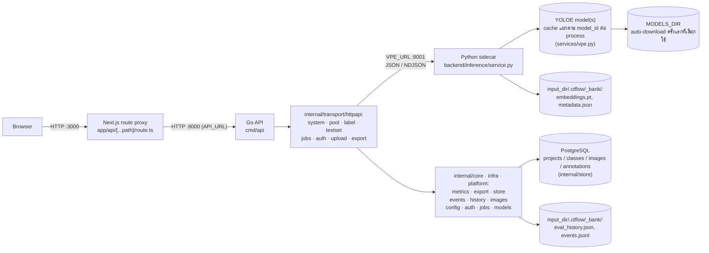

# Label Tool — สถาปัตยกรรมระบบ

## Tech stack

| ชั้น | เทคโนโลยี |
|---|---|
| Frontend | Next.js 15 (App Router) + React 19 + TypeScript — ไม่มี UI/state library เพิ่ม ใช้ `useState`/`useEffect` ล้วน และ CSS แบบ utility class ของตัวเอง (`globals.css`) |
| Backend API | **Go** (`backend/cmd/api`, `backend/internal/*`) — stdlib `net/http` ล้วน ไม่มี framework · dependency หลักคือ `jackc/pgx/v5`, `coreos/go-oidc/v3`, `x/oauth2`, `x/crypto/pbkdf2`, `x/image/bmp` (ดู [REFACTOR_PLAN.md](./REFACTOR_PLAN.md)) |
| Inference sidecar | **FastAPI (Python)** — `backend/inference/service.py` เหลือแค่ส่วนที่ต้องใช้ torch: YOLOE + prompt bank |
| Model / Inference | Ultralytics **YOLOE** ผ่าน `YOLOEVPSegPredictor` (SAVPE) — **เลือก checkpoint ได้จากรายการที่กำหนดไว้ล่วงหน้า** (`inference/models.py`) ตั้งแต่ `yoloe-v8s-seg` เล็กสุด ถึง `yoloe-26x-seg` รุ่นล่าสุดและใหญ่สุด ไม่ hardcode ตัวเดียวอีกต่อไป |
| ML runtime | PyTorch — build ด้วย CUDA (`cu126`) เป็นค่าเริ่มต้นใน Docker image, override เป็น CPU ได้ด้วย build arg |
| Background job tracking | map ในหน่วยความจำ, guard ด้วย `sync.Mutex` (`internal/platform/jobs`) — พฤติกรรมเหมือน `job_tracker.py` เดิมทุกประการ ไม่มี TTL ไม่ persist |
| การจัดเก็บข้อมูล | **label/box metadata อยู่ใน PostgreSQL** (`internal/infra/store`, T-21) — prompt bank (`embeddings.pt` torch pickle + `metadata.json`) ยังเป็นไฟล์เหมือนเดิม ดูหัวข้อ "รูปแบบการจัดเก็บข้อมูล" ด้านล่าง |
| การป้องกันการเขียนชนกัน | DB: row lock บนแถว `projects` ตอนสร้างคลาสใหม่ (`internal/infra/store.getOrCreateClass`) · ไฟล์ (prompt bank เท่านั้น): `filelock.FileLock` บน `_bank/.lock` ถือโดย sidecar ผู้เดียว · โมเดล: `RLock` ต่อ `model_id` ครอบ `arm()`→predict ทั้ง batch (`inference/vpe.py::armed`) |
| Containerization | Docker Compose (4 services: `db`, `vpe`, `api`, `web`) |
| การเชื่อม Frontend↔Backend | Next.js runtime API route (`app/api/[...path]/route.ts`) proxy ทุก request ไปยัง Go API — **ไฟล์ frontend ไม่ถูกแก้เลยแม้แต่บรรทัดเดียวตอน port** |

## System diagram

Browser ไม่เคยคุยกับ Go API โดยตรง — คุยผ่าน Next.js proxy เท่านั้น จึงไม่ต้องตั้งค่า CORS ฝั่ง frontend และไม่มี `NEXT_PUBLIC_*` env var ที่ต้องซิงก์ข้ามการ deploy

**กติกาเส้นแบ่ง Go/Python:** sidecar เป็นเจ้าของโฟลเดอร์ `.ctflow/_bank/` ในส่วนของ `embeddings.pt` + `metadata.json` **แต่ผู้เดียว** — Go ไม่แตะสองไฟล์นี้เลย เพราะ `Bank.lock_model()`/`reembed()` commit แบบ atomic ใต้ `FileLock` เดียว ถ้ามีสอง process เขียนจะพังทันที ส่วน `eval_history.json` กับ `events.jsonl` อยู่ในโฟลเดอร์เดียวกันแต่ไม่เกี่ยวกับ bank จึงเป็นของ Go

**สิ่งที่ sidecar ไม่มี:** ไม่ต่อ PostgreSQL, ไม่รับ upload, ไม่มี auth, ไม่รู้จักคำว่า `.ctflow` (Go ส่ง `state_dir` ที่ join แล้วมาให้) · `BankSummary` ที่ frontend เห็นถูกประกอบจากสองฝั่ง: `classes`/`model` มาจาก sidecar, `labeled`/`auto` มาจาก DB ที่ Go อ่านเอง

## การไหลของข้อมูล (data flow) ต่อ workflow หลัก

- **Label flow** (`POST /api/label`): Go ตรวจ `store.IsTest()` และกล่องว่างก่อน → เรียก `POST /vpe/teach` ที่ sidecar ซึ่งล็อก `model_id` ผ่าน `bank.lock_model()` **ก่อน** สกัด embedding (mismatch ได้ 409 โดยไม่เสียเวลาโหลดโมเดลผิดตัว) → sidecar จัดกลุ่มกล่องตามคลาส แล้ว `vpe.extract_embedding()` หนึ่งครั้งต่อคลาสต่อการบันทึก (เฉลี่ยจากทุกกล่องคลาสนั้นในภาพเดียวกัน) → `bank.add()` → กลับมาฝั่ง Go: `store.WriteBoxes()` → `store.MarkLabeled()`
- **Score flow** (`POST /api/score`, background job): Go เปิด `POST /vpe/predict_stream` (`conf=0.05`, `want_sig=true`) → sidecar `arm()` ครั้งเดียวแล้ว predict ทีละภาพ ส่งกลับบรรทัดละภาพ → Go เก็บ detection ที่ confidence สูงสุดต่อภาพ + `sig` (thumbnail 8×8) แล้ว tick progress
- **Evaluate flow** (`POST /api/evaluate`, background job): Go โหลด ground truth จาก PostgreSQL (`store.LoadAnnotations(kind="testset")`, พิกัดพิกเซลอยู่ในตารางแล้ว ไม่ต้องอ่านภาพเพื่อ denormalize) ข้ามภาพที่ถูกลบไปแล้ว → `predict_stream` → `internal/metrics.Evaluate()` จับคู่แบบ greedy ที่ IoU ≥ 0.5 → precision/recall/F1 ทั้งรวมและต่อคลาส
- **Auto-label flow** (`POST /api/autolabel`, background job): `predict_stream` → `store.WriteBoxes()` เฉพาะภาพที่มี detection → `store.MarkAuto()` เฉพาะภาพที่เขียนป้ายจริง (ไม่ downgrade ภาพที่ label ด้วยมือไปแล้ว)

Job ทั้งสี่ตัว (`score`, `evaluate`, `autolabel`, `reembed`) ใช้สัญญาเดียวกัน: สร้าง job ผ่าน `jobs.Tracker.Create(total)` → รันเป็น goroutine ที่ใช้ `context.Background()` **ไม่ใช่ context ของ request** (request ถูก cancel ทันทีที่ตอบกลับไป ถ้าใช้ตัวนั้น job จะตายทันทีที่เริ่ม) → ฝั่ง frontend poll `GET /api/jobs/{id}` ทุก 400ms จนกว่า `finished`

**ทำไม sidecar ใช้ NDJSON ไม่ใช่ให้ Go ยิงทีละภาพ:** `arm()` ต้องเกิดครั้งเดียวต่อ batch — มันคือส่วนที่แพง และมันตั้ง class list ที่ทุก prediction หลังจากนั้นถูกถอดรหัสด้วย การ stream บรรทัดต่อภาพให้ Go ได้ progress ฟรีโดยไม่ต้องแตก batch

## การเลือกโมเดล

`inference/models.py` เป็น static catalog ของ YOLOE checkpoint ที่เลือกได้ (`yoloe-v8{s,m,l}-seg`, `yoloe-11{s,m,l}-seg`, `yoloe-26{n,s,m,l,x}-seg` — เฉพาะรุ่นที่รับ visual prompt ได้จริง, ไม่รวม `-pf` ที่เป็น prompt-free) `GET /api/config` ส่งรายการนี้ให้ frontend แสดงเป็น dropdown

**กติกาที่สำคัญที่สุด: embedding จากโมเดลคนละตัวใช้แทนกันไม่ได้** เพราะ SAVPE head ของแต่ละ checkpoint ให้ vector space คนละอัน ผสมกันแล้ว `set_classes()` จะพังหรือให้ผลผิด ระบบจึงล็อกโมเดลไว้ที่ระดับ bank เหมือนกับที่ล็อก class index:

- `Bank.model` เก็บใน `metadata.json`, เป็น `null` จนกว่าจะมี embedding แรกเข้า bank
- `Bank.lock_model(model_id)` ตั้งค่าตอน embedding แรก แล้วปฏิเสธ (`ValueError` → HTTP 409) ทุกครั้งที่ภายหลังมีการส่ง `model_id` อื่นเข้ามา
- `inference/vpe.py` เก็บ model instance แยก dict ต่อ `model_id` (ไม่ใช่ singleton ตัวเดียวเหมือนก่อนหน้านี้) — เปิดสองโปรเจกต์ (สอง `input_dir`) ที่ใช้คนละโมเดลพร้อมกันได้ในหนึ่ง process แต่ VRAM จะโตตามจำนวนโมเดลที่เคยถูกเรียกใช้ (มีคอมเมนต์ `ponytail:` กำกับไว้ว่ายังไม่มี eviction)
- **`arm()` แก้ state ระดับ process จึงต้องมี lock** — `arm()` และ `set_prompts()` เขียนทับ `model.names`/`nc`/SAVPE vectors บน object ที่แชร์กันทั้ง process แล้ว `predict()`/`get_vpe()` อ่านกลับทันที สองโปรเจกต์ที่ใช้ checkpoint เดียวกันจึงรันพร้อมกันไม่ได้: `arm()` ตัวที่สองจะทับ class list ของตัวแรกกลางคัน แล้ว prediction ที่เหลือถูกถอดรหัสด้วยคลาสผิด **ไม่ error ไม่ crash แค่ตอบผิด** เดิมรอดเพราะ sync FastAPI endpoint บังเอิญเรียงคิวให้ พอ Go เรียกขนานได้จริงจึงต้องทำให้ชัดเจน: `RLock` ต่อ `model_id` และ context manager `armed()` ที่ถือ lock ตั้งแต่ arm จนจบ batch
- `/api/predict`, `/api/score`, `/api/evaluate`, `/api/autolabel` **ไม่รับ `model_id` จาก client** — อ่านจาก `bank.model` ที่ backend เท่านั้น กัน mismatch ระหว่างสิ่งที่ผู้ใช้เห็นกับสิ่งที่ bank ถูกสอนมาจริง

## รูปแบบการจัดเก็บข้อมูล (storage format)

**T-21 (2026-08-21):** label/box metadata ทั้งหมดย้ายจากไฟล์ YOLO txt ไปตาราง PostgreSQL แล้ว — เหตุผลและ scope เต็มอยู่ที่ [DB_MIGRATION_PLAN.md](./DB_MIGRATION_PLAN.md) แรงจูงใจหลักคือรองรับหลายคนแก้ project เดียวกันพร้อมกันจริง (row lock ระดับ transaction แทน `filelock` ทั้งไฟล์) เตรียมทางสำหรับ login + workspace แบบ Label Studio ในอนาคต

- **ตาราง PostgreSQL (`backend/db/schema.sql`, `internal/infra/store`) — `schema.sql` เป็นไฟล์เดียวที่ Go อ่านตอน start (idempotent, ไม่มี migration step):**
  - `projects` — หนึ่งแถวต่อ `input_dir` หนึ่งโฟลเดอร์ (ยังไม่มีแนวคิด workspace/multi-tenant จริง แค่เตรียม `id` ไว้ให้ระบบ user/workspace ในอนาคตอ้างอิงได้)
  - `classes` — index → ชื่อคลาส **append-only เสมอ ห้ามเรียงใหม่หรือลบ** (แทน `classes.txt` เดิม) แยก index space ระหว่าง `kind='pool'` กับ `kind='testset'` คนละชุดกัน สร้างคลาสใหม่ผ่าน `internal/infra/store.getOrCreateClass()` ซึ่งล็อกแถว `projects` ก่อนคำนวณ index ถัดไป กันสองคนสร้างคลาสใหม่ชนกัน (แทนที่ `filelock` เดิมที่ใช้จุดประสงค์เดียวกันตอนยังเป็นไฟล์)
  - `images` — หนึ่งแถวต่อ `(project, kind, path)` มีคอลัมน์ `status` (`unlabeled`/`labeled`/`auto`) แทนที่ `bank.labeled`/`bank.auto` เดิม
  - `annotations` — หนึ่งแถวต่อกล่อง พิกัดพิกเซล `x1,y1,x2,y2` ตรงกับ Box model ใน API_REFERENCE.md ทุกประการ (ไม่ normalize เหมือน YOLO txt เดิมอีกต่อไป — export ค่อยแปลงตอนขาออก) มี `created_by` สำหรับ audit ในอนาคต
- **Prompt bank (`<input_dir>/.ctflow/_bank/`, ดู `deps.state_dir()`) — ยังเป็นไฟล์เหมือนเดิม ไม่อยู่ใน scope ของ T-21:**
  - `embeddings.pt` — dict ที่ `torch.save` แล้ว: `{ชื่อคลาส: [Tensor, Tensor, ...]}` หนึ่ง tensor ต่อหนึ่ง instance ที่ label ด้วยมือ
  - `metadata.json` — `{"instances": {ชื่อคลาส: [{source_image, bbox, added_at, labeled_by}]}, "model": "yoloe-11s-seg" | null}` (ตัด `labeled`/`auto` ออกแล้ว ย้ายไปเป็น `images.status` ใน DB)
  - `.lock` — ไฟล์ `FileLock` กันการเขียนชนกัน (เฉพาะไฟล์ prompt bank เท่านั้น)
  - **`Bank.classes` (คุณสมบัติของ `inference/bank.py`) ไม่ได้อ่านจาก DB** — ยังเป็น `list(self.embeddings.keys())` เหมือนเดิม เพราะมันตอบคำถาม "บอทสอนคลาสนี้จาก embedding หรือยัง" ซึ่งเป็นคนละเรื่องกับ "DB มีคลาสนี้ในตาราง label หรือยัง" (ดูเหตุผลเต็มที่ DB_MIGRATION_PLAN.md หัวข้อ 10) · sidecar ต่อ DB ไม่ได้อยู่แล้ว จึงตอบได้แค่ครึ่งเดียวของ `BankSummary` ตามที่ควรเป็น
  - `eval_history.json` และ `events.jsonl` อยู่ใน `_bank/` เหมือนกันแต่เป็นของ Go (`internal/infra/history`, `internal/infra/events`) — ไม่เกี่ยวกับ embedding และไม่ต้องใช้ torch
- **Test set:** ภาพในพูลที่ถูกแปะป้ายเป็น test set คือแถว `images` ที่ `kind='testset'` ใช้ `path` เดียวกับแถว `kind='pool'` — **ไม่คัดลอกไฟล์ภาพ** เหมือนพฤติกรรมเดิม `POST /api/label`/`POST /api/relabel` เช็ค `store.IsTest()` และปฏิเสธด้วย `400` ถ้าภาพที่ส่งมาถูกแปะป้ายเป็น test set ไว้ (มี assertion ตรวจสอบใน `tests/smoke_test.py`)
- **Export (`GET /api/export`, T-24, `internal/core/export`):** อ่านจาก DB แล้วแปลงเป็น YOLO (zip ของ `labels/*.txt` + `classes.txt`), COCO (JSON เดียว), หรือ Pascal VOC (zip ของ XML) — เลือกได้ทั้งจากพูลหรือ test set (`kind=pool|testset`) ไม่มี state ใด ๆ เขียนกลับ เป็น pure read
- **การ retire `groundtruth.py`/`yolo_labels.py`/`metrics.py`:** สามไฟล์นี้ **ไม่ได้ถูกลบ** แม้ endpoint ที่เคยใช้จะย้ายไป Go หมดแล้ว — `backend/tools/experiment_conf.py` (สคริปต์ทดลอง T-01) ยังใช้ `metrics.load_ground_truth()` + `metrics.evaluate()` อ่านโฟลเดอร์ YOLO ดิบที่ไม่ใช่ `.ctflow` project เลย จึงต้องคงไว้ · ผลคือ **มีโค้ดคำนวณ P/R/F1 สองภาษาอยู่พร้อมกัน** ซึ่งยอมรับได้เพราะ `evaluate()` เป็นฟังก์ชัน pure ที่นิ่งมาก และ `backend/tests/testdata/metrics_cases.json` + `python -m backend.tests.gen_testdata --check` ใน CI คือสิ่งที่กันสองฝั่งไม่ให้เพี้ยนจากกัน

## การ deploy

Docker Compose มี 3 services:

| service | build context | หน้าที่ | พอร์ต | ขึ้นกับ |
|---|---|---|---|---|
| `db` | — (image `postgres:16-alpine` สำเร็จรูป) | label/box metadata (T-21), healthcheck ด้วย `pg_isready` ทุก 5s, ข้อมูล persist ใน named volume `pgdata` | ไม่ expose ออก host | — |
| `vpe` | `label_tool/` + `backend/inference/Dockerfile` | inference sidecar (YOLOE + prompt bank), healthcheck ที่ `GET /vpe/health` ทุก 15s (ไม่โหลดโมเดล), ขอ GPU ผ่าน `deploy.reservations.devices` | ไม่ expose ออก host — **และต้องเป็นแบบนั้น** มันเชื่อว่า caller ตรวจ path มาแล้ว | — |
| `api` | `label_tool/` + `backend/Dockerfile` | Go API (~35 MB), healthcheck ที่ `GET /api/config` ทุก 15s | ไม่ expose ออก host ตอน production (dev override เปิดให้) | รอ `db` + `vpe` healthy ก่อน |
| `web` | `label_tool/` — ต้องเข้าถึง `certs/` | Next.js frontend (`output: "standalone"`) | `${WEB_PORT:-3000}` | รอ `api` healthy ก่อน |

ทั้งสอง service ใช้ build context เดียวกัน (`label_tool/`) ตั้งแต่ที่เอาการพึ่งพา `poc/yoloe-11s-seg.pt` ของฝั่ง `api` ออก — น้ำหนักโมเดลไม่ต้อง bake เข้า image อีกต่อไป ดาวน์โหลดครั้งแรกที่ถูกเลือกใช้แล้วเก็บไว้ใน named volume `models` แทน (ดูหัวข้อ "การเลือกโมเดล" ด้านบน) ทำให้ repo นี้ไม่ต้องพึ่งพาโฟลเดอร์นอก repo อีกต่อไปสำหรับการ build

Environment variables หลัก:

| env | default | ความหมาย |
|---|---|---|
| `DATA_DIR` | `../data` | โฟลเดอร์บนเครื่อง host ที่ mount เข้า `/opt/mount/project` ใน container `api` |
| `WEB_PORT` | `3000` | พอร์ตที่ UI เปิดให้ใช้งาน |
| `LABEL_TOOL_MODE` | `vm` เมื่อรันใน Docker | `vm` = จำกัดการ browse ไว้แค่ `LABEL_TOOL_VM_ROOT`, `local` = browse ได้ทุก drive (สำหรับรันนอก Docker บนเครื่องตัวเอง) |
| `LABEL_TOOL_VM_ROOT` | `/opt/mount/project` | รากของขอบเขตที่ยอมให้เข้าถึงใน `vm` mode |
| `MODELS_DIR` | `/models` (Docker) / `label_tool/models` (นอก Docker) | โฟลเดอร์เก็บ checkpoint ที่ดาวน์โหลดมาแล้ว — ใน Docker คือ named volume `models` |
| `POSTGRES_PASSWORD` | — (ต้องตั้งเอง ไม่มี default) | รหัสผ่านของ service `db` — `docker-compose.yml` ปฏิเสธ start ถ้าไม่ได้ตั้งใน `.env` |
| `DATABASE_URL` | `postgresql://labeltool:${POSTGRES_PASSWORD}@db:5432/labeltool` (ตั้งให้อัตโนมัติใน compose) | connection string ที่ `internal/infra/store` ใช้ — override ได้ตอนรันนอก Docker (เช่น ชี้ไปที่ Postgres local) |

**Path safety:** ทุก path ที่ browser ส่งมาต้องผ่าน `deps.checked_path()` ซึ่งเรียก `config.path_allowed()` — ใน `vm` mode จะปฏิเสธ path ที่ resolve ออกนอก `VM_DATA_ROOT` ด้วย HTTP 403 ส่วนใน `local` mode ยอมทุก path เพราะถือว่าเป็นเครื่องส่วนตัวของผู้ใช้เอง

**ปัญหา TLS ตอน build:** ทั้งสอง Dockerfile มีขั้นตอน copy root certificate จาก `label_tool/certs/*.crt` เข้า system CA bundle ก่อน `pip install`/`npm ci` — เป็นทางแก้สำหรับเครื่องพัฒนาที่อยู่หลัง proxy ตรวจสอบ TLS ขององค์กร (พบไฟล์ `avg-web-shield.crt` จริงในโฟลเดอร์ `certs/`) ไม่เกี่ยวกับการเสิร์ฟแอปผ่าน HTTPS ตอนรันจริงแต่อย่างใด — **แอปนี้ไม่มี HTTPS ในตัวเอง**

## ข้อจำกัดด้าน scalability ปัจจุบัน

- **Job tracker อยู่ในหน่วยความจำของ process เดียว.** `internal/platform/jobs` เก็บ progress เป็น map เดียวไม่มีการลบทิ้ง (TTL) และไม่ persist ข้าม restart — **ตั้งใจ port มาเหมือนเดิมทุกประการ ไม่ได้ถือโอกาสแก้** เพราะ refactor ที่เปลี่ยนพฤติกรรมไปด้วยจะแยกไม่ออกว่าบั๊กมาจาก port หรือจากของใหม่ ข้อจำกัดเดิมยังอยู่ครบ: รองรับ API instance เดียว ไม่ scale แนวนอน (มีคอมเมนต์ `ponytail:` ระบุทางแก้เป็น Redis/TTL eviction ไว้แล้ว)
- **โมเดลโหลดต่อ `model_id` ต่อ process** ผ่าน dict ระดับ module (`_models`/`_predictors` ใน `inference/vpe.py`) ไม่ใช่ singleton ตัวเดียวอีกต่อไปตั้งแต่รองรับหลายโมเดล — เหมาะกับ 1 worker และโมเดลไม่กี่ตัวต่อการรัน แต่ (ก) ถ้ารันหลาย worker แต่ละตัวโหลดซ้ำ ใช้ RAM/VRAM คูณตามจำนวน worker เหมือนเดิม และ (ข) ยังไม่มีการปลดโมเดลที่ไม่ได้ใช้แล้วออกจาก VRAM — สลับไปสอนหลาย output_dir ที่ใช้คนละโมเดลในโปรเซสเดียวนานๆ จะสะสม VRAM โดยไม่มีเพดาน (มีคอมเมนต์ `ponytail:` กำกับจุดนี้ไว้)
- **GPU (CUDA) โดย default** — Dockerfile ติดตั้ง PyTorch จาก `--extra-index-url https://download.pytorch.org/whl/cu126` และ `docker-compose.yml` ขอ GPU ผ่าน `deploy.resources.reservations.devices` (ต้องมี NVIDIA GPU + driver + NVIDIA Container Toolkit บน host) ไม่มี GPU ก็ build แบบ CPU ได้ด้วย `--build-arg TORCH_INDEX_URL=.../whl/cpu` โดยไม่ต้องแก้ Dockerfile
- **ไม่มี CORS header เลยแล้ว** — ของเดิมตั้ง `allow_origins=["*"]` ไว้ใน `app.py` ซึ่งไม่เคยจำเป็นตั้งแต่แรก เพราะ browser คุยผ่าน Next.js proxy อย่างเดียว ไม่เคยยิงตรงมาที่ backend จาก origin ภายนอก · ถ้าวันหนึ่งจะเปิดให้เข้าถึงตรง ต้องเพิ่ม CORS แบบระบุ origin ไม่ใช่ `*`
- **ทุก container ไม่รันเป็น root** — `ARG APP_UID` + `USER app` ในทั้ง `backend/Dockerfile` และ `backend/inference/Dockerfile` (NFR-07) · **`api` กับ `vpe` ต้องใช้ UID เดียวกัน** เพราะเขียนลง `DATA_DIR` ทั้งคู่ (`api` เขียน uploads/history/events, `vpe` เขียน `_bank/`) ตั้ง `--build-arg APP_UID=$(id -u)` ให้ตรงกับเจ้าของ `DATA_DIR` บน Linux host มิฉะนั้นเขียนไฟล์ไม่ได้
- ~~**Label storage เขียนชนกันได้ถ้าหลายคนแก้ project เดียวกันพร้อมกัน**~~ **แก้แล้ว (T-21)** — ย้ายไป PostgreSQL, row lock ระดับ transaction แทน `filelock` ทั้งไฟล์ (ดูหัวข้อ "รูปแบบการจัดเก็บข้อมูล" ด้านบน) — คอขวดที่เหลือคือ job tracker กับโมเดลใน VRAM สองข้อด้านบน ไม่ใช่ label storage อีกต่อไป

**Bottom line:** ระบบนี้ออกแบบมาสำหรับผู้ใช้จำนวนน้อยต่อ instance เดียวบนเซิร์ฟเวอร์ภายใน ไม่ใช่สถาปัตยกรรมที่พร้อม scale แนวนอนหรือรองรับผู้ใช้พร้อมกันจำนวนมาก — **การ port ไป Go ไม่ได้เปลี่ยนข้อนี้ และไม่ได้ตั้งใจจะเปลี่ยน** สิ่งที่มันเปลี่ยนคือแยก torch ออกจาก API (image 12.3 GB → 35 MB) และทำให้ API เป็น process ที่ scale แยกได้ *ถ้า* job tracker ย้ายออกจาก memory ในอนาคต จุดคอขวดหลักยังคงเป็น job tracker และโมเดลที่ผูกกับหน่วยความจำของ process เดียว — ดูรายการข้อจำกัดเชิงปฏิบัติการเพิ่มเติมใน [PROJECT_STATUS.md](./PROJECT_STATUS.md)
