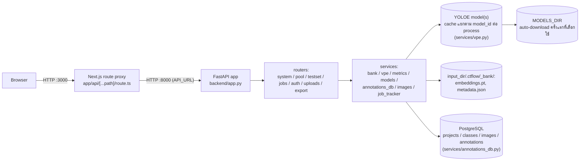

# Label Tool — สถาปัตยกรรมระบบ

## Tech stack

| ชั้น | เทคโนโลยี |
|---|---|
| Frontend | Next.js 15 (App Router) + React 19 + TypeScript — ไม่มี UI/state library เพิ่ม ใช้ `useState`/`useEffect` ล้วน และ CSS แบบ utility class ของตัวเอง (`globals.css`) |
| Backend API | FastAPI (Python) |
| Model / Inference | Ultralytics **YOLOE** ผ่าน `YOLOEVPSegPredictor` (SAVPE) — **เลือก checkpoint ได้จากรายการที่กำหนดไว้ล่วงหน้า** (`services/models.py`) ตั้งแต่ `yoloe-v8s-seg` เล็กสุด ถึง `yoloe-26x-seg` รุ่นล่าสุดและใหญ่สุด ไม่ hardcode ตัวเดียวอีกต่อไป |
| ML runtime | PyTorch — build ด้วย CUDA (`cu126`) เป็นค่าเริ่มต้นใน Docker image, override เป็น CPU ได้ด้วย build arg |
| Background job tracking | dict ในหน่วยความจำ, thread-safe ด้วย `threading.Lock` (`services/job_tracker.py`) |
| การจัดเก็บข้อมูล | **label/box metadata อยู่ใน PostgreSQL** (`services/annotations_db.py`, T-21) — prompt bank (`embeddings.pt` torch pickle + `metadata.json`) ยังเป็นไฟล์เหมือนเดิม ดูหัวข้อ "รูปแบบการจัดเก็บข้อมูล" ด้านล่าง |
| การป้องกันการเขียนชนกัน | DB: row lock บนแถว `projects` ตอนสร้างคลาสใหม่ (`annotations_db._get_or_create_class`) · ไฟล์ (prompt bank เท่านั้น): `filelock.FileLock` บน `_bank/.lock` |
| Containerization | Docker Compose (3 services: `db`, `api`, `web`) |
| การเชื่อม Frontend↔Backend | Next.js runtime API route (`app/api/[...path]/route.ts`) proxy ทุก request ไปยัง FastAPI |

## System diagram

Browser ไม่เคยคุยกับ FastAPI โดยตรง — คุยผ่าน Next.js proxy เท่านั้น จึงไม่ต้องตั้งค่า CORS ฝั่ง frontend และไม่มี `NEXT_PUBLIC_*` env var ที่ต้องซิงก์ข้ามการ deploy

## การไหลของข้อมูล (data flow) ต่อ workflow หลัก

- **Label flow** (`POST /api/label`): ตรวจ/ล็อก `model_id` ผ่าน `bank.lock_model()` ก่อน (ดูหัวข้อ "การเลือกโมเดล" ด้านล่าง) → ภาพ + กล่อง → crop ตามกล่อง → `vpe.extract_embedding()` (หนึ่ง embedding ต่อคลาสต่อการบันทึกหนึ่งครั้ง โดยเฉลี่ยจากทุกกล่องของคลาสนั้นในภาพเดียวกัน) → `bank.add()` บันทึก embedding + ที่มาลงไฟล์ (`_bank/`) → `annotations_db.write_boxes()` เขียนกล่องลง PostgreSQL → `annotations_db.mark_labeled()`
- **Score flow** (`POST /api/score`, background job): โหลด `bank.mean_vpe()` → `vpe.arm()` เซ็ต classes บนโมเดลครั้งเดียว → รัน `predict_one(conf=0.05)` ทีละภาพในพูล → เก็บ detection ที่ confidence สูงสุดต่อภาพ
- **Evaluate flow** (`POST /api/evaluate`, background job): โหลด ground truth จาก PostgreSQL (`metrics.load_ground_truth_db` → `annotations_db.load_annotations(input_dir, "testset")`, พิกัดพิกเซลอยู่ในตารางแล้ว ไม่ต้องอ่านภาพเพื่อ denormalize) → รันโมเดล arm แล้ว predict ทุกภาพใน test set → จับคู่ prediction กับ ground truth แบบ greedy ที่ IoU ≥ 0.5 → คำนวณ precision/recall/F1 ทั้งรวมและต่อคลาส
- **Auto-label flow** (`POST /api/autolabel`, background job): arm โมเดลจาก bank ปัจจุบัน → predict ทุกภาพที่เหลือ → `annotations_db.write_boxes()` เฉพาะภาพที่มี detection → `annotations_db.mark_auto()` เฉพาะภาพที่เขียนป้ายจริง

Job ทั้งสามตัว (`score`, `evaluate`, `autolabel`) ใช้สัญญาสัญญาเดียวกัน: สร้าง job ผ่าน `job_tracker.create(total)` → รันเป็น FastAPI `BackgroundTasks` → ฝั่ง frontend poll `GET /api/jobs/{id}` ทุก 400ms จนกว่า `finished`

## การเลือกโมเดล

`services/models.py` เป็น static catalog ของ YOLOE checkpoint ที่เลือกได้ (`yoloe-v8{s,m,l}-seg`, `yoloe-11{s,m,l}-seg`, `yoloe-26{n,s,m,l,x}-seg` — เฉพาะรุ่นที่รับ visual prompt ได้จริง, ไม่รวม `-pf` ที่เป็น prompt-free) `GET /api/config` ส่งรายการนี้ให้ frontend แสดงเป็น dropdown

**กติกาที่สำคัญที่สุด: embedding จากโมเดลคนละตัวใช้แทนกันไม่ได้** เพราะ SAVPE head ของแต่ละ checkpoint ให้ vector space คนละอัน ผสมกันแล้ว `set_classes()` จะพังหรือให้ผลผิด ระบบจึงล็อกโมเดลไว้ที่ระดับ bank เหมือนกับที่ล็อก class index:

- `Bank.model` เก็บใน `metadata.json`, เป็น `null` จนกว่าจะมี embedding แรกเข้า bank
- `Bank.lock_model(model_id)` ตั้งค่าตอน embedding แรก แล้วปฏิเสธ (`ValueError` → HTTP 409) ทุกครั้งที่ภายหลังมีการส่ง `model_id` อื่นเข้ามา
- `services/vpe.py` เก็บ model instance แยก dict ต่อ `model_id` (ไม่ใช่ singleton ตัวเดียวเหมือนก่อนหน้านี้) — เปิดสองโปรเจกต์ (สอง `input_dir`) ที่ใช้คนละโมเดลพร้อมกันได้ในหนึ่ง process แต่ VRAM จะโตตามจำนวนโมเดลที่เคยถูกเรียกใช้ (มีคอมเมนต์ `ponytail:` กำกับไว้ว่ายังไม่มี eviction)
- `/api/predict`, `/api/score`, `/api/evaluate`, `/api/autolabel` **ไม่รับ `model_id` จาก client** — อ่านจาก `bank.model` ที่ backend เท่านั้น กัน mismatch ระหว่างสิ่งที่ผู้ใช้เห็นกับสิ่งที่ bank ถูกสอนมาจริง

## รูปแบบการจัดเก็บข้อมูล (storage format)

**T-21 (2026-08-21):** label/box metadata ทั้งหมดย้ายจากไฟล์ YOLO txt ไปตาราง PostgreSQL แล้ว — เหตุผลและ scope เต็มอยู่ที่ [DB_MIGRATION_PLAN.md](./DB_MIGRATION_PLAN.md) แรงจูงใจหลักคือรองรับหลายคนแก้ project เดียวกันพร้อมกันจริง (row lock ระดับ transaction แทน `filelock` ทั้งไฟล์) เตรียมทางสำหรับ login + workspace แบบ Label Studio ในอนาคต

- **ตาราง PostgreSQL (`schema.sql`, `services/annotations_db.py`):**
  - `projects` — หนึ่งแถวต่อ `input_dir` หนึ่งโฟลเดอร์ (ยังไม่มีแนวคิด workspace/multi-tenant จริง แค่เตรียม `id` ไว้ให้ระบบ user/workspace ในอนาคตอ้างอิงได้)
  - `classes` — index → ชื่อคลาส **append-only เสมอ ห้ามเรียงใหม่หรือลบ** (แทน `classes.txt` เดิม) แยก index space ระหว่าง `kind='pool'` กับ `kind='testset'` คนละชุดกัน สร้างคลาสใหม่ผ่าน `annotations_db._get_or_create_class()` ซึ่งล็อกแถว `projects` ก่อนคำนวณ index ถัดไป กันสองคนสร้างคลาสใหม่ชนกัน (แทนที่ `filelock` เดิมที่ใช้จุดประสงค์เดียวกันตอนยังเป็นไฟล์)
  - `images` — หนึ่งแถวต่อ `(project, kind, path)` มีคอลัมน์ `status` (`unlabeled`/`labeled`/`auto`) แทนที่ `bank.labeled`/`bank.auto` เดิม
  - `annotations` — หนึ่งแถวต่อกล่อง พิกัดพิกเซล `x1,y1,x2,y2` ตรงกับ Box model ใน API_REFERENCE.md ทุกประการ (ไม่ normalize เหมือน YOLO txt เดิมอีกต่อไป — export ค่อยแปลงตอนขาออก) มี `created_by` สำหรับ audit ในอนาคต
- **Prompt bank (`<input_dir>/.ctflow/_bank/`, ดู `deps.state_dir()`) — ยังเป็นไฟล์เหมือนเดิม ไม่อยู่ใน scope ของ T-21:**
  - `embeddings.pt` — dict ที่ `torch.save` แล้ว: `{ชื่อคลาส: [Tensor, Tensor, ...]}` หนึ่ง tensor ต่อหนึ่ง instance ที่ label ด้วยมือ
  - `metadata.json` — `{"instances": {ชื่อคลาส: [{source_image, bbox, added_at, labeled_by}]}, "model": "yoloe-11s-seg" | null}` (ตัด `labeled`/`auto` ออกแล้ว ย้ายไปเป็น `images.status` ใน DB)
  - `.lock` — ไฟล์ `FileLock` กันการเขียนชนกัน (เฉพาะไฟล์ prompt bank เท่านั้น)
  - **`Bank.classes` (คุณสมบัติของ `services/bank.py`) ไม่ได้อ่านจาก DB** — ยังเป็น `list(self.embeddings.keys())` เหมือนเดิม เพราะมันตอบคำถาม "บอทสอนคลาสนี้จาก embedding หรือยัง" ซึ่งเป็นคนละเรื่องกับ "DB มีคลาสนี้ในตาราง label หรือยัง" (ดูเหตุผลเต็มที่ DB_MIGRATION_PLAN.md หัวข้อ 10)
- **Test set:** ภาพในพูลที่ถูกแปะป้ายเป็น test set คือแถว `images` ที่ `kind='testset'` ใช้ `path` เดียวกับแถว `kind='pool'` — **ไม่คัดลอกไฟล์ภาพ** เหมือนพฤติกรรมเดิม `POST /api/label`/`POST /api/relabel` เช็ค `annotations_db.is_test()` และปฏิเสธด้วย `400` ถ้าภาพที่ส่งมาถูกแปะป้ายเป็น test set ไว้ (มี assertion ตรวจสอบใน `_smoke_test.py`)
- **Export (`GET /api/export`, T-24, `routers/export.py`):** อ่านจาก DB แล้วแปลงเป็น YOLO (zip ของ `labels/*.txt` + `classes.txt`), COCO (JSON เดียว), หรือ Pascal VOC (zip ของ XML) — เลือกได้ทั้งจากพูลหรือ test set (`kind=pool|testset`) ไม่มี state ใด ๆ เขียนกลับ เป็น pure read
- **การ retire `groundtruth.py`/`yolo_labels.py`:** สองไฟล์นี้ **ไม่ได้ถูกลบ** แม้จะไม่ถูกเรียกจาก router ไหนอีกต่อไปแล้ว — `backend/_experiment_conf.py` (สคริปต์ทดลอง T-01) ยังใช้ `metrics.load_ground_truth()` (เวอร์ชันไฟล์เดิม ผ่าน `groundtruth.py`) อ่านโฟลเดอร์ YOLO ดิบที่ไม่ใช่ `.ctflow` project เลย จึงต้องคงไว้

## การ deploy

Docker Compose มี 3 services:

| service | build context | หน้าที่ | พอร์ต | ขึ้นกับ |
|---|---|---|---|---|
| `db` | — (image `postgres:16-alpine` สำเร็จรูป) | label/box metadata (T-21), healthcheck ด้วย `pg_isready` ทุก 5s, ข้อมูล persist ใน named volume `pgdata` | ไม่ expose ออก host | — |
| `api` | `label_tool/` (repo นี้เอง) | FastAPI backend, healthcheck ที่ `GET /api/config` ทุก 15s, ขอ GPU ผ่าน `deploy.reservations.devices` | ไม่ expose ออก host (คุยผ่าน network ภายในเท่านั้น) | รอ `db` healthy ก่อน |
| `web` | `label_tool/` — ต้องเข้าถึง `certs/` | Next.js frontend (`output: "standalone"`) | `${WEB_PORT:-3000}` | รอ `api` healthy ก่อน |

ทั้งสอง service ใช้ build context เดียวกัน (`label_tool/`) ตั้งแต่ที่เอาการพึ่งพา `poc/yoloe-11s-seg.pt` ของฝั่ง `api` ออก — น้ำหนักโมเดลไม่ต้อง bake เข้า image อีกต่อไป ดาวน์โหลดครั้งแรกที่ถูกเลือกใช้แล้วเก็บไว้ใน named volume `models` แทน (ดูหัวข้อ "การเลือกโมเดล" ด้านบน) ทำให้ repo นี้ไม่ต้องพึ่งพาโฟลเดอร์นอก repo อีกต่อไปสำหรับการ build

Environment variables หลัก:

| env | default | ความหมาย |
|---|---|---|
| `DATA_DIR` | `../data` | โฟลเดอร์บนเครื่อง host ที่ mount เข้า `/opt/mount/project` ใน container `api` |
| `WEB_PORT` | `3000` | พอร์ตที่ UI เปิดให้ใช้งาน |
| `LABEL_TOOL_MODE` | `vm` เมื่อรันใน Docker | `vm` = จำกัดการ browse ไว้แค่ `LABEL_TOOL_VM_ROOT`, `local` = browse ได้ทุก drive (สำหรับรันนอก Docker บนเครื่องตัวเอง) |
| `LABEL_TOOL_VM_ROOT` | `/opt/mount/project` | รากของขอบเขตที่ยอมให้เข้าถึงใน `vm` mode |
| `MODELS_DIR` | `/models` (Docker) / `label_tool/models` (นอก Docker) | โฟลเดอร์เก็บ checkpoint ที่ดาวน์โหลดมาแล้ว — ใน Docker คือ named volume `models` |
| `POSTGRES_PASSWORD` | — (ต้องตั้งเอง ไม่มี default) | รหัสผ่านของ service `db` — `docker-compose.yml` ปฏิเสธ start ถ้าไม่ได้ตั้งใน `.env` |
| `DATABASE_URL` | `postgresql://labeltool:${POSTGRES_PASSWORD}@db:5432/labeltool` (ตั้งให้อัตโนมัติใน compose) | connection string ที่ `services/db.py` ใช้ — override ได้ตอนรันนอก Docker (เช่น ชี้ไปที่ Postgres local) |

**Path safety:** ทุก path ที่ browser ส่งมาต้องผ่าน `deps.checked_path()` ซึ่งเรียก `config.path_allowed()` — ใน `vm` mode จะปฏิเสธ path ที่ resolve ออกนอก `VM_DATA_ROOT` ด้วย HTTP 403 ส่วนใน `local` mode ยอมทุก path เพราะถือว่าเป็นเครื่องส่วนตัวของผู้ใช้เอง

**ปัญหา TLS ตอน build:** ทั้งสอง Dockerfile มีขั้นตอน copy root certificate จาก `label_tool/certs/*.crt` เข้า system CA bundle ก่อน `pip install`/`npm ci` — เป็นทางแก้สำหรับเครื่องพัฒนาที่อยู่หลัง proxy ตรวจสอบ TLS ขององค์กร (พบไฟล์ `avg-web-shield.crt` จริงในโฟลเดอร์ `certs/`) ไม่เกี่ยวกับการเสิร์ฟแอปผ่าน HTTPS ตอนรันจริงแต่อย่างใด — **แอปนี้ไม่มี HTTPS ในตัวเอง**

## ข้อจำกัดด้าน scalability ปัจจุบัน

- **Job tracker อยู่ในหน่วยความจำของ process เดียว.** `job_tracker.py` เก็บ progress เป็น dict เดียวไม่มีการลบทิ้ง (TTL) และไม่ persist ข้าม restart — ใช้ได้ดีกับ uvicorn worker เดียวและผู้ใช้จำนวนน้อย แต่ไม่รองรับหลาย worker หรือการ scale แนวนอน (โค้ดมีคอมเมนต์ `ponytail:` ระบุไว้ตรงนี้ว่าต้องเปลี่ยนเป็น Redis/TTL eviction ถ้าจะรองรับ traffic จริง)
- **โมเดลโหลดต่อ `model_id` ต่อ process** ผ่าน dict ระดับ module (`_models`/`_predictors` ใน `services/vpe.py`) ไม่ใช่ singleton ตัวเดียวอีกต่อไปตั้งแต่รองรับหลายโมเดล — เหมาะกับ 1 worker และโมเดลไม่กี่ตัวต่อการรัน แต่ (ก) ถ้ารันหลาย worker แต่ละตัวโหลดซ้ำ ใช้ RAM/VRAM คูณตามจำนวน worker เหมือนเดิม และ (ข) ยังไม่มีการปลดโมเดลที่ไม่ได้ใช้แล้วออกจาก VRAM — สลับไปสอนหลาย output_dir ที่ใช้คนละโมเดลในโปรเซสเดียวนานๆ จะสะสม VRAM โดยไม่มีเพดาน (มีคอมเมนต์ `ponytail:` กำกับจุดนี้ไว้)
- **GPU (CUDA) โดย default** — Dockerfile ติดตั้ง PyTorch จาก `--extra-index-url https://download.pytorch.org/whl/cu126` และ `docker-compose.yml` ขอ GPU ผ่าน `deploy.resources.reservations.devices` (ต้องมี NVIDIA GPU + driver + NVIDIA Container Toolkit บน host) ไม่มี GPU ก็ build แบบ CPU ได้ด้วย `--build-arg TORCH_INDEX_URL=.../whl/cpu` โดยไม่ต้องแก้ Dockerfile
- **CORS เปิดกว้างทุก origin** (`allow_origins=["*"]` ใน `app.py`) ยอมรับได้ในสถาปัตยกรรมปัจจุบันเพราะ browser คุยผ่าน Next.js proxy เท่านั้น ไม่เคยยิงตรงมาที่ FastAPI จาก origin ภายนอก
- **Container `api` ไม่รันเป็น root แล้ว** — `ARG APP_UID` + `useradd`/`USER app` ใน Dockerfile (NFR-07) ต้องตั้ง `--build-arg APP_UID=$(id -u)` ให้ตรงกับเจ้าของ `DATA_DIR` บน Linux host มิฉะนั้นเขียนไฟล์ไม่ได้
- ~~**Label storage เขียนชนกันได้ถ้าหลายคนแก้ project เดียวกันพร้อมกัน**~~ **แก้แล้ว (T-21)** — ย้ายไป PostgreSQL, row lock ระดับ transaction แทน `filelock` ทั้งไฟล์ (ดูหัวข้อ "รูปแบบการจัดเก็บข้อมูล" ด้านบน) — คอขวดที่เหลือคือ job tracker กับโมเดลใน VRAM สองข้อด้านบน ไม่ใช่ label storage อีกต่อไป

**Bottom line:** ระบบนี้ออกแบบมาสำหรับผู้ใช้จำนวนน้อยต่อ instance เดียวบนเซิร์ฟเวอร์ภายใน ไม่ใช่สถาปัตยกรรมที่พร้อม scale แนวนอนหรือรองรับผู้ใช้พร้อมกันจำนวนมาก จุดคอขวดหลักคือ job tracker และโมเดลที่ผูกกับหน่วยความจำของ process เดียว — ดูรายการข้อจำกัดเชิงปฏิบัติการเพิ่มเติมใน [PROJECT_STATUS.md](./PROJECT_STATUS.md)
