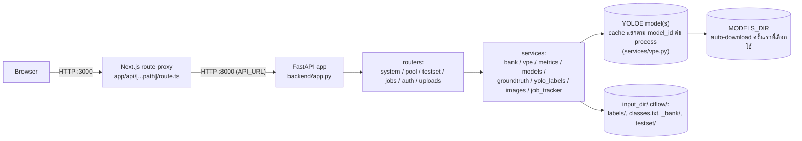

# Label Tool — สถาปัตยกรรมระบบ

## Tech stack

| ชั้น | เทคโนโลยี |
|---|---|
| Frontend | Next.js 15 (App Router) + React 19 + TypeScript — ไม่มี UI/state library เพิ่ม ใช้ `useState`/`useEffect` ล้วน และ CSS แบบ utility class ของตัวเอง (`globals.css`) |
| Backend API | FastAPI (Python) |
| Model / Inference | Ultralytics **YOLOE** ผ่าน `YOLOEVPSegPredictor` (SAVPE) — **เลือก checkpoint ได้จากรายการที่กำหนดไว้ล่วงหน้า** (`services/models.py`) ตั้งแต่ `yoloe-v8s-seg` เล็กสุด ถึง `yoloe-26x-seg` รุ่นล่าสุดและใหญ่สุด ไม่ hardcode ตัวเดียวอีกต่อไป |
| ML runtime | PyTorch — build ด้วย CUDA (`cu126`) เป็นค่าเริ่มต้นใน Docker image, override เป็น CPU ได้ด้วย build arg |
| Background job tracking | dict ในหน่วยความจำ, thread-safe ด้วย `threading.Lock` (`services/job_tracker.py`) |
| การจัดเก็บข้อมูล | ระบบไฟล์ล้วน: ป้าย YOLO txt, `embeddings.pt` (torch pickle), `metadata.json` |
| การป้องกันการเขียนชนกัน | `filelock.FileLock` บน `_bank/.lock` |
| Containerization | Docker Compose (2 services: `api`, `web`) |
| การเชื่อม Frontend↔Backend | Next.js runtime API route (`app/api/[...path]/route.ts`) proxy ทุก request ไปยัง FastAPI |

## System diagram

Browser ไม่เคยคุยกับ FastAPI โดยตรง — คุยผ่าน Next.js proxy เท่านั้น จึงไม่ต้องตั้งค่า CORS ฝั่ง frontend และไม่มี `NEXT_PUBLIC_*` env var ที่ต้องซิงก์ข้ามการ deploy

## การไหลของข้อมูล (data flow) ต่อ workflow หลัก

- **Label flow** (`POST /api/label`): ตรวจ/ล็อก `model_id` ผ่าน `bank.lock_model()` ก่อน (ดูหัวข้อ "การเลือกโมเดล" ด้านล่าง) → ภาพ + กล่อง → crop ตามกล่อง → `vpe.extract_embedding()` (หนึ่ง embedding ต่อคลาสต่อการบันทึกหนึ่งครั้ง โดยเฉลี่ยจากทุกกล่องของคลาสนั้นในภาพเดียวกัน) → `bank.add()` บันทึก embedding + ที่มา → `bank.mark_labeled()` → เขียนไฟล์ label YOLO format ลงดิสก์
- **Score flow** (`POST /api/score`, background job): โหลด `bank.mean_vpe()` → `vpe.arm()` เซ็ต classes บนโมเดลครั้งเดียว → รัน `predict_one(conf=0.05)` ทีละภาพในพูล → เก็บ detection ที่ confidence สูงสุดต่อภาพ
- **Evaluate flow** (`POST /api/evaluate`, background job): โหลด ground truth จาก `<input_dir>/.ctflow/testset/` โดยอ่านรายชื่อภาพจาก manifest ไม่ใช่ `iterdir()` (`metrics.load_ground_truth` → `groundtruth.list_test_images`) → รันโมเดล arm แล้ว predict ทุกภาพใน test set → จับคู่ prediction กับ ground truth แบบ greedy ที่ IoU ≥ 0.5 → คำนวณ precision/recall/F1 ทั้งรวมและต่อคลาส
- **Auto-label flow** (`POST /api/autolabel`, background job): arm โมเดลจาก bank ปัจจุบัน → predict ทุกภาพที่เหลือ → เขียนไฟล์ label เฉพาะภาพที่มี detection → `bank.mark_auto()` เฉพาะภาพที่เขียนป้ายจริง

Job ทั้งสามตัว (`score`, `evaluate`, `autolabel`) ใช้สัญญาสัญญาเดียวกัน: สร้าง job ผ่าน `job_tracker.create(total)` → รันเป็น FastAPI `BackgroundTasks` → ฝั่ง frontend poll `GET /api/jobs/{id}` ทุก 400ms จนกว่า `finished`

## การเลือกโมเดล

`services/models.py` เป็น static catalog ของ YOLOE checkpoint ที่เลือกได้ (`yoloe-v8{s,m,l}-seg`, `yoloe-11{s,m,l}-seg`, `yoloe-26{n,s,m,l,x}-seg` — เฉพาะรุ่นที่รับ visual prompt ได้จริง, ไม่รวม `-pf` ที่เป็น prompt-free) `GET /api/config` ส่งรายการนี้ให้ frontend แสดงเป็น dropdown

**กติกาที่สำคัญที่สุด: embedding จากโมเดลคนละตัวใช้แทนกันไม่ได้** เพราะ SAVPE head ของแต่ละ checkpoint ให้ vector space คนละอัน ผสมกันแล้ว `set_classes()` จะพังหรือให้ผลผิด ระบบจึงล็อกโมเดลไว้ที่ระดับ bank เหมือนกับที่ล็อก class index:

- `Bank.model` เก็บใน `metadata.json`, เป็น `null` จนกว่าจะมี embedding แรกเข้า bank
- `Bank.lock_model(model_id)` ตั้งค่าตอน embedding แรก แล้วปฏิเสธ (`ValueError` → HTTP 409) ทุกครั้งที่ภายหลังมีการส่ง `model_id` อื่นเข้ามา
- `services/vpe.py` เก็บ model instance แยก dict ต่อ `model_id` (ไม่ใช่ singleton ตัวเดียวเหมือนก่อนหน้านี้) — เปิดสองโปรเจกต์ (สอง `input_dir`) ที่ใช้คนละโมเดลพร้อมกันได้ในหนึ่ง process แต่ VRAM จะโตตามจำนวนโมเดลที่เคยถูกเรียกใช้ (มีคอมเมนต์ `ponytail:` กำกับไว้ว่ายังไม่มี eviction)
- `/api/predict`, `/api/score`, `/api/evaluate`, `/api/autolabel` **ไม่รับ `model_id` จาก client** — อ่านจาก `bank.model` ที่ backend เท่านั้น กัน mismatch ระหว่างสิ่งที่ผู้ใช้เห็นกับสิ่งที่ bank ถูกสอนมาจริง

## รูปแบบการจัดเก็บข้อมูล (storage format)

- **ป้าย (labels):** มาตรฐาน YOLO txt — `labels/<stem>.txt` หนึ่งบรรทัดต่อกล่อง `<class_idx> <cx> <cy> <w> <h>` ปรับสเกล 0–1 เทียบกับขนาดภาพ
- **`classes.txt`:** index → ชื่อคลาส (บรรทัดที่ N = index N) เป็น **append-only เสมอ ห้ามเรียงใหม่หรือลบ** เพราะไฟล์ label ทุกไฟล์อ้างอิงด้วย index ตำแหน่งนี้ ทั้ง `bank.py` (คุณสมบัติ `classes`) และ `groundtruth.write_label` ยึดกติกานี้เหมือนกัน
- **Project state (`<input_dir>/.ctflow/`, ดู `deps.state_dir()`):** subfolder เดียวที่ backend สร้างเองใต้โฟลเดอร์ภาพที่ผู้ใช้เลือก — ไม่มี output folder ให้เลือกแยกอีกต่อไป
  - **Prompt bank (`_bank/`):**
    - `embeddings.pt` — dict ที่ `torch.save` แล้ว: `{ชื่อคลาส: [Tensor, Tensor, ...]}` หนึ่ง tensor ต่อหนึ่ง instance ที่ label ด้วยมือ
    - `metadata.json` — `{"instances": {ชื่อคลาส: [{source_image, bbox, added_at, labeled_by}]}, "labeled": [...], "auto": [...], "model": "yoloe-11s-seg" | null}`
    - `.lock` — ไฟล์ `FileLock` กันการเขียนชนกัน
  - **Test set (`testset/`, ดู `deps.test_dir()` และ `services/groundtruth.py`):** `testset.json` เก็บ path ของภาพในพูลที่ถูกแปะป้ายเป็น test set — **ไม่คัดลอกไฟล์ภาพ**, path เดียวกับในพูลเป๊ะ ๆ ใช้ convention `labels/*.txt` + `classes.txt` เดียวกับ bank ของพูล แต่ **ไม่มีโฟลเดอร์ `_bank/` เลย** — เป็นการบังคับว่าภาพ test set ต้องไม่ถูกป้อนเป็น prompt เด็ดขาด นอกจากนี้ `POST /api/label`/`POST /api/relabel` ยังเช็ค `groundtruth.is_test()` และปฏิเสธด้วย `400` ถ้าภาพที่ส่งมาถูกแปะป้ายเป็น test set ไว้ (มี assertion ตรวจสอบทั้งสองชั้นใน `_smoke_test.py`)

## การ deploy

Docker Compose มี 2 services:

| service | build context | หน้าที่ | พอร์ต | ขึ้นกับ |
|---|---|---|---|---|
| `api` | `label_tool/` (repo นี้เอง) | FastAPI backend, healthcheck ที่ `GET /api/config` ทุก 15s, ขอ GPU ผ่าน `deploy.reservations.devices` | ไม่ expose ออก host (คุยผ่าน network ภายในเท่านั้น) | — |
| `web` | `label_tool/` — ต้องเข้าถึง `certs/` | Next.js frontend (`output: "standalone"`) | `${WEB_PORT:-3000}` | รอ `api` healthy ก่อน |

ทั้งสอง service ใช้ build context เดียวกัน (`label_tool/`) ตั้งแต่ที่เอาการพึ่งพา `poc/yoloe-11s-seg.pt` ของฝั่ง `api` ออก — น้ำหนักโมเดลไม่ต้อง bake เข้า image อีกต่อไป ดาวน์โหลดครั้งแรกที่ถูกเลือกใช้แล้วเก็บไว้ใน named volume `models` แทน (ดูหัวข้อ "การเลือกโมเดล" ด้านบน) ทำให้ repo นี้ไม่ต้องพึ่งพาโฟลเดอร์นอก repo อีกต่อไปสำหรับการ build

Environment variables หลัก:

| env | default | ความหมาย |
|---|---|---|
| `DATA_DIR` | `../data` | โฟลเดอร์บนเครื่อง host ที่ mount เข้า `/data` ใน container `api` |
| `WEB_PORT` | `3000` | พอร์ตที่ UI เปิดให้ใช้งาน |
| `LABEL_TOOL_MODE` | `vm` เมื่อรันใน Docker | `vm` = จำกัดการ browse ไว้แค่ `LABEL_TOOL_VM_ROOT`, `local` = browse ได้ทุก drive (สำหรับรันนอก Docker บนเครื่องตัวเอง) |
| `LABEL_TOOL_VM_ROOT` | `/data` | รากของขอบเขตที่ยอมให้เข้าถึงใน `vm` mode |
| `MODELS_DIR` | `/models` (Docker) / `label_tool/models` (นอก Docker) | โฟลเดอร์เก็บ checkpoint ที่ดาวน์โหลดมาแล้ว — ใน Docker คือ named volume `models` |

**Path safety:** ทุก path ที่ browser ส่งมาต้องผ่าน `deps.checked_path()` ซึ่งเรียก `config.path_allowed()` — ใน `vm` mode จะปฏิเสธ path ที่ resolve ออกนอก `VM_DATA_ROOT` ด้วย HTTP 403 ส่วนใน `local` mode ยอมทุก path เพราะถือว่าเป็นเครื่องส่วนตัวของผู้ใช้เอง

**ปัญหา TLS ตอน build:** ทั้งสอง Dockerfile มีขั้นตอน copy root certificate จาก `label_tool/certs/*.crt` เข้า system CA bundle ก่อน `pip install`/`npm ci` — เป็นทางแก้สำหรับเครื่องพัฒนาที่อยู่หลัง proxy ตรวจสอบ TLS ขององค์กร (พบไฟล์ `avg-web-shield.crt` จริงในโฟลเดอร์ `certs/`) ไม่เกี่ยวกับการเสิร์ฟแอปผ่าน HTTPS ตอนรันจริงแต่อย่างใด — **แอปนี้ไม่มี HTTPS ในตัวเอง**

## แผนงานที่วางไว้ (ยังไม่ implement)

**ย้าย label/box storage จากไฟล์ YOLO txt ไป PostgreSQL** — ตกลงกับทีมแล้ว (2026-08-21) เพื่อรองรับหลายคนแก้ project เดียวกันพร้อมกันจริง (เตรียมทางสำหรับ login + workspace แบบ Label Studio ในอนาคต) พร้อมเพิ่ม export ที่เลือก format ได้ (YOLO/COCO/VOC) — **scope เฉพาะ `labels/*.txt`, `classes.txt`, `testset.json`, และสถานะ `labeled`/`auto`** เท่านั้น `_bank/embeddings.pt` และ `_bank/metadata.json`'s `instances`/`model` ยังเป็นไฟล์เหมือนเดิม (ไม่มี pain point ที่ DB จะแก้ให้ตรงนั้น) ยังไม่มีโค้ดไหนถูกแก้ — ดูแผนแบบละเอียด (schema, concurrency, migration, ผลกระทบต่อ `bank.py`/`yolo_labels.py`/`groundtruth.py`) ที่ [DB_MIGRATION_PLAN.md](./DB_MIGRATION_PLAN.md)

## ข้อจำกัดด้าน scalability ปัจจุบัน

- **Job tracker อยู่ในหน่วยความจำของ process เดียว.** `job_tracker.py` เก็บ progress เป็น dict เดียวไม่มีการลบทิ้ง (TTL) และไม่ persist ข้าม restart — ใช้ได้ดีกับ uvicorn worker เดียวและผู้ใช้จำนวนน้อย แต่ไม่รองรับหลาย worker หรือการ scale แนวนอน (โค้ดมีคอมเมนต์ `ponytail:` ระบุไว้ตรงนี้ว่าต้องเปลี่ยนเป็น Redis/TTL eviction ถ้าจะรองรับ traffic จริง)
- **โมเดลโหลดต่อ `model_id` ต่อ process** ผ่าน dict ระดับ module (`_models`/`_predictors` ใน `services/vpe.py`) ไม่ใช่ singleton ตัวเดียวอีกต่อไปตั้งแต่รองรับหลายโมเดล — เหมาะกับ 1 worker และโมเดลไม่กี่ตัวต่อการรัน แต่ (ก) ถ้ารันหลาย worker แต่ละตัวโหลดซ้ำ ใช้ RAM/VRAM คูณตามจำนวน worker เหมือนเดิม และ (ข) ยังไม่มีการปลดโมเดลที่ไม่ได้ใช้แล้วออกจาก VRAM — สลับไปสอนหลาย output_dir ที่ใช้คนละโมเดลในโปรเซสเดียวนานๆ จะสะสม VRAM โดยไม่มีเพดาน (มีคอมเมนต์ `ponytail:` กำกับจุดนี้ไว้)
- **GPU (CUDA) โดย default** — Dockerfile ติดตั้ง PyTorch จาก `--extra-index-url https://download.pytorch.org/whl/cu126` และ `docker-compose.yml` ขอ GPU ผ่าน `deploy.resources.reservations.devices` (ต้องมี NVIDIA GPU + driver + NVIDIA Container Toolkit บน host) ไม่มี GPU ก็ build แบบ CPU ได้ด้วย `--build-arg TORCH_INDEX_URL=.../whl/cpu` โดยไม่ต้องแก้ Dockerfile
- **CORS เปิดกว้างทุก origin** (`allow_origins=["*"]` ใน `app.py`) ยอมรับได้ในสถาปัตยกรรมปัจจุบันเพราะ browser คุยผ่าน Next.js proxy เท่านั้น ไม่เคยยิงตรงมาที่ FastAPI จาก origin ภายนอก
- **Container `api` ไม่รันเป็น root แล้ว** — `ARG APP_UID` + `useradd`/`USER app` ใน Dockerfile (NFR-07) ต้องตั้ง `--build-arg APP_UID=$(id -u)` ให้ตรงกับเจ้าของ `DATA_DIR` บน Linux host มิฉะนั้นเขียนไฟล์ไม่ได้

**Bottom line:** ระบบนี้ออกแบบมาสำหรับผู้ใช้จำนวนน้อยต่อ instance เดียวบนเซิร์ฟเวอร์ภายใน ไม่ใช่สถาปัตยกรรมที่พร้อม scale แนวนอนหรือรองรับผู้ใช้พร้อมกันจำนวนมาก จุดคอขวดหลักคือ job tracker และโมเดลที่ผูกกับหน่วยความจำของ process เดียว — ดูรายการข้อจำกัดเชิงปฏิบัติการเพิ่มเติมใน [PROJECT_STATUS.md](./PROJECT_STATUS.md)
