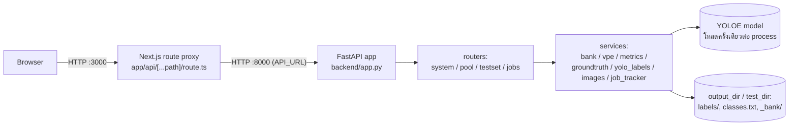

# Label Tool — สถาปัตยกรรมระบบ

## Tech stack

| ชั้น | เทคโนโลยี |
|---|---|
| Frontend | Next.js 15 (App Router) + React 19 + TypeScript — ไม่มี UI/state library เพิ่ม ใช้ `useState`/`useEffect` ล้วน และ CSS แบบ utility class ของตัวเอง (`globals.css`) |
| Backend API | FastAPI (Python) |
| Model / Inference | Ultralytics **YOLOE** (น้ำหนัก `yoloe-11s-seg.pt`) ผ่าน `YOLOEVPSegPredictor` (SAVPE) |
| ML runtime | PyTorch — build CPU-only ใน Docker image |
| Background job tracking | dict ในหน่วยความจำ, thread-safe ด้วย `threading.Lock` (`services/job_tracker.py`) |
| การจัดเก็บข้อมูล | ระบบไฟล์ล้วน: ป้าย YOLO txt, `embeddings.pt` (torch pickle), `metadata.json` |
| การป้องกันการเขียนชนกัน | `filelock.FileLock` บน `_bank/.lock` |
| Containerization | Docker Compose (2 services: `api`, `web`) |
| การเชื่อม Frontend↔Backend | Next.js runtime API route (`app/api/[...path]/route.ts`) proxy ทุก request ไปยัง FastAPI |

## System diagram

Browser ไม่เคยคุยกับ FastAPI โดยตรง — คุยผ่าน Next.js proxy เท่านั้น จึงไม่ต้องตั้งค่า CORS ฝั่ง frontend และไม่มี `NEXT_PUBLIC_*` env var ที่ต้องซิงก์ข้ามการ deploy

## การไหลของข้อมูล (data flow) ต่อ workflow หลัก

- **Label flow** (`POST /api/label`): ภาพ + กล่อง → crop ตามกล่อง → `vpe.extract_embedding()` (หนึ่ง embedding ต่อคลาสต่อการบันทึกหนึ่งครั้ง โดยเฉลี่ยจากทุกกล่องของคลาสนั้นในภาพเดียวกัน) → `bank.add()` บันทึก embedding + ที่มา → `bank.mark_labeled()` → เขียนไฟล์ label YOLO format ลงดิสก์
- **Score flow** (`POST /api/score`, background job): โหลด `bank.mean_vpe()` → `vpe.arm()` เซ็ต classes บนโมเดลครั้งเดียว → รัน `predict_one(conf=0.05)` ทีละภาพในพูล → เก็บ detection ที่ confidence สูงสุดต่อภาพ
- **Evaluate flow** (`POST /api/evaluate`, background job): โหลด ground truth จาก `test_dir` (`metrics.load_ground_truth`) → รันโมเดล arm แล้ว predict ทุกภาพใน test set → จับคู่ prediction กับ ground truth แบบ greedy ที่ IoU ≥ 0.5 → คำนวณ precision/recall/F1 ทั้งรวมและต่อคลาส
- **Auto-label flow** (`POST /api/autolabel`, background job): arm โมเดลจาก bank ปัจจุบัน → predict ทุกภาพที่เหลือ → เขียนไฟล์ label เฉพาะภาพที่มี detection → `bank.mark_auto()` เฉพาะภาพที่เขียนป้ายจริง

Job ทั้งสามตัว (`score`, `evaluate`, `autolabel`) ใช้สัญญาสัญญาเดียวกัน: สร้าง job ผ่าน `job_tracker.create(total)` → รันเป็น FastAPI `BackgroundTasks` → ฝั่ง frontend poll `GET /api/jobs/{id}` ทุก 400ms จนกว่า `finished`

## รูปแบบการจัดเก็บข้อมูล (storage format)

- **ป้าย (labels):** มาตรฐาน YOLO txt — `labels/<stem>.txt` หนึ่งบรรทัดต่อกล่อง `<class_idx> <cx> <cy> <w> <h>` ปรับสเกล 0–1 เทียบกับขนาดภาพ
- **`classes.txt`:** index → ชื่อคลาส (บรรทัดที่ N = index N) เป็น **append-only เสมอ ห้ามเรียงใหม่หรือลบ** เพราะไฟล์ label ทุกไฟล์อ้างอิงด้วย index ตำแหน่งนี้ ทั้ง `bank.py` (คุณสมบัติ `classes`) และ `groundtruth.write_label` ยึดกติกานี้เหมือนกัน
- **Prompt bank (`_bank/` ใน output_dir):**
  - `embeddings.pt` — dict ที่ `torch.save` แล้ว: `{ชื่อคลาส: [Tensor, Tensor, ...]}` หนึ่ง tensor ต่อหนึ่ง instance ที่ label ด้วยมือ
  - `metadata.json` — `{"instances": {ชื่อคลาส: [{source_image, bbox, added_at}]}, "labeled": [...], "auto": [...]}`
  - `.lock` — ไฟล์ `FileLock` กันการเขียนชนกัน
- **Test set (`<test_dir>/`):** ใช้ convention `labels/*.txt` + `classes.txt` เดียวกับ output_dir ของพูล แต่ **ไม่มีโฟลเดอร์ `_bank/` เลย** — เป็นการบังคับว่าภาพ test set ต้องไม่ถูกป้อนเป็น prompt เด็ดขาด (มี assertion ตรวจสอบเรื่องนี้ใน `_smoke_test.py`)

## การ deploy

Docker Compose มี 2 services:

| service | build context | หน้าที่ | พอร์ต | ขึ้นกับ |
|---|---|---|---|---|
| `api` | root ของ repo (`..`) — ต้องเข้าถึง `poc/yoloe-11s-seg.pt` | FastAPI backend, healthcheck ที่ `GET /api/config` ทุก 15s | ไม่ expose ออก host (คุยผ่าน network ภายในเท่านั้น) | — |
| `web` | `label_tool/` — ต้องเข้าถึง `certs/` | Next.js frontend (`output: "standalone"`) | `${WEB_PORT:-3000}` | รอ `api` healthy ก่อน |

Environment variables หลัก:

| env | default | ความหมาย |
|---|---|---|
| `DATA_DIR` | `../data` | โฟลเดอร์บนเครื่อง host ที่ mount เข้า `/data` ใน container `api` |
| `WEB_PORT` | `3000` | พอร์ตที่ UI เปิดให้ใช้งาน |
| `LABEL_TOOL_MODE` | `vm` เมื่อรันใน Docker | `vm` = จำกัดการ browse ไว้แค่ `LABEL_TOOL_VM_ROOT`, `local` = browse ได้ทุก drive (สำหรับรันนอก Docker บนเครื่องตัวเอง) |
| `LABEL_TOOL_VM_ROOT` | `/data` | รากของขอบเขตที่ยอมให้เข้าถึงใน `vm` mode |
| `MODEL_PATH` | `/models/yoloe-11s-seg.pt` | น้ำหนักโมเดลที่ bake เข้า image `api` |

**Path safety:** ทุก path ที่ browser ส่งมาต้องผ่าน `deps.checked_path()` ซึ่งเรียก `config.path_allowed()` — ใน `vm` mode จะปฏิเสธ path ที่ resolve ออกนอก `VM_DATA_ROOT` ด้วย HTTP 403 ส่วนใน `local` mode ยอมทุก path เพราะถือว่าเป็นเครื่องส่วนตัวของผู้ใช้เอง

**ปัญหา TLS ตอน build:** ทั้งสอง Dockerfile มีขั้นตอน copy root certificate จาก `label_tool/certs/*.crt` เข้า system CA bundle ก่อน `pip install`/`npm ci` — เป็นทางแก้สำหรับเครื่องพัฒนาที่อยู่หลัง proxy ตรวจสอบ TLS ขององค์กร (พบไฟล์ `avg-web-shield.crt` จริงในโฟลเดอร์ `certs/`) ไม่เกี่ยวกับการเสิร์ฟแอปผ่าน HTTPS ตอนรันจริงแต่อย่างใด — **แอปนี้ไม่มี HTTPS ในตัวเอง**

## ข้อจำกัดด้าน scalability ปัจจุบัน

- **Job tracker อยู่ในหน่วยความจำของ process เดียว.** `job_tracker.py` เก็บ progress เป็น dict เดียวไม่มีการลบทิ้ง (TTL) และไม่ persist ข้าม restart — ใช้ได้ดีกับ uvicorn worker เดียวและผู้ใช้จำนวนน้อย แต่ไม่รองรับหลาย worker หรือการ scale แนวนอน (โค้ดมีคอมเมนต์ `ponytail:` ระบุไว้ตรงนี้ว่าต้องเปลี่ยนเป็น Redis/TTL eviction ถ้าจะรองรับ traffic จริง)
- **โมเดลโหลดครั้งเดียวต่อ process** ผ่าน module-level singleton (`_model`/`_predictor` ใน `services/vpe.py`) — เหมาะกับ 1 worker แต่ถ้ารันหลาย worker แต่ละตัวจะโหลดโมเดลซ้ำ ใช้ RAM คูณตามจำนวน worker
- **CPU-only โดย default** — Dockerfile ติดตั้ง PyTorch จาก `--extra-index-url https://download.pytorch.org/whl/cpu` มีคอมเมนต์บอกวิธีสลับเป็น GPU (เปลี่ยน base image + เอาบรรทัดนี้ออก) แต่ยังไม่ได้ทำ
- **CORS เปิดกว้างทุก origin** (`allow_origins=["*"]` ใน `app.py`) ยอมรับได้ในสถาปัตยกรรมปัจจุบันเพราะ browser คุยผ่าน Next.js proxy เท่านั้น ไม่เคยยิงตรงมาที่ FastAPI จาก origin ภายนอก
- **Container `api` รันเป็น root** เพื่อให้เขียนลง bind mount `/data` ได้เสมอโดยไม่ต้องกังวลเรื่อง UID ของ host — เป็นทางลัดที่ทิ้งไว้ตั้งใจ ไม่ใช่ค่า default ที่ปลอดภัยสำหรับ production

**Bottom line:** ระบบนี้ออกแบบมาสำหรับผู้ใช้จำนวนน้อยต่อ instance เดียวบนเซิร์ฟเวอร์ภายใน ไม่ใช่สถาปัตยกรรมที่พร้อม scale แนวนอนหรือรองรับผู้ใช้พร้อมกันจำนวนมาก จุดคอขวดหลักคือ job tracker และโมเดลที่ผูกกับหน่วยความจำของ process เดียว — ดูรายการข้อจำกัดเชิงปฏิบัติการเพิ่มเติมใน [PROJECT_STATUS.md](./PROJECT_STATUS.md)
