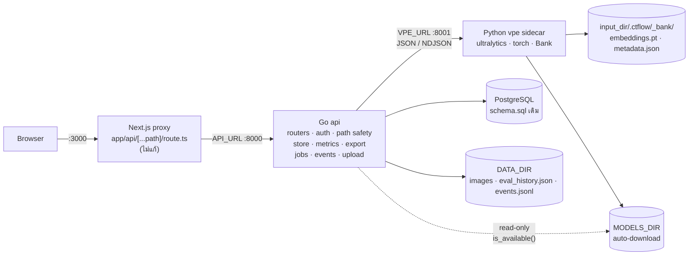

# CT-Flow — แผน Refactor Backend จาก Python เป็น Go

> **สถานะ: ✅ เสร็จและ merge เข้า `main` แล้ว (2026-08-24)** — merge commit `40b0c7f` จาก PR #2 · ดูบันทึกความคืบหน้าจริงที่หัวข้อ 10 · เอกสารนี้เป็นบันทึกของ refactor ที่เสร็จแล้ว งานถัดไปอยู่ใน [ROADMAP.md](../ROADMAP.md)
>
> **ที่มา:** ระบบ login ของบริษัทเป็น Go — backend ตัวนี้ต้องปรับตามเพื่อให้ integrate กันได้ ไม่ใช่เพราะ Python มีปัญหาด้าน performance **หลักการที่ตามมาจากเหตุผลนี้: ส่วนไหนคงเป็น Python service ได้ ให้คงไว้ ไม่ต้องฝืน**
>
> **เอกสารที่เกี่ยวข้อง:** [ARCHITECTURE.md](../ARCHITECTURE.md) · [API_REFERENCE.md](../API_REFERENCE.md) · [DB_MIGRATION_PLAN.md](./DB_MIGRATION_PLAN.md) (แผนก่อนหน้าที่ใช้เป็นแม่แบบของเอกสารนี้) · [ROADMAP.md](../ROADMAP.md)

---

## 0. ก่อนอื่น: refactor นี้ซื้ออะไร และไม่ซื้ออะไร

**เหตุผลของงานนี้คือ integration ไม่ใช่ performance** — ระบบ login ของบริษัทเป็น Go backend ตัวนี้จึงต้องเป็น Go เพื่อใช้ของร่วมกันได้ นั่นแปลว่าเกณฑ์ตัดสินความสำเร็จคือ **"พฤติกรรมเหมือนเดิมทุกอย่าง แต่เป็น Go"** ไม่ใช่ "เร็วขึ้น/ดีขึ้น" — ทุกครั้งที่ลังเลระหว่าง "เหมือนเดิม" กับ "ดีกว่าเดิม" ให้เลือกเหมือนเดิม แล้วแยกเป็นงานต่างหาก

ผลพลอยได้ที่ได้มาฟรีจากการแยก process:

1. **torch ออกจาก API image** — วันนี้ image `api` แบก CUDA torch wheel (~2.5 GB) ไว้เพื่อเสิร์ฟ `GET /api/browse` ด้วย หลัง refactor API เป็น static binary ~20 MB ส่วน torch อยู่ใน container แยกที่ deploy/restart คนละจังหวะได้
2. **เปิดทางให้ API scale หลาย worker** (หลังย้าย job tracker ออกจาก memory ซึ่งเป็นงานคนละชิ้น) — วันนี้ทำไม่ได้เพราะโมเดลผูกกับ process เดียวกับ router

**และสิ่งที่ Go ไม่ได้แก้ให้ อย่าคาดหวัง:** คอขวดที่เอกสารระบุไว้เอง — job tracker อยู่ใน memory, VRAM ไม่มี eviction, รันได้ worker เดียว — ไม่มีข้อไหนที่การเปลี่ยนภาษาแก้ให้ ทั้งสามข้อแก้ด้วย Redis/TTL/LRU และอยู่นอก scope นี้ทั้งหมด

**สิ่งที่แผนนี้จงใจไม่แตะ:** frontend (0 บรรทัด), schema PostgreSQL (0 บรรทัด), รูปแบบไฟล์บนดิสก์ (0 ไบต์), และ inference stack (ยังเป็น Python/ultralytics เหมือนเดิม)

---

## 1. Scope

### ย้ายไป Go (`api` service ใหม่)

| ของเดิม | บรรทัด | ไปเป็น |
|---|---|---|
| `app.py` (routers + auth middleware + CORS) | 89 | `main.go` + `middleware.go` |
| `config.py`, `deps.py` (path safety) | 92 | `internal/platform/config` |
| `routers/system.py` | 44 | `internal/transport/httpapi/system.go` |
| `routers/pool.py` | 183 | `internal/transport/httpapi/pool.go` |
| `routers/testset.py` | 64 | `internal/transport/httpapi/testset.go` |
| `routers/jobs.py` | 222 | `internal/transport/httpapi/jobs.go` |
| `routers/auth.py` | 48 | `internal/transport/httpapi/auth.go` |
| `routers/uploads.py` | 80 | `internal/transport/httpapi/upload.go` |
| `routers/export.py` | 128 | `internal/core/export` |
| `services/annotations_db.py`, `db.py`, `schema.sql` | 457 | `internal/infra/store` (pgx, SQL เดิมทุกตัวอักษร) |
| `tools/metrics.py` (IoU, greedy match, P/R/F1) | 167 | `internal/core/metrics` |
| `services/auth.py` (pbkdf2 + signed cookie) | 135 | `internal/platform/auth` |
| `services/events.py` (jsonl + summary) | 138 | `internal/infra/events` |
| `inference/models.py` (catalog + `is_available`) | 76 | `internal/platform/models` |
| `services/images.py`, `bank.py`'s `*_history` | 63 | `internal/infra/images`, `internal/infra/history` |

รวม ~1,986 บรรทัด Python → คาด ~3,000–3,500 บรรทัด Go

### ยังเป็น Python (`vpe` service ใหม่ — inference sidecar)

| ไฟล์ | บรรทัด | เหตุผล |
|---|---|---|
| `inference/vpe.py` | 114 | ultralytics `YOLOEVPSegPredictor.get_vpe()` / `set_classes()` — ไม่มีของเทียบเท่าใน Go และจะไม่มี |
| `inference/bank.py` | 233 | `embeddings.pt` คือ `torch.save` ของ `dict[str, list[Tensor]]` · `mean_vpe()` คือ `torch.stack`/`mean`/`cat` · Go อ่านไฟล์นี้ไม่ได้และไม่ควรพยายาม |

**กติกาที่ตัดสิน scope นี้: prompt bank กับ torch แยกจากกันไม่ได้** ถ้า Go ถือ `metadata.json` (model lock + instances) แต่ Python ถือ `embeddings.pt` เราจะได้ two-writer problem บนโฟลเดอร์เดียวกัน และ `Bank.lock_model()`/`reembed()` ที่ commit แบบ atomic ใต้ `FileLock` เดียวจะพังทันที ดังนั้น **sidecar เป็นเจ้าของทั้งโฟลเดอร์ `.ctflow/_bank/` แต่ผู้เดียว** — Go ไม่แตะไฟล์ในนั้นเลย ยกเว้น `eval_history.json` และ `events.jsonl` ซึ่งไม่เกี่ยวกับ bank (ดูหัวข้อ 4.6)

### ไม่แตะเลย

- **frontend ทั้งหมด** — proxy (`app/api/[...path]/route.ts`) ชี้ที่ `API_URL` อยู่แล้ว เปลี่ยนปลายทางคือจบ ไม่มีไฟล์ frontend ไหนต้องแก้แม้แต่บรรทัดเดียว
- **PostgreSQL schema + ข้อมูลทั้งหมด** — Go รัน `schema.sql` ไฟล์เดิม (embed เข้า binary) SQL ทุก statement คัดลอกมาตรง ๆ
- **`embeddings.pt`, `metadata.json`, `eval_history.json`, `events.jsonl`** — format เดิมทุกไบต์
- **`tools/experiment_conf.py`, `tools/migrate_to_db.py`, `groundtruth.py`, `yolo_labels.py`** — สคริปต์ทดลอง/ย้ายข้อมูลครั้งเดียว ไม่ใช่ runtime path ปล่อยไว้เป็น Python

**ผลรวม: refactor นี้ไม่มี data migration** rollback = ชี้ compose กลับไปที่ image เดิม ข้อมูลอ่านต่อได้ทันที นี่คือคุณสมบัติที่สำคัญที่สุดของแผนนี้ อย่าทำอะไรที่ทำลายมัน

---

## 2. สถาปัตยกรรมปลายทาง



### สัญญาของ sidecar (`vpe`, :8001, internal only)

ทุก endpoint รับ/คืน JSON, error เป็น `{"detail": "<message>"}` เหมือน API หลัก (Go ส่งต่อ status + detail ให้ client ตรง ๆ)

| Method + path | Body | คืน |
|---|---|---|
| `GET /vpe/health` | — | `{"ok": true}` · healthcheck ของ container |
| `GET /vpe/bank?input_dir=` | — | `{"classes": [{"name", "count"}], "model": str\|null}` |
| `POST /vpe/teach` | `{input_dir, image, boxes, model_id, labeled_by}` | `{"classes": [...], "model": str}` · **409** ถ้า `model_id` ไม่ตรงกับที่ bank ล็อกไว้ |
| `POST /vpe/predict` | `{input_dir, image, conf, conf_by_class}` | `{"boxes": [{cls, box, conf}]}` |
| `POST /vpe/predict_stream` | `{input_dir, images, conf, conf_by_class, want_sig}` | **NDJSON** บรรทัดละภาพ: `{"image", "boxes", "sig"?}` |
| `POST /vpe/reembed_stream` | `{input_dir, model_id}` | **NDJSON** progress บรรทัดละ instance แล้วปิดท้ายด้วย `{"done": true, "classes": [...], "model": str}` |

**ทำไม NDJSON ไม่ใช่ให้ Go poll sidecar:** Go เป็นเจ้าของ job tracker และต้องการ progress รายภาพ การ stream บรรทัดต่อภาพให้ progress ฟรี **และรับประกันว่า `arm()` ถูกเรียกครั้งเดียวต่อ job** เหมือนพฤติกรรมวันนี้เป๊ะ ๆ (ถ้า Go ยิง `/vpe/predict` ทีละภาพ จะ arm ใหม่ทุกภาพ ช้าลงและเปลี่ยนพฤติกรรม)

**สิ่งที่หายไปจาก sidecar:** `psycopg2-binary`, `python-multipart` — sidecar ไม่แตะ DB เลย `bank.summary()` เดิมที่เรียก `annotations_db.list_by_status()` ถูกแยกเป็นสองส่วน: sidecar คืน `classes`+`model`, Go ดึง `labeled`/`auto` จาก Postgres เอง แล้วประกอบเป็น `BankSummary` ตาม API_REFERENCE.md ที่ frontend คาดไว้

### Dependency ฝั่ง Go — สามตัว จบ

| dep | ทำไม | ทำไมไม่ใช้ของอื่น |
|---|---|---|
| `github.com/jackc/pgx/v5` | PostgreSQL driver + pool | stdlib ไม่มี driver — ต้องมีตัวใดตัวหนึ่งอยู่ดี |
| `golang.org/x/crypto/pbkdf2` | ต้องได้ hash format เดิม `pbkdf2$240000$salt$hex` เป๊ะ | stdlib ไม่มี pbkdf2 |
| `golang.org/x/image/bmp` | `IMAGE_EXTS` มี `.bmp` แต่ `image/` ใน stdlib ไม่รองรับ | — |

**ไม่ใช้:** ORM (repo นี้ไม่เคยมี), web framework (Go 1.22+ `http.ServeMux` รองรับ `POST /api/label` pattern แล้ว), logging library (`log/slog` เป็น stdlib), config library (`os.Getenv` เหมือนที่ `config.py` ทำ)

---

## 3. กลยุทธ์ความปลอดภัย — 4 เฟส

หลักการเดียวที่คุมทั้งแผน: **แยก "การแยก process ถูกไหม" ออกจาก "โค้ด Go ถูกไหม" ให้พิสูจน์คนละรอบกัน** ถ้าทำสองอย่างพร้อมกันแล้วพัง จะไม่รู้ว่าพังเพราะอะไร

```
เฟส 0  parity harness           ยัง Python 100%      ← เครื่องมือวัด ต้องมีก่อน
เฟส 1  แยก vpe sidecar          ยัง Python 100%      ← พิสูจน์ seam
เฟส 2  strangler ทีละกลุ่ม      Go เข้ามาทีละ route  ← พิสูจน์ Go
เฟส 3  ตัด FastAPI router ทิ้ง  Go + vpe             ← เก็บกวาด
```

---

### เฟส 0 — Parity harness (ประมาณ 1 วัน)

**นี่คือขั้นที่คุ้มที่สุดในแผนทั้งหมด อย่าข้าม**

`backend/tests/smoke_test.py` วันนี้ยิงผ่าน `TestClient(app)` — ซึ่ง**คือ `httpx.Client` ที่ผูกกับ ASGI app** เปลี่ยนให้รับ base URL แทน แล้วสคริปต์เดิมทั้ง 501 บรรทัดจะยิงใส่ backend ตัวไหนก็ได้:

```python
# backend/tests/smoke_test.py
BASE = os.getenv("SMOKE_BASE_URL")
c = httpx.Client(base_url=BASE) if BASE else TestClient(app)
```

จากนั้น `SMOKE_BASE_URL=http://localhost:8000 python -m backend.tests.smoke_test` คือ **acceptance test ของทุกเฟสถัดไป** — Python ผ่าน, Go ต้องผ่านเหมือนกัน

**งานย่อย:**

1. เปลี่ยน `tests/smoke_test.py` ให้รับ base URL (ไม่กี่บรรทัด — `TestClient` มี API เดียวกับ `httpx.Client`)
2. แยก assertion ที่เรียก `Bank(...)`/`annotations_db.*` ตรง ๆ (ตรวจสถานะดิสก์/DB) ออกเป็น helper — พวกนี้ยังใช้ได้ในโหมด HTTP เพราะ smoke test รันบนเครื่องเดียวกับ backend
3. **สร้าง golden vectors** — dump ผลลัพธ์จาก Python ปัจจุบันลง `backend/tests/testdata/` เพื่อให้ Go test เทียบได้ข้ามภาษา:
   - `auth_vectors.json` — คู่ (password, hash) 3 คู่ + cookie ที่ `issue()` สร้าง 3 ใบ (valid / tampered / expired) → `internal/platform/auth` ต้อง verify ผ่าน/ไม่ผ่านตรงกันทุกใบ
   - `metrics_cases.json` — input `gt`/`pred` 5 เคส + output ของ `metrics.evaluate()` เต็ม ๆ รวม `per_image`
   - `events_log.jsonl` + `events_summary.json` — log ตัวอย่าง + `summary()` ที่ควรได้
   - `export_yolo.zip`, `export_coco.json`, `export_voc.zip` — จาก project ตัวอย่างชุดเดียว
4. เขียน `backend/tests/parity.py` — สคริปต์ที่ยิง endpoint ชุดเดียวกันใส่ **สอง** base URL แล้ว diff response ทีละ endpoint (ตัวเลข float เทียบด้วย tolerance `1e-9` ไม่ใช่ string equality) นี่คือของที่ใช้ตอนเฟส 2 ตอนที่มี Python กับ Go รันคู่กันจริง

**Definition of done:** `SMOKE_BASE_URL=... python -m backend.tests.smoke_test` ผ่านกับ backend Python ที่รันด้วย uvicorn จริง (ไม่ใช่ TestClient) · `backend/tests/testdata/` มีครบ 4 ชุด · `tests/parity.py` diff Python-กับ-Python ได้ 0 ความต่าง

**Rollback:** ไม่มีอะไรให้ rollback — เฟสนี้เพิ่มไฟล์เทสต์อย่างเดียว ไม่แตะ runtime path

---

### เฟส 1 — แยก vpe sidecar ออกมา (ยังเป็น Python ล้วน) (ประมาณ 2 วัน)

ยังไม่มี Go แม้แต่บรรทัดเดียว เป้าหมายคือพิสูจน์ว่า **เส้นแบ่ง Go/Python ที่เลือกไว้ถูกต้อง** ก่อนจะลงทุนเขียน Go ทับมัน ถ้าเส้นแบ่งผิด เฟสนี้จะเจอ — และการย้ายเส้นแบ่งตอนที่ทั้งสองฝั่งยังเป็น Python นั้นถูกกว่าการย้ายตอนที่ฝั่งหนึ่งเป็น Go แล้วมาก

**งานย่อย:**

1. สร้าง `backend/inference/service.py` — FastAPI app เล็ก ๆ เสิร์ฟ 6 endpoint ตามตารางหัวข้อ 2 เรียก `inference/vpe.py` + `inference/bank.py` ที่มีอยู่แล้ว **ไม่แก้สองไฟล์นี้เลย** ยกเว้นสองจุด:
   - `Bank.summary()` แยกเป็น `Bank.classes_summary()` (ไม่แตะ DB, sidecar ใช้) — ตัวเดิมยังอยู่ให้ router เดิมใช้ระหว่างเฟสนี้
   - เพิ่ม mutex รอบ `arm()`+`predict` (ดูหัวข้อ 4.1 — เรื่องนี้สำคัญกว่าที่เห็น)
2. เพิ่ม `_signature()` (8×8 grayscale thumbnail) เข้า sidecar ย้ายมาจาก `routers/jobs.py` — **จงใจให้อยู่ฝั่ง Python เพื่อ parity เป๊ะ** `cv2.INTER_AREA` กับ resize ของ Go ให้ตัวเลขไม่ตรงกัน และ FR-18 ไม่ควรเปลี่ยนพฤติกรรมเพราะ refactor
3. แก้ router เดิมทั้ง 4 จุดที่เรียก vpe/bank ให้ยิง HTTP ไปที่ sidecar แทน import ตรง (`pool.py::save_label`, `pool.py::predict`, `pool.py::relabel`'s unknown-class check, `jobs.py` ทั้งไฟล์)
4. compose: เพิ่ม service `vpe` (build จาก `backend/inference/Dockerfile` — เอา `psycopg2-binary`/`python-multipart` ออกจาก requirements ของมัน), `api` ได้ env `VPE_URL=http://vpe:8001`, `models` volume ย้ายไป `vpe` (Go/api mount แบบ `:ro`)

**Definition of done:** smoke test ผ่านเต็ม · `tests/parity.py` diff "Python เดิม (commit ก่อนหน้า)" กับ "Python แยก sidecar" ได้ 0 ความต่าง · `docker compose up` ขึ้นครบ 4 service

**Rollback:** revert commit เดียว — `inference/vpe.py`/`bank.py` ไม่ถูกแก้ ไฟล์บนดิสก์ไม่เปลี่ยน

---

### เฟส 2 — Strangler: Go เข้ามาทีละกลุ่ม (ประมาณ 8–12 วัน)

Go binary ยืนหน้า :8000 · route ไหนยังไม่ port ให้ **reverse proxy** ต่อไปที่ FastAPI เดิมที่ย้ายไป :8100 (`httputil.NewSingleHostReverseProxy`, ~10 บรรทัด) · `web` ชี้ที่ Go ตั้งแต่วันแรกของเฟสนี้ · ทุก commit ต้องรัน smoke test ผ่าน — ซึ่งทำได้เพราะระบบใช้งานได้ครบตลอดเวลา ไม่มีช่วงพัง

```
web :3000 ──> Go :8000 ──┬──> route ที่ port แล้ว  (Go จัดการเอง)
                          ├──> route ที่ยังไม่ port (proxy ไป FastAPI :8100)
                          └──> vpe :8001
```

**ลำดับการ port — เรียงจากเสี่ยงน้อยไปมาก:**

| # | กลุ่ม | endpoint | ทำไมอยู่ตรงนี้ |
|---|---|---|---|
| 2.1 | รากฐาน | `internal/platform/config` (path safety), `internal/platform/models` (catalog), `internal/infra/images`, `GET /api/config`, `GET /api/browse`, `GET /api/image` | อ่านอย่างเดียว ไม่มี state · path safety เป็นด่านความปลอดภัยที่ทุกอย่างพึ่ง ต้องถูกก่อน (ดู 4.2) |
| 2.2 | auth | `internal/platform/auth`, middleware, `/api/auth/*` | ไม่มี state ในโค้ด แต่ต้อง **ผ่าน golden vectors ทั้งหมด** ก่อนเดินต่อ — ถ้า cookie format เพี้ยน ทุกคนหลุด session (ดู 4.3) |
| 2.3 | ไฟล์เล็ก | `internal/infra/history`, `internal/infra/events`, `GET/POST/DELETE /api/history`, `GET/POST /api/events` | อ่าน-เขียน JSON/JSONL ธรรมดา · เทียบ golden ได้ตรง ๆ |
| 2.4 | store | `internal/infra/store` (pgx) + `GET /api/boxes`, `POST /api/session`, `/api/testset/*` | SQL คัดลอกมาทั้งดุ้น รวม `FOR UPDATE` (ดู 4.4) · smoke test มี concurrency assertion อยู่แล้วให้ยืม |
| 2.5 | export | `internal/core/export` + `GET /api/export` | เทียบ zip/json กับ golden ไบต์ต่อไบต์ได้ |
| 2.6 | upload | `POST /api/upload` | multipart + image decode · มี divergence ที่รับได้หนึ่งจุด (ดู 4.5) |
| 2.7 | teach | `POST /api/label`, `POST /api/relabel` | จุดแรกที่ Go เรียก sidecar · ลำดับการเรียกต้องเหมือนเดิมเป๊ะ (ดู 4.6) |
| 2.8 | **jobs (ก้อนเดียว)** | `internal/platform/jobs` + `GET /api/jobs/{id}` + `/api/score` `/api/evaluate` `/api/autolabel` `/api/reembed` + `internal/core/metrics` | **ต้องย้ายพร้อมกันทั้งหมด** — job tracker เป็น map ใน memory ถ้าแยกครึ่ง Go ครึ่ง Python จะได้ `job_id` ที่อีกฝั่งตอบ 404 (ดู 4.7) |

**Definition of done ของแต่ละกลุ่ม:** Go test ของกลุ่มนั้นผ่าน · `tests/parity.py` diff endpoint กลุ่มนั้นระหว่าง Go:8000 กับ FastAPI:8100 ได้ 0 ความต่าง · smoke test เต็มผ่าน · commit เดียวจบต่อกลุ่ม

**Rollback ระดับกลุ่ม:** ลบ route ออกจาก mux ของ Go หนึ่งบรรทัด → proxy ตกกลับไป FastAPI ทันที ไม่ต้อง revert โค้ด ไม่ต้อง redeploy อย่างอื่น **นี่คือเหตุผลทั้งหมดที่ใช้ strangler แทนการเขียนใหม่ทีเดียว**

---

### เฟส 3 — เก็บกวาด (ประมาณ 2 วัน)

1. **ลบ:** `backend/app.py`, `backend/deps.py`, `backend/config.py`, `backend/routers/` ทั้งโฟลเดอร์, `services/{annotations_db,db,auth,events,models,images,job_tracker}.py`
   **เก็บไว้:** `services/{vpe,bank}.py` (sidecar ใช้) · `services/{groundtruth,yolo_labels,metrics}.py` + `tools/experiment_conf.py` (หัวข้อ 8 ข้อ 5 — ยังต้องรันได้) · `inference/service.py`, `schema.sql` (Go embed), `tests/smoke_test.py`, `tests/parity.py`, `tools/migrate_to_db.py`
   ⚠️ `tools/metrics.py` **ห้ามลบ** ถึงแม้จะ port ไป Go แล้ว — `tools/experiment_conf.py` เรียก `metrics.evaluate()` และ `metrics.load_ground_truth()` โดยตรง · `config.py` ถูกลบ แต่ `groundtruth.py`/`images.py` import `config.IMAGE_EXTS` ⇒ ย้ายค่านั้นไปเป็น const ใน `groundtruth.py` แทน (ตรวจด้วย `python -m backend.tools.groundtruth` และ `python -m backend.tools.metrics`)
2. ลบ reverse-proxy fallback ออกจาก Go และลบ service `legacy` ออกจาก compose
3. `.github/workflows/backend.yml` — job `go` (`go vet ./... && go test ./... && go build`) + job `smoke` ที่ยิง `SMOKE_BASE_URL` ใส่ compose ที่ยกขึ้นจริง · เก็บ job `checks` ไว้เฉพาะ self-check ที่ยังเป็น Python
4. อัปเดตเอกสาร: `README.md` (badge, repository layout, local development), `docs/ARCHITECTURE.md` (tech stack, system diagram, deploy), `docs/API_REFERENCE.md` (เฉพาะย่อหน้า convention ที่อ้าง FastAPI/`HTTPException`), `docs/PROJECT_STATUS.md`, `.env.example`
5. `docker-compose.override.yml` — hot reload ของ Go: `air` หรือแค่ `go run ./cmd/api` + bind mount (ponytail: `go run` พอ ไม่ต้องเพิ่ม tool)

**Definition of done:** ไม่มี FastAPI ใน runtime path · smoke test ผ่านใน CI จริง · `docker compose up --build` จากเครื่องเปล่าขึ้นได้

---

## 4. รายละเอียดที่ต้องคิดให้ตกก่อนเริ่ม

ทั้งหมดนี้มาจากการอ่านโค้ดจริง ไม่ใช่รายการทั่วไป — แต่ละข้อคือจุดที่ port ตรง ๆ แล้วจะได้บั๊ก

### 4.1 `arm()` แก้ state ระดับ process — Go จะทำให้ race ที่ซ่อนอยู่โผล่ออกมา

`vpe.arm()` เขียนทับ `model.model.names`, `nc`, และ `set_classes()` บน object ที่แชร์ทั้ง process แล้ว `predict_one()` อ่านมันกลับ วันนี้มันรอดเพราะ FastAPI sync endpoint + `BackgroundTasks` ทำให้งานเรียงคิวกันโดยบังเอิญ

**Go เรียก sidecar แบบขนานได้จริง** — สอง job บนคนละ `input_dir` ที่ใช้ `model_id` เดียวกันจะ arm ทับกันกลางคัน ผลคือ prediction ของ project A ถูกตีความด้วย class list ของ project B **เงียบ ๆ ไม่มี error** นี่คือความเสี่ยงข้อที่ร้ายที่สุดในแผนทั้งหมด เพราะมันไม่ crash มันแค่ให้คำตอบผิด

**ทางแก้ (เฟส 1 ข้อ 1):** `threading.Lock` หนึ่งตัวต่อ `model_id` ใน sidecar ครอบตั้งแต่ `arm()` จนจบ predict ทั้งชุด — สำหรับ `predict_stream` คือครอบทั้ง stream ไม่ใช่ทีละภาพ

```python
# ponytail: หนึ่ง lock ต่อ model_id ครอบตั้งแต่ arm ถึง predict ตัวสุดท้าย
# เพราะ arm() เขียนทับ state บน model object ที่แชร์ทั้ง process
# แยกเป็นคนละ model instance ต่อ project เมื่อ throughput เริ่มเป็นปัญหาจริง
```

ผลข้างเคียงที่ยอมรับ: score/evaluate/autolabel ที่ใช้โมเดลเดียวกันจะเข้าคิวกัน — **ซึ่งคือพฤติกรรมวันนี้อยู่แล้ว** ไม่ได้แย่ลง และ GPU ตัวเดียวก็ทำขนานไม่ได้อยู่ดี

**เพิ่ม parity test:** ยิง `/api/score` สอง `input_dir` พร้อมกัน ยืนยันว่าผลของแต่ละอันตรงกับตอนรันเดี่ยว ๆ

### 4.2 Path safety — `HasPrefix` คือบั๊ก

`config.path_allowed()` ใช้ `p.resolve().relative_to(VM_DATA_ROOT.resolve())` ซึ่ง (ก) resolve symlink และ (ข) เทียบเป็น path component ไม่ใช่ string

Go ที่ port ผิดแบบคลาสสิก:

```go
strings.HasPrefix(p, root)   // ✗ /opt/mount/projectX ผ่าน ทั้งที่ root คือ /opt/mount/project
filepath.Clean(p)            // ✗ ไม่ตาม symlink -- .ctflow/evil -> /etc ยังหลุด
```

ที่ถูก:

```go
rp, err := filepath.EvalSymlinks(p)   // ตาม symlink เหมือน Path.resolve()
rel, err := filepath.Rel(root, rp)
ok := err == nil && rel != ".." && !strings.HasPrefix(rel, ".."+string(filepath.Separator))
```

**ข้อควรระวัง:** `EvalSymlinks` คืน error ถ้าไฟล์ยังไม่มี — แต่ `POST /api/upload` ส่ง dir ที่ยังไม่ถูกสร้างมา (`d.mkdir(parents=True)`) และ Python `Path.resolve()` ไม่ error ในกรณีนั้น ต้อง fallback ไป resolve ตัว parent ที่มีอยู่จริงตัวแรก แล้วต่อส่วนที่เหลือ **นี่คือจุดที่ต้องมี unit test 6 เคสเป็นอย่างน้อย:** ข้างใน / ข้างนอก / `..` traversal / prefix ที่เป็นพี่น้อง (`/opt/mount/projectX`) / symlink หนีออกนอก / path ที่ยังไม่มีอยู่จริง

### 4.3 Auth — ต้องเข้ากันได้ทั้งสองทาง ไม่ใช่แค่ "ทำงานได้"

สองอย่างต้องเหมือนเดิม **ทุกไบต์** ไม่งั้น deploy แล้วทุกคนหลุด session และ `LABEL_TOOL_USERS` ที่ตั้งไว้ใช้ไม่ได้:

- **hash:** `pbkdf2$240000$<salt hex>$<dk hex>` · PBKDF2-HMAC-SHA256, 240,000 iterations, `dk` ยาว 32 ไบต์ (default ของ `hashlib.pbkdf2_hmac`), salt 16 ไบต์ hex
- **cookie:** `<user>|<exp unix int>|<hmac-sha256 hex ของ "user|exp">` — และต้อง **`rsplit` เป็น 3 ส่วน ไม่ใช่ `split`** เพราะ username มี `|` ได้ (`services/auth.py` มี assertion ข้อนี้อยู่แล้ว: `identify(issue("a|b")) == "a|b"`) Go ใช้ `strings.LastIndex` สองครั้ง
- **cookie attributes:** `HttpOnly`, `SameSite=Lax`, `Max-Age=43200`, ชื่อ `labeltool_session`
- **timing:** `check()` แฮชแม้ user ไม่มีอยู่จริง เพื่อให้เวลาปฏิเสธเท่ากัน — port มาด้วย ไม่ใช่ optimization ที่ตัดทิ้งได้
- **compare:** `hmac.compare_digest` → `hmac.Equal` / `subtle.ConstantTimeCompare`

**Gate ของกลุ่ม 2.2:** golden vectors ต้องผ่านครบก่อน merge — cookie ที่ Python ออกให้ Go ต้อง `identify` ได้, cookie ที่ Go ออกให้ Python ต้องอ่านได้ (ทดสอบสองทางจริง ๆ ในช่วง strangler มันเกิดขึ้นแน่นอนอยู่แล้ว เพราะ login อาจไปโดน Go แต่ request ถัดไป proxy ไป FastAPI)

`LABEL_TOOL_SECRET` ที่ไม่ได้ตั้ง = random ต่อ restart → ระหว่างเฟส 2 **ต้องตั้ง `LABEL_TOOL_SECRET` ให้ตรงกันทั้งสอง process** ไม่งั้น session พังทันทีที่ request ข้ามฝั่ง ใส่ข้อนี้ใน `.env.example` และใน compose ของช่วง transition

### 4.4 Store — คัดลอก SQL ไม่ใช่เขียนใหม่

`_get_or_create_class()` คือหัวใจของ concurrency ที่ T-21 ซื้อมา (DB_MIGRATION_PLAN.md §4.1) ห้ามเขียนใหม่ให้ "สวยขึ้น" ใน Go:

```
BEGIN
SELECT id FROM projects WHERE id = $1 FOR UPDATE
SELECT COALESCE(MAX(idx), -1) + 1 FROM classes WHERE project_id = $1 AND kind = $2
INSERT INTO classes (...) VALUES (...) ON CONFLICT (project_id, kind, name) DO NOTHING
COMMIT
```

- `services/db.py::connect()` เป็น context manager ที่ commit เมื่อจบสวย / rollback เมื่อ exception → Go: `pgx.BeginFunc` (semantics เดียวกัน) ทุก write ที่วันนี้อยู่ใน `with connect()` เดียว ต้องอยู่ใน `BeginFunc` เดียวเหมือนกัน ไม่แตกเป็นหลาย transaction
- `schema.sql` → `//go:embed schema.sql` แล้วรันตอน start เหมือน `app.py`'s `@app.on_event("startup")` · idempotent อยู่แล้ว
- `annotations_db` self-check มี concurrency test จริง (หลาย thread สร้างคลาสพร้อมกัน) — **port เป็น Go test ที่ใช้ goroutine + `t.Parallel()`** อย่าปล่อยข้อนี้หลุด มันคือ regression guard ของ invariant ที่แพงที่สุดในระบบ
- **class index append-only** — smoke test คุ้มครองอยู่แล้ว (ทดสอบแล้วว่า fail จริงเมื่อจงใจใส่ `sorted()`) ยืมมาใช้ต่อ

### 4.5 Image decode — divergence ที่ยอมรับได้ หนึ่งจุด

`POST /api/upload` กันไฟล์ปลอมด้วย `cv2.imdecode(...) is None` — ด่านจริง ไม่ใช่นามสกุล Go ใช้ `image.Decode` ซึ่งรับ/ปฏิเสธไม่ตรงกับ OpenCV 100% (CMYK JPEG, 16-bit PNG, PNG บางรูปแบบ)

**การตัดสินใจ: ยอมรับความต่างนี้** — ผลกระทบคือไฟล์ขอบ ๆ บางไฟล์ถูกปฏิเสธด้วยเหตุผล `not a readable image` ทั้งที่ OpenCV เคยรับ ซึ่งเป็นการปฏิเสธที่ปลอดภัยกว่า ไม่ใช่หลวมกว่า บันทึกไว้ใน `docs/PROJECT_STATUS.md` ตอนเฟส 3 · ทางเลือกถ้าต้อง parity เป๊ะคือส่ง byte ไปให้ sidecar ตรวจ — **ไม่ทำ** เพราะเอา torch container มายืนขวางทาง upload เพื่อความต่างที่ยังไม่มีใครเจอ

**`GET /api/export` ต่างออกไป:** `_dims()` วันนี้ใช้ `cv2.imread()` (decode ทั้งภาพ) เพื่อเอาแค่ w/h → Go ใช้ `image.DecodeConfig` (อ่านแค่ header) **เร็วกว่ามากและให้ค่าเดียวกัน** ไม่ใช่ divergence เป็นการปรับปรุงฟรี · แต่ต้องคง `import _ "golang.org/x/image/bmp"` และ `_ "image/jpeg"` `_ "image/png"` ให้ครบ ไม่งั้น `.bmp` จะถูกข้ามเงียบ ๆ ในทุก export (เพราะโค้ดเดิมออกแบบให้ "ภาพที่อ่านไม่ได้ = ข้าม ไม่ล้มทั้ง export")

### 4.6 `POST /api/label` — ลำดับการเรียกต้องเหมือนเดิม รวมทั้งจุดที่มันไม่ atomic

วันนี้: `is_test()` → `lock_model()` → `extract_embedding()`+`add()` ต่อคลาส → `write_boxes()` → `mark_labeled()`

Go ต้องรักษาลำดับนี้ทั้งหมด โดยเฉพาะ **`lock_model()` เกิดก่อน `extract_embedding()` เสมอ** (คอมเมนต์ใน API_REFERENCE.md ระบุชัด: 409 ต้องเกิดก่อนเสียเวลาโหลดโมเดลผิดตัว) — ในสถาปัตยกรรมใหม่ทั้งสองอย่างอยู่ใน `/vpe/teach` call เดียว sidecar เป็นคนรับประกันลำดับ ไม่ใช่ Go

**การจัดกลุ่ม box ตามคลาสก่อน extract (หนึ่ง embedding ต่อคลาสต่อการบันทึก เฉลี่ยทุกกล่องคลาสนั้น) ต้องอยู่ใน sidecar ไม่ใช่ Go** — มันคือ semantics ของ bank ไม่ใช่ของ HTTP layer และมี bug ที่รู้อยู่แล้วผูกกับมัน (reembed replay ได้แค่กล่องแรก — `jobs.py` มีคอมเมนต์ `ponytail:` กำกับ) ถ้าย้ายไป Go บั๊กนี้จะกระจายข้ามสอง codebase

**Non-atomicity ที่คงไว้เท่าเดิม:** ถ้า bank สอนสำเร็จแล้ว `write_boxes()` พัง จะได้ embedding ที่ไม่มี annotation row คู่กัน — **วันนี้ก็เป็นแบบนี้อยู่แล้ว** (คนละ store คนละ transaction) refactor นี้ไม่ทำให้แย่ลงและไม่แก้ให้ดีขึ้น ห้ามพยายามแก้พร้อมกับ refactor เขียนไว้ใน `ponytail:` comment แล้วแยกเป็นงานต่างหาก

### 4.7 Job tracker — ย้ายทั้งก้อน และอย่าเผลอทำให้ดีขึ้น

`job_tracker.py` = `dict` + `threading.Lock` → Go = `map[string]*Job` + `sync.Mutex` แปลงตรง ๆ

**ห้ามใส่ TTL/eviction/persistence ในเฟสนี้** ถึงแม้เอกสารจะบอกว่าควรทำ (NEXT_STEPS ข้อ 3) — refactor ที่เปลี่ยนพฤติกรรมไปด้วยคือ refactor ที่ debug ไม่ได้ `GET /api/jobs/{id}` ต้องคืน 404 สำหรับ job ที่ไม่รู้จัก และเก็บ job เก่าไว้ตลอดอายุ process เหมือนเดิมเป๊ะ · คง `ponytail:` comment เดิมไว้ใน Go พร้อมข้อความเดิม

**เหตุผลที่กลุ่ม 2.8 แยกไม่ได้:** ถ้า `/api/score` อยู่ที่ Go แต่ `/api/jobs/{id}` ยัง proxy ไป FastAPI, `job_id` ที่ Go สร้างจะไม่มีใน dict ของ Python → 404 → frontend `runJob()` ค้าง

**`BackgroundTasks` → goroutine:** FastAPI รัน background task หลังส่ง response แล้ว Go ก็เหมือนกัน (`go run...` หลัง `w.Write`) แต่ต้องระวังว่า `context` ของ request ถูก cancel ไปแล้ว — **อย่าใช้ `r.Context()` ใน goroutine ของ job** ใช้ `context.Background()` ที่มี timeout ของตัวเอง นี่คือบั๊ก Go มือใหม่คลาสสิกที่จะทำให้ทุก job ตายกลางคันทันทีที่ browser ปิด tab

### 4.8 Error shape กับ float — สิ่งที่ frontend มองเห็น

- `lib/api.ts` โยน `Error(data.detail)` ทุกครั้งที่ response ไม่ ok → **ทุก error ต้องเป็น `{"detail": "<string>"}`** เขียน helper `httpError(w, code, msg)` ตัวเดียวแล้วใช้ทุกที่ ห้ามให้ `panic` หลุดออกไปเป็น HTML 500 (มี recovery middleware ที่แปลงเป็น `{"detail": "internal error"}` + log)
- **ข้อความ error ต้องเหมือนเดิมทุกตัวอักษร** ในจุดที่ smoke test assert หรือ UI แสดง เช่น `"this image is in the test set -- it can never be taught to the model"`, `"prompt bank is empty -- label something first"` — grep เอาจาก `HTTPException(` ทุกจุดแล้วทำเป็น const ใน Go
- **float ใน JSON:** Python `json.dumps(0.1)` → `0.1`, Go `encoding/json` → `0.1` เหมือนกัน แต่ `precision/recall/f1` ที่ได้จากการหารอาจได้ตัวสุดท้ายต่างกันในบิตที่ 17 → `tests/parity.py` เทียบตัวเลขด้วย tolerance ไม่ใช่ string
- **`GET /api/jobs/{id}` คืน `now`** จากนาฬิกา server เพื่อให้ `ProgressBar.tsx` คำนวณ ETA โดยไม่โดน clock skew — `float64` unix seconds เหมือนเดิม ไม่ใช่ RFC3339
- **`GET /api/image`** คืน `FileResponse` → `http.ServeFile` (ได้ Range request + ETag ฟรี ซึ่งดีกว่าเดิม ไม่กระทบ ``)

### 4.9 ของที่จะหายไป และต้องยอมรับ

- **Swagger UI / ReDoc / `openapi.json`** — FastAPI แถมให้ฟรี Go ไม่มี · `docker-compose.yml` เปิด `API_PORT` ออก host เพื่อสิ่งนี้โดยเฉพาะ และ `.env.example` มีคอมเมนต์อ้างถึง
  **ตัดสินใจแล้ว: ลบทิ้ง** (หัวข้อ 8 ข้อ 2) ไม่เขียน openapi spec ด้วยมือและไม่เพิ่ม swagger generator — `docs/API_REFERENCE.md` ละเอียดกว่า OpenAPI ที่ generate จาก `req: dict` อยู่แล้ว (ซึ่ง generate ออกมาได้แค่ `body: object`)
  **เฟส 3 ต้องทำสามอย่าง ไม่ใช่แค่หยุดเสิร์ฟ:** เอา `ports: ["${API_PORT:-8000}:8000"]` ออกจาก service `api`, ลบ `API_PORT` + คอมเมนต์ที่อ้าง `/docs` จาก `.env.example`, และลบย่อหน้าที่อ้าง Swagger ใน `docker-compose.yml`
- **`--reload` ที่เร็ว ~1 วินาที** ของ uvicorn → Go ต้อง recompile (~2–5 วินาทีสำหรับ codebase ขนาดนี้) ยอมรับได้ · `docker-compose.override.yml` ปรับเป็น `go run ./cmd/api` + bind mount
- **`python -m backend.services.<name>` self-check** ที่ CI ใช้อยู่ 7 ตัว → กลายเป็น `go test ./...` ซึ่งดีกว่า แต่ต้องแปลงให้ครบ ไม่ใช่ทิ้ง: `auth`, `events`, `metrics`, `models`, `db`, `annotations_db` มี assertion ที่มีค่า อ่านแล้ว port มาเป็น `_test.go` ทีละตัว (`groundtruth` ยังเป็น Python เพราะ `tools/experiment_conf.py` ใช้)

---

## 5. โครงไฟล์ปลายทาง

```
CT-Flow/
├── cmd/api/main.go              wiring: env -> deps -> mux -> ListenAndServe
├── internal/
│   ├── config/                  MODE, VM_ROOT, MODELS_DIR, PathAllowed  (<- config.py + deps.py)
│   ├── auth/                    pbkdf2, cookie sign/verify, users()     (<- services/auth.py)
│   ├── store/                   pgx pool, SQL, schema.sql (embed)       (<- annotations_db.py + db.py)
│   ├── metrics/                 IoU, greedy match, P/R/F1               (<- services/metrics.py)
│   ├── events/                  jsonl append + summary                  (<- services/events.py)
│   ├── history/                 eval_history.json                       (<- bank.py's *_history)
│   ├── images/                  list_images, decode helpers             (<- services/images.py)
│   ├── models/                  CATALOG, checkpointPath, isAvailable    (<- services/models.py)
│   ├── export/                  yolo / coco / voc                       (<- routers/export.py)
│   ├── jobs/                    tracker (map + Mutex)                   (<- services/job_tracker.py)
│   ├── vpe/                     HTTP client ของ sidecar                 (ของใหม่)
│   └── api/                     handlers: system pool testset jobs auth upload export
├── backend/                     Python ที่เหลือ
│   ├── vpe_service.py             sidecar FastAPI (ของใหม่)
│   ├── services/vpe.py            ไม่แก้
│   ├── services/bank.py           แก้จุดเดียว: แยก classes_summary()
│   ├── services/groundtruth.py    ┐
│   ├── services/yolo_labels.py    ├ เก็บไว้ให้ _experiment_conf.py (หัวข้อ 8 ข้อ 5)
│   ├── services/metrics.py        ┘ ซ้ำกับ internal/metrics -- golden vectors กันสองฝั่งเพี้ยน
│   ├── schema.sql                 Go embed ไฟล์นี้ตรง ๆ
│   ├── requirements.txt           เหลือ: ultralytics opencv pillow numpy fastapi uvicorn filelock
│   ├── testdata/                  golden vectors (เฟส 0)
│   ├── _smoke_test.py             parity harness -- ยิงใส่ backend ตัวไหนก็ได้
│   ├── _parity.py                 diff สอง backend (ของใหม่)
│   ├── _experiment_conf.py        ไม่แก้
│   ├── _migrate_to_db.py          ไม่แก้
│   ├── backend/Dockerfile             ← ลบตอนเฟส 3
│   └── Dockerfile.vpe             torch + ultralytics เท่านั้น
├── Dockerfile.go                  multi-stage: golang:1.26 -> distroless/static
├── frontend/                      ไม่แตะเลยแม้แต่บรรทัดเดียว
├── docker-compose.yml             db · vpe · api(go) · web
└── refactor_plan.md               เอกสารนี้
```

### compose ปลายทาง

| service | image | mount | port |
|---|---|---|---|
| `db` | `postgres:16-alpine` | `pgdata` | ไม่ expose |
| `vpe` | build `Dockerfile.vpe` (torch/CUDA, ขอ GPU) | `DATA_DIR:/opt/mount/project`, `models:/models` | ไม่ expose · healthcheck `/vpe/health` |
| `api` | build `Dockerfile.go` (distroless ~20 MB) | `DATA_DIR:/opt/mount/project`, `models:/models:ro` | ไม่ expose · healthcheck `/api/config` |
| `web` | เดิม | — | `${WEB_PORT:-3000}` |

**`APP_UID` ต้องตรงกันทั้ง `api` และ `vpe`** — ทั้งคู่เขียนลง `DATA_DIR` (`api` เขียน uploads/history/events, `vpe` เขียน `_bank/`) ปัญหา root-owned files ที่ PROJECT_STATUS.md บันทึกไว้ (~4,377 ไฟล์) จะกลับมาทันทีถ้า UID ไม่ตรง — เพิ่มบรรทัดเตือนใน `.env.example`

**`models` volume:** `vpe` mount แบบเขียนได้ (ultralytics auto-download), `api` mount `:ro` (แค่ `is_available()` ที่ `stat` ไฟล์) · การ bake 3 checkpoint เข้า image ย้ายจาก `backend/Dockerfile` ไป `Dockerfile.vpe`

---

## 6. Timeline และลำดับ commit

| เฟส | งาน | ประเมิน | commit |
|---|---|---|---|
| 0 | parity harness + golden vectors | ~1 วัน | 2 |
| 1 | แยก vpe sidecar (Python ล้วน) | ~2 วัน | 2 |
| 2.1 | config/path-safety, models, images, system routes | ~1.5 วัน | 1 |
| 2.2 | auth + middleware | ~1 วัน | 1 |
| 2.3 | history, events | ~0.5 วัน | 1 |
| 2.4 | store (pgx) + session/boxes/testset | ~2.5 วัน | 1 |
| 2.5 | export | ~1 วัน | 1 |
| 2.6 | upload | ~0.5 วัน | 1 |
| 2.7 | label/relabel + vpe client | ~1 วัน | 1 |
| 2.8 | jobs + metrics (ก้อนเดียว) | ~2.5 วัน | 1 |
| 3 | เก็บกวาด, CI, เอกสาร, compose | ~2 วัน | 3 |
| | **รวม** | **~15.5 วัน** (คนเดียว) | **15** |

ทุก commit ในเฟส 2 ต้องมี smoke test เขียว และ `tests/parity.py` diff เป็น 0 ก่อน merge · ระบบใช้งานได้ตลอดทุก commit ไม่มีช่วงที่ branch พัง

---

## 7. Risk register

| # | ความเสี่ยง | ความรุนแรง | ป้องกัน |
|---|---|---|---|
| R1 | `arm()` race ข้าม project → prediction ผิดแบบเงียบ ๆ | **สูงสุด** — ไม่ crash แค่ตอบผิด | lock ต่อ `model_id` ใน sidecar (4.1) + parity test แบบขนาน |
| R2 | Path safety port ผิด → หลุดออกนอก `VM_DATA_ROOT` | **สูงสุด** — ช่องโหว่ | 6 unit test บังคับ (4.2) · เป็นกลุ่มแรกที่ port |
| R3 | Cookie/hash format ไม่ตรง → ทุกคนหลุด session, `LABEL_TOOL_USERS` ใช้ไม่ได้ | สูง | golden vectors สองทางเป็น gate ของ 2.2 (4.3) · `LABEL_TOOL_SECRET` ต้องตั้งช่วง transition |
| R4 | `_get_or_create_class` race → class index ชนกัน → label เก่าทั้งหมด decode ผิดคลาส | สูง — เสียข้อมูลถาวร | คัดลอก SQL ตรง ๆ ห้ามเขียนใหม่ (4.4) · port concurrency test เป็น goroutine test |
| R5 | job goroutine ใช้ `r.Context()` → ทุก job ตายเมื่อปิด tab | กลาง — เห็นชัด แก้ง่าย | `context.Background()` + code review checklist (4.7) |
| R6 | error message เพี้ยน → UI แสดงข้อความผิด/smoke test พัง | กลาง | ทำเป็น const, grep `HTTPException(` ให้ครบ (4.8) |
| R7 | ประเมินเวลาต่ำไป (2,000 บรรทัดที่มีคอมเมนต์อธิบาย "ทำไม" หนาแน่นมาก) | กลาง | strangler = ปล่อยของได้ทีละกลุ่ม ไม่ต้องรอ big bang |
| R8 | `.bmp` หายเงียบ ๆ จาก export/upload | ต่ำ | `import _ "golang.org/x/image/bmp"` + test ที่มี .bmp จริง (4.5) |
| R9 | Swagger หาย ทีมไม่รู้ตัว | ต่ำ | ประกาศในเฟส 3 + อัปเดต `.env.example`/compose (4.9) |

---

## 8. ข้อตัดสินใจ (สรุปแล้ว 2026-08-23)

1. **ที่อยู่เอกสาร** → `docs/REFACTOR_PLAN.md` ตามแบบ `DB_MIGRATION_PLAN.md`
2. **Swagger UI / ReDoc / `openapi.json`** → **ลบทิ้ง** ไม่เขียน spec ด้วยมือและไม่เพิ่ม generator · เฟส 3 ต้องเอา `API_PORT` ออกจาก compose + แก้คอมเมนต์ใน `.env.example` ที่อ้างถึง `/docs` ด้วย ไม่ใช่แค่หยุดเสิร์ฟ (ดู 4.9)
3. **job tracker** → **ไม่แตะ** map + Mutex แปลงตรง ๆ ไม่ใส่ TTL/persistence แม้จะรู้ว่าควร แยกเป็นงานหลัง refactor จบ (ดู 4.7)
4. **ภาษาใน Go code comment** → **อังกฤษทั้งหมด** ตามโค้ด Python ปัจจุบัน · คง convention `ponytail:` ไว้ · เอกสารใน `docs/` ยังเป็นไทยเหมือนเดิม
5. **`tools/experiment_conf.py`** → **ต้องรันได้ต่อ** ⇒ `tools/groundtruth.py` และ `tools/yolo_labels.py` **ห้ามลบ** ในเฟส 3 (สคริปต์นี้อ่านโฟลเดอร์ YOLO ดิบที่ไม่ใช่ `.ctflow` project จึงพึ่ง `metrics.load_ground_truth()` เวอร์ชันไฟล์)
   ⚠️ **ข้อควรระวัง:** `metrics.py` ถูก port ไป Go (กลุ่ม 2.8) แต่ `tools/experiment_conf.py` เรียก `metrics.evaluate()` ฝั่ง Python ⇒ **เฟส 3 ต้องคง `tools/metrics.py` ฝั่ง Python ไว้ด้วย** กลายเป็นโค้ดสองภาษาที่ทำเรื่องเดียวกัน ซึ่งยอมรับได้เพราะ `metrics.evaluate()` เป็นฟังก์ชัน pure ที่นิ่งมาก และ golden vectors (`backend/tests/testdata/metrics_cases.json`) คุ้มครองไม่ให้สองฝั่งเพี้ยนจากกัน — self-check `python -m backend.tools.metrics` ต้องอยู่ใน CI ต่อไป

**หลักการที่ครอบทุกข้อข้างบน (จากที่มาของงาน):** ส่วนไหนคงเป็น Python service ได้ ให้คงไว้ ไม่ต้องฝืนย้าย

---

## 9. Definition of done ของทั้งโปรเจกต์

- [x] `docker compose up --build` จากเครื่องเปล่า → UI ที่ :3000 ใช้งานได้ครบ workflow (label → score → evaluate → autolabel → review → export)
- [x] `SMOKE_BASE_URL=http://localhost:8000 python -m backend.tests.smoke_test` ผ่านทุก assertion
- [x] `go vet ./... && go test ./...` เขียว รวม concurrency test ของ `_get_or_create_class`
- [x] `tests/parity.py` diff Go กับ FastAPI (commit สุดท้ายก่อนเฟส 3) ได้ 0 ความต่าง — รันครั้งสุดท้ายก่อนลบ FastAPI
- [x] เปิด project เก่าที่มีอยู่แล้ว (`.ctflow/_bank/` + แถวใน Postgres จาก T-21) แล้ว label/evaluate ต่อได้ **โดยไม่มี migration step ใด ๆ**
- [x] CI มี job `go` + `python` + `smoke` และ smoke ยังจับ regression ได้จริง
- [x] image `api` เล็กกว่า 50 MB
- [x] `README.md`, `docs/ARCHITECTURE.md`, `docs/API_REFERENCE.md`, `docs/PROJECT_STATUS.md`, `.env.example` อัปเดตตรงกับของจริง
- [x] `frontend/` มี 0 บรรทัดที่เปลี่ยน (`git diff --stat main -- frontend/` ว่างเปล่า)

---

## 10. บันทึกความคืบหน้าจริง (ปรับปรุงระหว่างทำ)

เอกสารข้างบนคือแผนที่เขียนไว้ก่อนเริ่ม ส่วนนี้บันทึกสิ่งที่ทำจริงและจุดที่ต่างจากแผน

### เฟส 0 — parity harness ✅ (2026-08-23)

- `tests/smoke_test.py` รับ `SMOKE_BASE_URL` แล้ว ยิงใส่ backend ตัวไหนก็ได้ · ทดสอบผ่านครบ 3 โหมด (in-process, HTTP+auth off+vm, HTTP+auth on+local)
- **เกินแผน:** ต้องสร้าง `tests/dbcheck.py` เพิ่ม (harness เดิม import `annotations_db` ซึ่งจะถูกลบในเฟส 3 — harness ที่ import โค้ดที่ตัวเองตรวจ ใช้ตรวจ Go ไม่ได้)
- **เกินแผน:** upload size cap กับ auth section เดิมพึ่ง monkeypatch/env ของ process เดียวกัน → เปลี่ยนเป็นถาม server จริง (`cfg["mode"]`, `/api/auth/me`) ได้ coverage **เพิ่มขึ้น**: T-13's vm-mode refusal ถูก assert จริงแล้ว จากเดิมที่ไม่เคยทดสอบ
- golden vectors 4 ชุดใน `backend/tests/testdata/` + `_gen_testdata.py --check` เข้า CI แล้ว · ยืนยันว่าจับ regression จริงด้วยการขยับ IoU threshold เป็น 0.4
- `tests/parity.py` 43 เคส · ยืนยันสองทาง: 43/43 เมื่อชี้ที่ server เดียวกัน, และรายงาน diff ระดับฟิลด์เมื่อชี้ที่ server ที่ตั้ง mode ต่างกัน

### เฟส 1 — แยก vpe sidecar ✅ (2026-08-23)

- `inference/service.py` (6 endpoint) + `services/vpe_client.py` + `Dockerfile.vpe` + compose service `vpe`
- **ยืนยัน R1 เป็นของจริง** — `arm()` race ที่หัวข้อ 4.1 ทำนายไว้มีอยู่จริงในโค้ดเดิม แก้ด้วย `RLock` ต่อ `model_id` + `armed()` context manager ที่ถือ lock ทั้ง batch
- **R1 รอบสอง (เจอตอน review ก่อน merge):** ตัวแก้ข้างบน**ยังไม่พอ** — `armed()` ถือ `threading.RLock` คร่อม `yield` ของ sync generator ที่ส่งให้ `StreamingResponse` แต่ Starlette ลาก generator นั้นผ่าน `iterate_in_threadpool` ซึ่งเรียก `next()` บน anyio worker คนละตัวได้ทุกบรรทัด · RLock ผูกกับ thread ที่ acquire ⇒ `release()` ไปลงอีก thread → `RuntimeError: cannot release un-acquired lock` **และ lock ค้างที่ `count=1` ตลอดอายุ process** ⇒ ทุก teach/predict บน checkpoint นั้น block ถาวร · trigger คือ pass ที่ streaming สองอันคาบกัน ซึ่งเป็นสิ่งที่ Go เปิดให้เกิดตรง ๆ (score/evaluate/autolabel/reembed แยก goroutine กัน) และเป็นเหตุผลเดียวกับที่ 4.1 บอกว่า FastAPI แค่ "บังหน้าไว้" · แก้ด้วยการให้ `_ndjson` ปั่น generator บน thread เดียวของตัวเองแล้วส่งบรรทัดผ่าน `asyncio.Queue` · เทสต์: `tests/stream_test.py` (ยืนยันว่า assert แบบ deterministic — ไล่ race ตรง ๆ จับได้แค่ ~1 ใน 3 รอบ ซึ่งใช้เป็น regression test ไม่ได้)
- **เกินแผน:** ต้องแยก `services/history.py` ออกจาก `bank.py` — ไม่งั้น API service ยังลาก torch เข้ามาเพราะ `read_history` อยู่ในไฟล์เดียวกับ `Bank`
- **เกินแผน:** ต้องทำ `backend/models.json` — sidecar ต้องใช้ `checkpoint_path()` ⇒ `models.py` ลบไม่ได้ ⇒ ถ้าไม่แยกเป็นไฟล์ข้อมูลจะได้ catalog สองชุดที่ไม่ตรงกันได้ (แผนเดิมข้อ 2.1 บอกให้ port `models.py` ไป Go เฉย ๆ ซึ่งผิด)
- **เกินแผน:** ย้าย bank unit test ออกเป็น `tests/bank_test.py` — smoke test ต้องรันได้โดยไม่มี torch เพราะเฟส 2 มันต้องขับ Go binary
- **Divergence ที่ยอมรับ 1 จุด:** `"cannot read image"` ไม่ได้มาก่อน `"no boxes"`/test-set refusal อีกต่อไป (decode ย้ายไป sidecar) — แต่ละเงื่อนไขเดี่ยว ๆ ยังตอบเหมือนเดิมเป๊ะ
- **ผลลัพธ์:** API image **12.3 GB → 573 MB** · parity 43/43 เทียบกับ monolith ก่อนแยก (รัน 80f652e คู่กันจริง)

### เฟส 2.1+2.2 — Go: config/browse/image + auth ✅ (2026-08-23)

- `cmd/api` + `internal/{config,models,images,auth,api}` · strangler proxy ไป service `legacy`
- **ต่างจากแผน:** รวมกลุ่ม 2.1 กับ 2.2 เป็น commit เดียว — ถ้า port `/api/browse` ไป Go ก่อนมี middleware จะเกิดช่วงที่ endpoint นั้นเข้าถึงได้โดยไม่ต้อง login บน deployment ที่เปิด auth
- ยืนยัน R2: test ชุด path safety **fail จริง** เมื่อเปลี่ยนเป็น `strings.HasPrefix` (`/opt/mount/projectX` หลุด)
- ยืนยัน R3 สองทาง: golden vectors (Python → Go) และ live test (cookie ที่ Go ออก → Python ยอมรับผ่าน proxy)
- **บทเรียน:** ห้ามตั้งชื่อไฟล์ `Dockerfile.go` — `go vet ./...` พยายาม parse เป็น Go source (เปลี่ยนเป็น `backend/Dockerfile`)
- compose ตอนนี้: `db` · `vpe` · `legacy` (FastAPI) · `api` (Go, **35.5 MB**) · `web`
- ยืนยัน: smoke test ผ่านผ่าน Go front door · parity 43/43 · UI ที่ :3000 ใช้งานได้ครบ

### เฟส 2.3–2.8 — Go: ที่เหลือทั้งหมด ✅ (2026-08-23)

| กลุ่ม | สิ่งที่พบระหว่างทำ |
|---|---|
| 2.3 history/events | **`round()` ของ Python เป็น banker's rounding** — `math.Round(v*1000)/1000` ให้คำตอบต่างกันบน input ที่เกิดขึ้นจริง (1 fix / 16 auto-label = 0.0625 → Python ได้ 0.062, Go แบบ naive ได้ 0.063) แก้ด้วย `pyRound` บน `big.Rat` + เพิ่ม tie case เข้า golden vectors |
| 2.4 store | SQL คัดลอกมาทั้งดุ้น · **แต่พบว่า `TestConcurrentNewClasses` ผ่านแม้ลบ `FOR UPDATE` ออก** เพราะ upsert ของ `getOrCreateProject` ถือ row lock อยู่แล้ว — เขียนไว้ในคอมเมนต์ของ test ตรง ๆ ว่ามันพิสูจน์อะไรและไม่พิสูจน์อะไร ดีกว่าปล่อยให้เข้าใจผิด |
| 2.5 export | zip เทียบ byte ไม่ได้ (embed mtime) → แก้ `tests/parity.py` ให้เทียบ *เนื้อใน* zip ซึ่งเป็นการเทียบที่ถูกต้องกว่าอยู่แล้ว · COCO image id นับตำแหน่ง ไม่ใช่ภาพที่ออกจริง (ภาพที่ถูกลบกิน id ไปแล้วเว้นช่อง) — คัดลอกพฤติกรรมมา |
| 2.6 upload | `filepath.Base` ไม่ตัด backslash บน Linux ต้องเช็คเพิ่มเอง |
| 2.7 label | `conf` ต้องเป็น `*float64` — FR-33 ยิง `conf: 0.0` จริง ถ้าใช้ zero value จะกลายเป็น default 0.25 เงียบ ๆ |
| 2.8 jobs | **ต้องใช้ `context.Background()` ไม่ใช่ `r.Context()`** — request context ถูก cancel ทันทีที่ตอบกลับ ซึ่งคือจังหวะที่ job เพิ่งเริ่ม (R5 ในตารางความเสี่ยง เกิดขึ้นจริงตามคาด) |

### เฟส 3 — เก็บกวาด ✅ (2026-08-23)

- ลบ FastAPI + strangler proxy + `legacy` service ออกหมด · compose เหลือ `db` · `vpe` · `api` · `web`
- **เกินแผน:** `services/auth.py` เป็นเครื่องมือสร้าง `LABEL_TOOL_USERS` ด้วย ลบทิ้งเฉย ๆ จะไม่เหลือวิธีตั้งค่า auth เลย → เพิ่ม flag `-hash-password` ให้ binary Go
- **เกินแผน:** `tests/gen_testdata.py` regenerate ได้แค่ `metrics_cases.json` แล้ว (Python ที่สร้างอีกสามไฟล์ถูกลบไป) → เปลี่ยนสถานะสามไฟล์นั้นเป็น "frozen" และเขียนเหตุผลไว้ในไฟล์
- **ต่างจากแผน:** ลบ `tools/migrate_to_db.py` ด้วย (แผนเดิมบอกให้เก็บ) เพราะมันพึ่ง `annotations_db.py` ทั้งก้อน — เก็บไว้แปลว่าต้องเก็บโค้ด storage ที่ตายแล้ว ~400 บรรทัด migration T-21 รันไปแล้วตั้งแต่ 2026-08-21 ใครมี project ก่อน T-21 ให้ checkout commit ก่อนหน้ามารัน
- CI เป็น 3 job: `go` (vet + gofmt + test กับ Postgres จริง) · `python` (self-check ที่เหลือ) · `smoke` (ยก API + sidecar จริงแล้วยิง HTTP)

### ผลลัพธ์รวม

| | ก่อน | หลัง |
|---|---|---|
| API image | 12.3 GB | **35.5 MB** |
| Service | `db` `api` `web` | `db` `vpe` `api` `web` |
| Python ใน runtime path | ~2,600 บรรทัด | ~600 บรรทัด (sidecar เท่านั้น) |
| Dependency นอก stdlib (API) | 10 | **3** |
| frontend ที่แก้ | — | **0 บรรทัด** |
| data migration | — | **ไม่มี** |

**ยืนยันครั้งสุดท้าย:** `go test ./...` เขียว · smoke test เขียวทั้งแบบ auth-off และ auth-on · `_parity` 43/43 เทียบกับ FastAPI ก่อนลบ (รวม background job ทั้งสี่) · golden vectors ทั้ง 4 ไฟล์ตรง · UI ที่ :3000 ใช้งานได้ครบ workflow · เปิด project เดิมที่มี `.ctflow/_bank/` + แถวใน Postgres เดิมได้โดยไม่ต้อง migrate อะไรเลย

### สิ่งที่ยัง **ไม่ได้** แก้ ณ ตอน merge (ตั้งใจ)

ทั้งสามข้อนี้อยู่นอก scope ตั้งแต่ต้น และ Go ไม่ได้ช่วยข้อไหนเลย — ดูหัวข้อ 0:

1. Job tracker ยังอยู่ใน memory ไม่มี TTL ไม่ persist (`internal/platform/jobs`)
2. VRAM ไม่มี eviction — โมเดลที่โหลดแล้วอยู่ยาวจนจบ process (`inference/vpe.py`)
3. ยังไม่มีหน้า login บน UI — งานถัดไปจะออกแบบเป็น OIDC Login System ตาม [ROADMAP.md](../ROADMAP.md)

---

## 11. จัดโครงไฟล์ใหม่ (2026-08-23, หลัง port เสร็จ)

**ปัญหาที่พบหลัง port:** Go ไปอยู่ที่ `cmd/` + `internal/` ระดับ repo root ข้าง ๆ `backend/` (Python) กับ `frontend/` ซึ่งขัดกับ convention ของ repo เองที่ top level แบ่งตามส่วนของระบบ ไม่ใช่ตามภาษา · และ `backend/` เองก็มีไฟล์ `.py` หลุดอยู่ที่ root 8 ไฟล์

### โครงใหม่

```
backend/                     backend ทั้งหมด ไม่ว่าภาษาอะไร
├── go.mod                   module root
├── cmd/api/                 binary
├── internal/
│   ├── transport/httpapi/   HTTP เท่านั้น: handler, middleware, request/response
│   ├── core/                ตรรกะล้วน ไม่มี I/O — metrics, export
│   ├── infra/               adapter ไปหาของนอก process — store, vpe, events, history, images
│   ├── platform/            ใช้ข้ามชั้น — config, auth, jobs, models
│   └── testsupport/         หา fixture ร่วมจาก package ที่ลึกเท่าไหร่ก็ได้
├── inference/               Python sidecar (service.py, vpe.py, bank.py, models.py)
├── tools/                   สคริปต์ครั้งเดียว + โค้ดที่มีแต่มันใช้ (experiment_conf, metrics, groundtruth, yolo_labels)
├── tests/                   harness (smoke_test, parity, bank_test, dbcheck, gen_testdata, testdata/, fixtures/)
├── db/schema.sql
├── models.json
└── Dockerfile               Go API image (sidecar อยู่ที่ inference/Dockerfile)
```

### สิ่งที่เรียนรู้ระหว่างทำ

- **`../../..` ใน test พัง**ทันทีที่ package ย้ายชั้น — แก้ถาวรด้วย `internal/testsupport` ที่เดินขึ้นไปหา `go.mod` แทนการนับ `..` จะได้ไม่ต้อง debug เรื่องเดิมสองรอบ
- **`internal/transport/http` ตั้งชื่อ package ว่า `http` ไม่ได้** เพราะชนกับ `net/http` ที่ไฟล์พวกนี้ใช้หนักมาก จึงเป็น `internal/transport/httpapi` — ต่างจาก preview ที่อนุมัติไว้เล็กน้อย แต่จำเป็น
- **ไล่ replace path แบบเหมารวมไปพังเอกสารประวัติศาสตร์** — `DB_MIGRATION_PLAN.md` ระบุเองว่า "คงไว้เป็นบริบท ไม่แก้ย้อนหลัง" การไล่แทนที่ทำให้มันอ้าง `tools/migrate_to_db.py` ซึ่งถูกลบไปแล้ว · revert แล้วใส่หมายเหตุลงวันที่ที่หัวเอกสารแทน ส่วนเอกสารที่ยังใช้อ้างอิงจริง (`REQUIREMENTS_STAKEHOLDER_ANALYSIS.md`, `PRODUCT_OVERVIEW.md`) ค่อยแก้ path เฉพาะไฟล์ที่ยังมีอยู่จริง

### ยืนยัน

รัน image **ก่อนย้าย** (commit `aa8b4db`) คู่กับ **หลังย้าย** บน network เดียวกัน แล้ว diff ทีละ endpoint: **43/43 เหมือนกันทุกฟิลด์ รวม background job ทั้งสี่** — การจัดโครงไม่เปลี่ยนพฤติกรรมที่ client มองเห็นแม้แต่ฟิลด์เดียว · `go test ./...` เขียว · smoke test เขียว · self-check ฝั่ง Python เขียวหมด · UI ที่ :3000 ใช้งานได้ครบ

## 12. CI สีเขียว (2026-08-24)

Job `smoke` ไม่เคยได้รันจริงเลยตลอด port เพราะ `needs: [go, python]` และ job `python` แดงอยู่ก่อน · พอมันได้รันครั้งแรกก็เจอสองเรื่อง

- **`pip uninstall opencv-python` ลบ `cv2/` ของ headless ไปด้วย** — สองแพ็กเกจนี้เป็นเจ้าของไดเรกทอรี `cv2/` เดียวกัน ถอนตัวหนึ่งจึงลบไฟล์ของอีกตัว แล้ว `pip install opencv-python-headless` ที่ตามมาตอบว่า "already satisfied" ไม่ติดตั้งซ้ำ · ผลคือ **ไม่เหลือ cv2 เลย** sidecar ตายตอน `import cv2` และ `/api/session` ตอบ 500 `internal error` · แก้ด้วย `--force-reinstall --no-deps` แล้วปิดท้ายด้วย `python -c "import cv2"` ให้ step นั้นแดงเองถ้าพลาดอีก
- **ลูป health check เดิมแดงไม่เป็น** — `for ... curl && break; done` ครบ 30 รอบแล้วก็ผ่านไปเฉย ๆ service ที่ไม่เคยขึ้นจึงไปโผล่เป็น 500 ปริศนาอีก step หนึ่ง · ตอนนี้ทั้ง sidecar และ API เขียน log ลงไฟล์ ลูปจบด้วย `exit 1` พร้อม `cat` log และมี step `if: failure()` ท้าย job ดึง log ทั้งสองมาแสดง — API ตอบ `internal error` โดยตั้งใจ เหตุผลจริงมีอยู่ที่เดียวคือ log

เก็บกวาดที่ตามมาด้วย: `smoke_test.py` ตัดสาขา in-process (TestClient) ที่ตายไปแล้วตั้งแต่ลบ FastAPI ทิ้ง — ตอนนี้บังคับ `SMOKE_BASE_URL` และบอกวิธีรันถ้าไม่ได้ตั้ง · comment ที่ยังอ้างชื่อไฟล์เก่า (`vpe_service.py`, `_smoke_test.py`, `requirements-vpe.txt`, `services/bank.py`) แก้ให้ตรงของจริง

**ยืนยัน:** รัน smoke ครบชุดกับ Go API + sidecar จริง ทั้ง local mode (ได้ upload suite รวม size cap) และ vm mode — `SMOKE TEST OK` ทั้งคู่ · reproduce เคส cv2 ใน venv เปล่าจนเห็น `ModuleNotFoundError: No module named 'cv2'` แล้วยืนยันว่า `--force-reinstall --no-deps` ทำให้กลับมา import ได้
